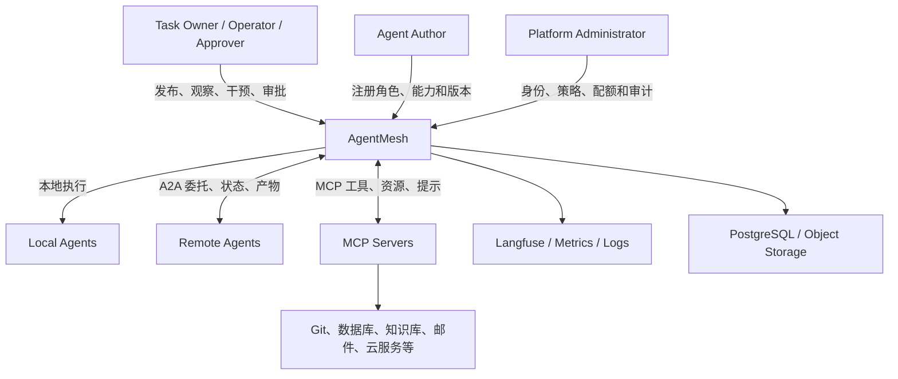

# AgentMesh L0 system design

Status: Proposed
Last updated: 2026-07-15

## 1. Purpose

AgentMesh 是一个自主可控的 AI Agent 协作控制平面。用户向平台提交目标、约束、预算和验收标准；平台选择合适的执行模式，协调一个或多个 Agent 完成任务，并允许用户持续观察、干预、审批和验收。

AgentMesh 的成功不以“参与的 Agent 数量”衡量，而以任务是否在可接受的质量、成本、时延与风险范围内可靠完成来衡量。

## 2. Problem statement

现有 Agent 原型通常面临以下问题：

- 复杂任务依赖自然语言群聊，缺少明确状态和责任边界。
- 长任务中断后难以恢复，已完成工作容易丢失或重复执行。
- Agent、工具和远程服务的权限过大，缺少统一策略与审批。
- 任务状态、模型 Trace、工具调用和业务结果散落在不同系统。
- Agent 交接依靠非结构化上下文，产生信息损失与成本膨胀。
- 单 Agent 与多 Agent 被建成两套系统，难以按任务复杂度平滑升级。

AgentMesh 要提供统一的任务语义和控制平面，使单 Agent、多 Agent、本地 Agent 与远程 A2A Agent 可以在同一治理模型下运行。

## 3. Goals

### 3.1 Product goals

- 用户可以创建、查看、暂停、恢复、取消和验收任务。
- 平台可以将任务拆成有依赖关系的子任务，并进行串行或并行调度。
- 每个 Agent 具有清晰角色、能力、工具、权限、成本与并发限制。
- Agent 可以认领、完成、拒绝、转交或请求补充信息。
- 高风险动作可以暂停执行并等待人类审批。
- 任务、步骤、交接、产物、评价和人工操作具有完整审计链。
- 平台能够根据任务需要选择单 Agent 或多 Agent，而不是强制多 Agent。

### 3.2 Platform goals

- 使用持久化状态机驱动执行，不依赖 Agent 自由对话维持流程。
- PostgreSQL 保存平台业务事实，执行引擎保存可恢复的工作流状态。
- 使用 A2A 接入跨进程、跨语言或跨团队 Agent。
- 使用 MCP 暴露经过治理的工具、资源和上下文能力。
- 使用开放的遥测标准连接 Langfuse 和基础设施监控系统。
- 核心能力支持私有化部署，并避免绑定单一模型供应商。

## 4. Non-goals for the initial product

首个可用版本不以实现以下能力为目标：

- 无约束的去中心化 Agent 社交网络。
- 让 Agent 自主创建无限层级的新 Agent。
- 通用模型训练、微调或推理服务。
- 面向公众的 Agent 商业交易市场。
- 取代 BPM、CI/CD、RPA、数据编排或 Kubernetes 等成熟系统。
- 对所有 Agent 行为提供形式化正确性保证。
- 默认向每个 Agent 暴露所有 MCP 工具。
- 使用区块链解决 Agent 身份或任务结算。

## 5. Primary actors

| Actor | 目标与职责 |
|---|---|
| Task Owner | 发布任务，定义目标、约束、预算和验收标准，查看结果 |
| Operator | 观察运行状态，处理故障、暂停、恢复、改派或取消任务 |
| Approver | 对高风险操作进行批准、拒绝或修改 |
| Agent Author | 定义 Agent 的角色、能力、模型、提示词、工具和执行策略 |
| Tool Provider | 发布和维护 MCP Server，定义能力与安全边界 |
| Platform Administrator | 管理租户、身份、策略、配额、密钥和基础设施 |
| Local Agent | 作为 AgentMesh Runtime 内部节点执行任务 |
| Remote Agent | 通过 A2A 接收委托并返回状态和产物 |
| External System | 被 MCP、Webhook 或业务连接器访问的数据与操作系统 |

## 6. System context



## 7. Core concepts

### 7.1 Task

由用户或外部系统提交的顶层工作单元。Task 必须包含目标，并可选包含约束、优先级、预算、截止时间、输入产物和验收标准。

### 7.2 Subtask

Task 的可调度分解单元。Subtask 可以依赖其他 Subtask，拥有独立执行者、重试策略、输入、输出和状态。

### 7.3 Run

Task 或 Subtask 的一次执行尝试。重试、改派和从历史状态分叉会产生新的 Run，而不会覆盖既有历史。

### 7.4 Agent Definition

Agent 的版本化声明，包括角色、能力、模型策略、工具集合、权限、输入输出契约和运行限制。Agent Definition 不等于一个常驻进程。

### 7.5 Agent Instance

某个 Agent Definition 在特定 Runtime 中的可执行实例，具有健康、负载和租约状态。

### 7.6 Handoff

工作从一个执行者转移给另一个执行者的显式记录。Handoff 必须声明目标、原因、输入引用、约束和验收标准，不能只依赖聊天摘要。

### 7.7 Artifact

Agent 产生的可复用结果，例如报告、代码补丁、数据集、图片或结构化 JSON。大型内容保存在对象存储中，任务消息只携带引用和元数据。

### 7.8 Approval

在受控动作执行前创建的决策请求。Approval 记录申请者、动作、风险、证据、决策者、决定与时间。

### 7.9 Event

不可变的领域事实，例如 TaskCreated、RunStarted、HandoffRequested、ApprovalGranted、ArtifactPublished 和 TaskCompleted。

### 7.10 Trace

面向诊断和质量分析的一次执行链路。Trace 可以包含 Agent、模型、工具、检索、A2A 调用和评价 Span，但不作为业务状态真相。

## 8. Capability map

AgentMesh 的能力分成五个领域。

### 8.1 Control plane

- 任务与子任务管理
- Agent、Skill 与能力注册
- 策略、权限、配额和预算管理
- 人工审批与操作介入
- 版本、租户和审计管理

### 8.2 Execution plane

- LangGraph 工作流编排
- 单 Agent 与多 Agent 执行
- 并行、循环、重试、超时和恢复
- Worker 调度、租约和并发控制
- 人工中断与恢复

### 8.3 Interoperability plane

- A2A Agent 发现与任务委托
- A2A 状态、消息与 Artifact 映射
- MCP Server 注册、连接与工具发现
- MCP 调用策略、权限和审计
- Webhook 与外部事件入口

### 8.4 Data plane

- 业务任务账本
- 工作流 Checkpoint
- Artifact 元数据与对象存储
- Event Outbox 与消费游标
- 密钥引用和配置版本

### 8.5 Observability plane

- 业务进度和 Agent 状态
- 分布式 Trace 和 Langfuse 集成
- Token、模型成本、延迟和错误率
- 质量评价、人工反馈和实验
- 安全审计和策略决策记录

## 9. Execution modes

平台应根据任务复杂度选择最低成本且足够可靠的模式：

| Mode | 描述 | 典型用途 |
|---|---|---|
| Direct | 单 Agent 直接执行 | 简单、低风险、短任务 |
| Reviewed | 单 Agent 执行，独立 Reviewer 验证 | 需要质量门禁的单领域任务 |
| Coordinated | Planner/Supervisor 协调多个专业 Agent | 跨领域、可并行或上下文较大的任务 |
| Federated | 通过 A2A 委托独立部署的远程 Agent | 跨语言、跨团队、独立扩缩容 |
| Governed | 任一模式叠加策略检查与人工审批 | 高风险或受监管操作 |

执行模式是策略选择，不应要求用户理解底层拓扑。

## 10. Canonical task lifecycle

顶层 Task 使用稳定的业务状态；协议和执行引擎状态通过适配层映射，不直接泄露给用户。

```text
CREATED
  -> PLANNING
  -> READY
  -> RUNNING
     -> WAITING_AGENT
     -> WAITING_INPUT
     -> WAITING_APPROVAL
     -> REVIEWING
     -> REVISION_REQUIRED
  -> COMPLETED

Any active state may transition to FAILED or CANCELED according to policy.
```

状态转换必须：

- 由明确命令触发并校验前置状态。
- 通过数据库事务保存。
- 产生可审计领域事件。
- 使用幂等键抵抗重复请求。
- 保留原因、发起者和关联 Run。

## 11. End-to-end scenarios

### 11.1 Direct single-agent task

1. 用户提交目标和验收标准。
2. 平台创建 Task 和初始 Run。
3. 路由策略选择一个本地 Agent。
4. Agent 通过受控 MCP 工具完成工作。
5. 平台保存 Artifact、成本和 Trace。
6. 验收规则通过后完成 Task。

### 11.2 Coordinated multi-agent task

1. Planner 将目标拆成带依赖关系的 Subtask。
2. Supervisor 根据能力、权限、成本和负载选择 Agent。
3. 无依赖的 Subtask 并行运行。
4. 每个 Agent 通过 Artifact 引用交付结果。
5. Reviewer 对照验收标准验证汇总结果。
6. 未通过项创建有上限的修订 Run；通过后完成 Task。

### 11.3 Remote A2A delegation

1. Supervisor 从 Agent Registry 选择远程能力。
2. A2A Gateway 发送带关联 ID 和幂等键的委托请求。
3. 远程 Agent 返回远程 Task ID，并通过流、轮询或回调更新状态。
4. Gateway 将远程状态映射成内部 Run 状态。
5. Artifact 被复制到受控存储或登记为受策略保护的外部引用。
6. 远程完成事件唤醒对应 LangGraph Thread。

### 11.4 Human approval

1. Agent 请求执行受控动作。
2. Policy Engine 判断需要审批并创建 Approval。
3. LangGraph 保存 Checkpoint 并中断。
4. Approver 在管理后台检查动作、参数、证据和风险。
5. 批准、拒绝或修改被记录为审计事件。
6. 工作流以审批结果恢复，副作用通过幂等执行器提交。

## 12. Data ownership

| Data | System of record | Notes |
|---|---|---|
| Task、Subtask、Run、Handoff、Approval | PostgreSQL business schema | 面向业务的权威状态 |
| LangGraph Thread 与 Checkpoint | PostgreSQL execution schema | 面向恢复的执行状态，不替代业务账本 |
| Event 与 Outbox | PostgreSQL event schema | 事务提交后异步发布 |
| Artifact metadata | PostgreSQL business schema | 内容地址、校验值、类型和访问策略 |
| Artifact content | S3-compatible object storage | 大对象和版本化产物 |
| Model/tool traces | Langfuse | 诊断与评价数据，不作为业务真相 |
| Metrics and infrastructure logs | Metrics/log backend | 聚合监控和告警 |
| Secrets | External secret manager | 数据库只保存引用，不保存明文 |

## 13. Trust boundaries

系统默认不信任：

- 用户输入和上传文件
- 模型输出
- Web 检索内容和知识库内容
- 第三方 MCP Server
- 远程 A2A Agent
- Agent 自己选择的工具参数
- 跨租户或跨环境传入的 Artifact

关键控制包括：

- 人、服务和 Agent 使用可区分的身份。
- Agent 按任务获得短期、最小权限凭证。
- MCP 工具按 Agent、租户、环境和风险分配。
- A2A Peer 需要准入、认证、能力缓存和调用策略。
- 高风险副作用通过 Policy Engine 与审批门禁。
- 消息、回调和事件使用幂等键、防重放信息与关联 ID。
- Artifact 进行类型、大小、恶意内容和来源检查。
- Trace 中的 Prompt、密钥和敏感数据按策略脱敏。

## 14. Reliability principles

- 所有长任务都假设进程可能随时重启。
- 数据库状态提交和事件发布使用 Transactional Outbox 等可靠模式。
- 网络超时不等于远程执行失败，必须通过幂等查询确认。
- 副作用节点必须设计为幂等或具有可验证的去重策略。
- 重试必须分类：瞬时故障、业务拒绝、模型错误和永久故障不能同等处理。
- 每个循环、返工、委托和重试都有上限、预算和退出路径。
- 队列负责投递与唤醒，数据库负责业务真相。

## 15. Observability principles

每个用户任务至少具有：

- `task_id`：业务关联主键，也是 Langfuse Session 的候选 ID。
- `run_id`：一次执行尝试，对应一个或多个 Trace。
- `thread_id`：LangGraph Checkpoint 游标。
- `trace_id`：分布式诊断链路。
- `message_id`：A2A/MCP/事件消息去重与关联。

平台必须区分两种视图：

- 业务视图：进度、负责人、当前阶段、预算、风险、产物和审批。
- 工程视图：Prompt、模型调用、Tool Span、A2A Span、Token、延迟和异常。

## 16. Initial deployment posture

首个部署目标是单组织私有化环境，而非全球多区域 SaaS。

逻辑上区分控制平面、执行平面和集成平面；物理上可以先作为模块化单体和独立 Worker 部署，以减少早期分布式系统成本。只有存在独立扩缩容、故障域、权限域或团队所有权时才拆成服务。

初始基础设施基线：

- PostgreSQL
- Redis Streams
- S3-compatible object storage
- Langfuse
- Secret manager
- API/Console process
- Orchestrator/Worker process
- MCP/A2A integration adapters

## 17. High-level non-functional requirements

以下是 L1 阶段需要量化的方向，而非当前承诺：

- Durability：已确认完成的步骤不能因进程重启而无故重做。
- Auditability：关键状态和高风险动作能够还原发起者、原因、输入与结果。
- Security：支持最小权限、租户隔离、密钥隔离和敏感数据治理。
- Portability：核心控制平面可在主流容器环境和私有基础设施运行。
- Interoperability：本地 Agent 不被迫使用 A2A；远程边界遵循标准协议。
- Cost control：任务、Agent、模型和租户都可配置预算与并发上限。
- Operability：运行状态、积压、失败、成本和质量具有可查询指标。
- Evolvability：协议适配与领域模型隔离，避免外部协议直接定义内部数据库。

## 18. L0 decisions

当前 L0 设计提出以下基线，接受后应通过 ADR 修改：

1. 单 Agent 是默认执行模式，多 Agent 按明确需求启用。
2. PostgreSQL 是业务状态的唯一权威来源。
3. LangGraph 负责编排和恢复，不拥有业务产品模型。
4. A2A 只用于独立 Agent 边界，不用于同进程节点之间通信。
5. MCP 用于工具和上下文，不用于全局 Agent 调度。
6. Langfuse 用于 LLM 可观测与评价，不用于任务状态管理。
7. 队列用于可靠投递、唤醒和事件传播，不是业务账本。
8. 平台使用模块化单体起步，按证据而不是假设拆分微服务。

## 19. Questions deferred to L1

- 控制平面 API 与 Orchestrator Worker 的物理边界。
- Task、Run、LangGraph Thread 与 A2A Task 的精确映射。
- 调度模型采用中心化队列、能力匹配还是租约式 Worker Pool。
- Redis Streams 的消息语义、消费组、重试和死信设计。
- A2A Gateway 的同步、流式、Webhook 和轮询策略。
- MCP Registry 与 Gateway 是否在首版合并部署。
- Policy Engine 使用内置规则还是独立策略引擎。
- 多租户隔离级别和数据库布局。
- Artifact 在跨 Agent/跨租户传递时的访问授权模型。
- Langfuse 的自托管拓扑、数据保留与敏感内容策略。
- 任务取消、补偿和不可逆副作用的统一语义。
- 首个垂直场景及其验收指标。

## 20. L0 acceptance criteria

L0 可以进入 Accepted 状态的条件：

- 目标用户和首个落地场景明确。
- Goals 与 Non-goals 没有明显冲突。
- 五个能力领域及其责任边界获得认可。
- 数据所有权、协议边界和信任假设获得认可。
- 对“单 Agent 优先”和“模块化单体起步”形成共识。
- L1 的优先设计顺序获得认可。
