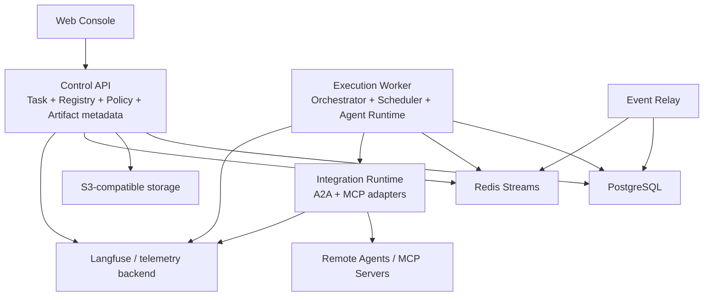

# AgentMesh L1 design plan

Status: Proposed
Depends on: [L0 system design](L0-system-design.md)

L1 将 L0 的能力领域分配给可部署容器，定义通信方式、数据所有权、信任边界、扩缩容方式和主要失败模式。本文先定义设计顺序，不提前完成所有细节。

## 1. Candidate containers

| Container | Core responsibility | Initial deployment posture |
|---|---|---|
| Web Console | 任务、Agent、审批、运行状态和审计的用户界面 | 独立前端 |
| Control API | 身份上下文、命令校验、查询聚合和外部 API | 模块化单体入口 |
| Task Service | Task/Subtask/Run/Handoff/Approval 的领域规则 | Control API 内模块 |
| Orchestrator | LangGraph 工作流、Checkpoint、路由和恢复 | 独立 Worker 进程 |
| Scheduler | 就绪任务选择、能力匹配、优先级、配额和租约 | 初期与 Orchestrator 同部署 |
| Agent Runtime | 本地 Agent 执行、模型调用、上下文装配和工具循环 | 可水平扩展 Worker |
| Agent Registry | Agent Definition、版本、能力、健康和端点目录 | Control API 内模块 |
| A2A Gateway | 远程 Agent 发现、认证、委托、状态和 Artifact 映射 | 初期集成模块，后续可独立 |
| MCP Registry | MCP Server 元数据、版本、工具缓存和准入 | Control API 内模块 |
| MCP Gateway | MCP 连接、授权、策略、审计和凭证代理 | 独立信任边界候选 |
| Policy Engine | 工具、Agent、数据、预算和审批策略判定 | 先内置接口，保留外置能力 |
| Artifact Service | Artifact 元数据、上传下载授权、扫描和版本 | API 模块 + 对象存储 |
| Event Relay | Transactional Outbox 发布与事件消费 | 独立后台进程 |
| Observability Adapter | OpenTelemetry/Langfuse 属性规范、脱敏和导出 | 共享库 + 后台任务 |

候选容器不等于首版必须部署十多个微服务。L1 的任务之一是确定哪些容器先作为同一部署单元中的模块存在。

## 2. Proposed initial deployment units

首版建议只有四类自有进程：Web Console、Control API、Execution Worker、Event Relay。Integration Runtime 可以先作为 Worker 内部模块，待安全或扩缩容需求出现后独立。

## 3. L1 document order

按风险和依赖关系逐步设计：

1. **Task and execution model**
   - Task、Subtask、Run、Attempt、Handoff、Approval、Artifact 的关系。
   - 业务状态机与并发控制。
   - LangGraph Thread/Checkpoint 的映射。

2. **Persistence and event consistency**
   - PostgreSQL Schema 边界。
   - Transactional Outbox、幂等键、乐观锁和审计事件。
   - Checkpoint 与业务事务不一致时的恢复策略。

3. **Orchestrator and scheduler**
   - Graph 类型、路由、并行、重试、超时、取消和人工中断。
   - 能力匹配、租约、优先级、预算与并发限制。

4. **Local Agent Runtime**
   - Agent Definition、上下文装配、模型策略、工具循环和沙箱边界。
   - 单 Agent、Reviewer 和 Supervisor 模式。

5. **Agent Registry and versioning**
   - Agent Card、内部能力模型、版本发布和健康状态。
   - Agent Definition 与运行实例分离。

6. **MCP integration**
   - 私有 Registry、连接生命周期、工具过滤、授权、凭证代理和审计。
   - 本地 stdio 与远程 Streamable HTTP 的支持范围。

7. **A2A integration**
   - 内部 Task/Run 与 A2A Task/Message/Artifact 的映射。
   - Streaming、Webhook、轮询、重新订阅和取消。
   - Peer 信任、认证、防重放和网络故障模型。

8. **Artifact lifecycle**
   - 内容寻址、校验、扫描、保留、授权和跨边界传递。

9. **Policy and approval**
   - 策略输入、判定结果、风险等级、审批和副作用提交。

10. **Observability and evaluation**
    - 业务事件、分布式 Trace、Langfuse Session/Trace/Span 映射。
    - 数据脱敏、成本核算、质量 Score 和告警。

11. **Control API and Console**
    - 命令/查询边界、实时事件、用户视图和运维视图。

12. **Deployment and operations**
    - 单机开发、Docker Compose、生产拓扑、备份、升级和容量规划。

## 4. Cross-container contracts to define

L1 必须先稳定以下逻辑契约，再进入具体 API：

- Task Command Envelope
- Domain Event Envelope
- Agent Assignment Contract
- Handoff Contract
- Artifact Reference
- Approval Request and Decision
- Policy Decision
- Remote A2A Correlation
- MCP Tool Invocation Audit
- Trace Context Propagation

每个契约至少需要：版本、关联 ID、幂等键、发起者、租户、时间、有效期和扩展字段策略。

## 5. Required failure analysis

每个 L1 容器设计必须回答：

- 进程在提交前、提交后、响应前崩溃分别会怎样？
- 同一命令执行两次是否安全？
- 下游超时后如何判断“未执行”还是“已执行但响应丢失”？
- 取消信号与完成事件并发时以什么为准？
- 队列事件重复、乱序或延迟时如何收敛？
- 外部 A2A/MCP 服务不可用时是否降级、重试或转人工？
- 预算耗尽、循环上限和截止时间如何终止执行？
- 哪些状态可自动修复，哪些必须人工处理？

## 6. L1 exit criteria

完成 L1 需要达到：

- 初始部署单元和每个容器的责任/非责任明确。
- 业务状态、执行状态和遥测状态所有权明确。
- 主要同步调用与异步事件流明确。
- 数据库、队列、对象存储和外部协议边界明确。
- 身份、信任和凭证传播路径明确。
- 主要失败模式、幂等与恢复方案明确。
- 可以选择一个垂直切片进入 L2，而无需重做 L0 决策。

## 7. Recommended first L1 slice

第一个 L1 设计建议聚焦：

> 用户提交一个任务，由一个本地 Agent 执行，允许暂停/恢复，产出一个 Artifact，并在 Console 中看到业务进度和 Langfuse Trace。

这个切片不需要 A2A，也不需要多 Agent，但会验证未来多 Agent 最依赖的任务账本、执行恢复、Artifact 和观测基础。

## 8. Accepted bootstrap MVP module designs

The first runnable increment is intentionally narrower than the complete slice above: it proves the task ledger, durable LangGraph thread, runtime port, and Control API before pause/resume, Artifact, Console, and Langfuse deployment are added. The following L2 documents define that bootstrap increment:

- [Task domain and execution model](modules/task-execution-model.md)
- [Persistence and consistency](modules/persistence-and-consistency.md)
- [Orchestration and Agent Runtime](modules/orchestration-runtime.md)
- [Control API](modules/control-api.md)

## 9. Formal L2 target baseline

正式版本的全部候选容器已经映射为可评审的 L2 文档：

- [Formal L2 design baseline and ownership map](modules/formal/README.md)
- [Cross-module contracts](modules/formal/cross-module-contracts.md)
- [Task and execution domain](modules/formal/task-and-execution-domain.md)
- [Persistence and consistency](modules/formal/persistence-and-consistency.md)
- [Orchestrator and scheduler](modules/formal/orchestrator-and-scheduler.md)
- [Local Agent Runtime](modules/formal/local-agent-runtime.md)
- [Agent Registry](modules/formal/agent-registry.md)
- [MCP integration](modules/formal/mcp-integration.md)
- [A2A integration](modules/formal/a2a-integration.md)
- [Artifact Service](modules/formal/artifact-service.md)
- [Policy and approval](modules/formal/policy-and-approval.md)
- [Event Relay](modules/formal/event-relay.md)
- [Observability and evaluation](modules/formal/observability-and-evaluation.md)
- [Identity, tenancy and secrets](modules/formal/identity-tenancy-and-secrets.md)
- [Control API](modules/formal/control-api.md)
- [Web Console](modules/formal/web-console.md)
- [Deployment and operations](modules/formal/deployment-and-operations.md)

这些文档当前统一为 `Proposed`。建议评审顺序为：统一契约 → 任务/持久化 → 编排/Runtime/Registry → Policy/Identity/Artifact → MCP/A2A → Event/Observability/API/Console → Deployment。
