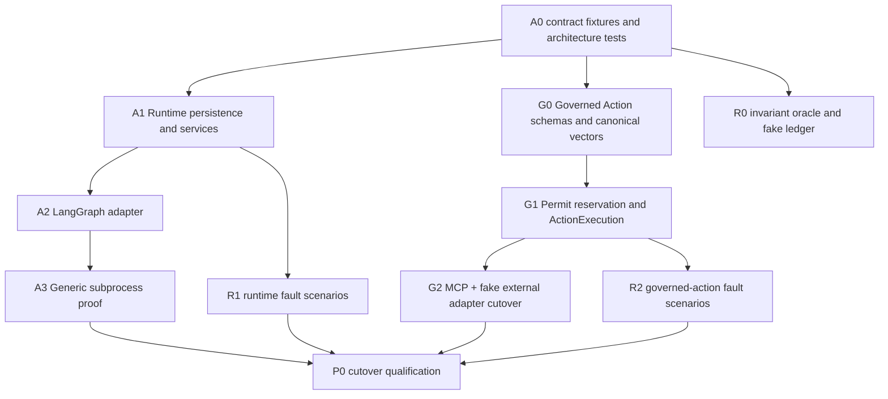

# Agent Control Plane P0 implementation plan

Status: Ready for implementation
Design date: 2026-08-16
Parent epic: [#134](https://github.com/0YHR0/AgentMesh/issues/134)
Primary implementer profile: autonomous coding Agent with repository access

## 1. Goal and completion definition

P0 is complete when AgentMesh can manage both the existing LangGraph Agent and one independent
non-LangGraph Agent through the same runtime lifecycle, govern an external write through the shared
Intent/Permit protocol, and publish repeatable evidence that crash windows converge.

P0 does **not** make new runtime/governance paths default until compatibility, rollback, and chaos
gates pass. It does not implement Agent Principal, OCI isolation, Fleet Console, experience
extraction, or Capability Bundles; those remain P1 issues #139–#143.

Normative inputs:

- [ADR 0007](../adr/0007-framework-neutral-agent-control-plane.md)
- [Managed Agent Runtime API v0.1](modules/formal/managed-agent-runtime.md)
- [Governed Action Protocol v0.1](modules/formal/governed-action-protocol.md)
- [Reliability Model and Chaos Qualification](modules/formal/reliability-model-and-chaos.md)
- existing Task, persistence, policy, identity, MCP, Artifact, and cross-module L2 contracts

If implementation reveals a contradiction in ownership, state identity, authority, crash behavior,
or compatibility, stop and update the ADR/specification before choosing an implementation shortcut.

## 2. Required dependency order



Runtime and Governance tracks may progress in parallel only after A0 fixes common contract,
Envelope, digest, and architecture-test conventions.

## 3. Target package and module layout

The exact file split may vary for cohesive size, but dependency direction is fixed:

```text
src/agentmesh/
  runtime_sdk/                    # public, framework-neutral, no internal service imports
    __init__.py
    models.py                     # descriptor/assignment/observation/result/error DTOs
    canonical.py                  # canonical JSON/digests
    fixtures/                     # packaged valid fixtures only if build policy permits
  governance_sdk/                 # public Intent/Permit/Receipt DTO + canonicalization
    __init__.py
    models.py
    canonical.py
  domain/
    runtime_execution.py          # RuntimeExecution/ownership/lifecycle domain rules
    policy.py                     # compatibility + target governance entities, or split module
  application/
    runtime_ports.py              # ManagedAgentRuntime port
    runtime_services.py           # admission/dispatch/observation/reconcile orchestration
    governed_action_services.py   # reserve/dispatch/reconcile application flow
  runtimes/
    langgraph_adapter.py
    subprocess_adapter.py
  infrastructure/postgres/
    runtime_repositories.py
    governed_action_repositories.py
  chaos/
    schemas.py
    driver.py
    oracle.py
    report.py
  entrypoints/
    chaos.py
tests/
  contracts/runtime/v1/
  contracts/governed_action/v1/
  architecture/
  chaos/
```

Public SDK modules may use standard library dataclasses/typing and existing lightweight schema
validation dependencies. They must not import FastAPI, SQLAlchemy, Redis, LangGraph, application
services, or a vertical experience.

## 4. Cross-cutting implementation rules

### 4.1 IDs and digests

- AgentMesh generates internal UUIDs.
- Provider IDs are opaque scoped references, never internal primary keys.
- Canonical digests use lowercase SHA-256 hex and golden fixture bytes.
- Idempotency records store request digest and stable outcome reference.
- All timestamps normalize to UTC; tests use an injected/fake clock where time changes behavior.

### 4.2 Transactions and external calls

- No runtime/provider/MCP/A2A/model/object-store network call while a database transaction or row
  lock is open.
- State intent + audit + outbox + idempotency outcome commit together.
- Read external state, then re-read/version-check owner state before applying an observation.
- Reconciler invokes normal application commands, never repository repair shortcuts.

### 4.3 Errors

- Boundary adapters map raw errors once into stable category/code/retry disposition.
- Tests assert codes/disposition, not full human messages.
- Raw stack/provider body is restricted log/Artifact evidence only.
- Unknown major/schema/security obligation fails closed.

### 4.4 Feature gates

Add separately controlled gates:

```text
managed_agent_runtime
generic_subprocess_runtime
governed_action_protocol_v1
```

The chaos harness is not a production feature gate; it requires explicit test environment/profile
and refuses production. During migration, legacy and new execution may be selected per newly
created Run, but one Run never switches paths implicitly.

### 4.5 Backward compatibility

- Existing default deterministic demo and public Task APIs remain functional in every PR.
- Existing persisted Runs stay readable.
- New nullable columns/tables are expand-only until cutover.
- Old and new paths may dual-record evidence, but only one path is authoritative for a Run.
- API additions are additive; removal happens only after deprecation and release window.

## 5. Runtime track (#135 and #136)

### A0 — canonical runtime SDK and fixtures

Deliver:

- v1 DTOs and validators from the Managed Runtime specification;
- canonical JSON/digest implementation;
- valid/invalid/unknown-major/unknown-obligation fixtures;
- public imports and API version constants;
- architecture dependency tests;
- fake adapter used only by contract tests.

Tests:

- JSON round trip and stable digest;
- RFC 8785 cross-language golden vectors, duplicate-key rejection, safe numeric boundaries, and
  closed-object unknown-field rejection;
- size/depth/count bounds;
- enum/version/capability negotiation;
- error redaction;
- import graph forbidden-dependency scan.

Do not add database tables or modify Worker behavior in A0.

### A1 — Runtime Registry and execution persistence

Deliver one Alembic expand migration for:

- Runtime Registration/Version;
- RuntimeExecution;
- ownership history;
- immutable observation inbox/evidence;
- lifecycle operations;
- nullable Run runtime-version/execution binding.

Implement domain transitions, repositories, application services, and internal query API. Register a
built-in LangGraph Runtime Version deterministically during seed/migration-safe bootstrap; do not
create a new version on every start.

Required concurrency tests use real PostgreSQL:

- same dispatch key/same digest is stable;
- same key/different digest conflicts;
- only one active RuntimeExecution under concurrent requests;
- owner fencing CAS;
- observation Inbox dedupe/order gap;
- replacement Attempt claim after lease expiry;
- stale owner observation preserved but not applied.

### A2 — LangGraph adapter and dual recording

Move framework-specific construction behind `ManagedAgentRuntime`. The adapter may call existing
workflow/executor internals initially, but the Worker application service talks only to the runtime
port when the gate is enabled.

Deliver:

- descriptor/capabilities pinned to an immutable Runtime Version;
- mapping RuntimeAssignment → existing workflow input;
- mapping current output/usage/error → canonical observation/result;
- stable LangGraph thread/checkpoint opaque references;
- cancellation/pause/resume/inspect behavior matching declared capabilities;
- dual-record comparison mode for deterministic fixtures.

Parity assertions compare Task/Run/Attempt terminal state, output digest, usage, Artifact refs,
review/revision behavior, and audit—not internal trace/node identity.

### A3 — generic non-LangGraph subprocess proof

Create an independently buildable reference Agent package/process with a minimal line-delimited JSON
or framed stdio protocol. It imports only the public Runtime SDK and has no LangGraph dependency.

Subprocess adapter requirements:

- structured argv, no shell concatenation;
- dedicated temporary workspace per RuntimeExecution;
- environment allowlist; no database URL, host Docker socket, unrelated secret, or parent env dump;
- bounded assignment/result/event bytes, stdout protocol, redacted bounded stderr;
- timeout, process group cancellation, exit/error mapping, orphan cleanup;
- stable dispatch metadata and inspect behavior supported by an adapter supervisor record;
- output only through structured result/Artifact staging.

The proof Agent creates a deterministic report Artifact and supports controlled delay/cancel/crash
fixtures. Do not turn it into a business scenario or a general hostile-code sandbox.

### A4 — runtime cutover

- enable new runtime path for new deterministic direct Runs in CI;
- then reviewed/coordinated modes;
- run conformance for LangGraph and subprocess adapters;
- run Runtime chaos scenarios;
- document rollback to legacy for new Runs only;
- stop creating legacy bindings after two-path parity is green;
- remove legacy Worker dependency only in a separate final PR.

Exit: #135 and #136 acceptance criteria and Managed Runtime section 19 are green.

## 6. Governed Action track (#137)

### G0 — SDK, canonicalization, and compatibility projector

Deliver v1 Intent/Decision/Approval/Permit/Execution/Receipt/Reconciliation DTOs, exact canonical
action vectors, stable errors, and a read-only projector from the existing combined
`GovernedAction` aggregate.

Do not change current authorization behavior in G0. Cross-language vectors must include nested maps,
set-like schema fields, null/absent, Unicode, timestamps, SecretReference, and changed resource/tool
version.

### G1 — persistence and Permit reservation

Add expand migration/tables and implement:

- immutable Intent/Decision/ApprovalDecision;
- Permit state/max uses/revocation;
- atomic `PermitUse + ActionExecution(PREPARED)` reservation;
- executor lease/fencing and DISPATCHING transition;
- immutable receipt and reconciliation records;
- compatibility links to existing policy/audit records.

Real PostgreSQL concurrency tests must prove use cap, same-key replay, different-request conflict,
and stale executor fencing.

### G2 — deterministic fake external ledger

Before migrating a real adapter, build an append-only fake external system outside AgentMesh owner
state. It supports configurable provider idempotency/query/cancel/response-loss behavior. Tests count
ledger effects independently.

Cover every dispatch crash window and ensure an ambiguous non-idempotent call has no ordinary retry.

### G3 — MCP write cutover

Migrate exactly one existing idempotent MCP write path behind the v1 gate:

1. propose Intent;
2. evaluate/approve using current policy semantics;
3. issue Permit;
4. reserve ActionExecution;
5. Gateway dispatch with existing invocation ID as stable external operation identity;
6. record receipt or unknown outcome;
7. resume Task via normal command.

Dual audit checks ensure no evidence field currently exposed disappears. Then migrate remaining MCP
writes and A2A delegation in separate PRs. Read-only MCP does not require Permit unless policy
explicitly asks for governed read.

### G4 — public SDK proof

Use the generic non-LangGraph Agent to propose one fake external action through the public SDK. The
runtime receives only Intent/wait/result references and cannot create a Decision, Approval, or
Permit. This is the cross-boundary proof for #137.

Exit: Governed Action section 18 plus chaos action scenarios are green.

## 7. Reliability track (#138)

### R0 — schemas, fake ledger, and invariant oracle

Implement scenario/result JSON schemas, independent external ledger, and oracle checks for R1–R12.
Start with component tests for duplicate delivery, stale fencing, idempotency conflict, and response
loss. A missed fault trigger is a harness error.

### R1 — `agentmesh-chaos` Compose smoke

- explicit disposable `chaos` Compose profile;
- guarded process/fault controller;
- CLI list/run/report;
- initial 12 scenarios;
- JSON Artifact + generated Markdown report;
- CI path/filter and artifact upload.

Never add an unauthenticated fault HTTP endpoint. Validate environment fingerprint and target paths
before process/database mutation.

### R2 — P0 qualification

Add Runtime and Governed Action scenarios as their code lands. P0 cannot cut over by default until
all correctness gates pass on a clean checkout and the result records code/image/migration digests.

Performance metrics are reported but not release gates until stable baselines exist.

## 8. API and projection requirements

P0 adds operator/read APIs sufficient for evidence and later Fleet Console:

```text
GET /api/v1/runtimes
GET /api/v1/runtimes/{id}/versions
GET /api/v1/runtime-executions/{id}
GET /api/v1/runtime-executions/{id}/observations
GET /api/v1/governed-actions/{intent_id}
GET /api/v1/action-executions/{id}
POST /api/v1/action-executions/{id}/reconcile
```

Names may align with existing routing conventions, but semantics are fixed:

- tenant/RBAC scoped and paginated;
- bounded safe summaries, not raw provider payloads;
- projection lag disclosed;
- reconciliation is an authenticated idempotent command;
- unknown outcome never exposes a generic Retry command;
- runtime/provider refs redacted according to trust and role.

Mutation APIs for Runtime Registration/Version may reuse Agent Registry patterns and remain feature
gated. P0 does not require a new Fleet UI.

## 9. Database migration and rollback matrix

| Stage | Database | Writer behavior | Rollback |
|---|---|---|---|
| expand | new nullable tables/columns | legacy only | old code ignores additions |
| dual record | both evidence models for selected fixtures | one authoritative path per Run/action | disable gate; preserve records |
| new path opt-in | new Runs/actions pin v1 | old active work drains | disable selection for new work; compatible workers remain for active v1 |
| default | v1 selected by default | legacy read remains | configuration rollback within compatibility window |
| contract | remove legacy writes/columns later | v1 only | requires new release, not same-step rollback |

Never contract schema in the same release that changes the default. Backfill uses bounded resumable
cursors and never fabricates missing historical identity/evidence.

## 10. Required tests per pull request

Every implementation PR runs:

- `ruff check .`;
- all non-PostgreSQL tests and repository coverage gate;
- relevant real PostgreSQL integration tests;
- architecture dependency tests;
- canonical contract fixture tests;
- Compose E2E when composition/runtime/migration changes;
- targeted chaos smoke when touching a named reliability boundary;
- upgrade from the previous merged migration head.

Additional security cases:

- cross-tenant object/list access;
- payload/Artifact/secret size and redaction;
- forged Principal/Attempt/Permit/fencing token;
- unknown major/obligation/provider status;
- subprocess environment and path traversal;
- provider result prompt injection treated as untrusted data.

Do not lower the current 80% repository coverage gate. New domain/contract/application code should
target branch-complete behavior, including illegal transitions, rather than only raising aggregate
coverage.

## 11. Pull request slicing and review gates

Keep PRs reviewable and independently green:

1. **A0:** Runtime SDK/fixtures/architecture tests.
2. **A1:** Runtime persistence/domain/query API.
3. **A2:** LangGraph adapter behind disabled gate.
4. **A3:** generic subprocess adapter/reference Agent.
5. **G0:** Governed Action SDK/canonical vectors/compatibility projection.
6. **G1:** Permit reservation/ActionExecution persistence.
7. **R0:** fake ledger and invariant oracle (may precede G2).
8. **G2/G3:** fake path, then one MCP write cutover.
9. **R1/R2:** Compose harness and qualification matrix.
10. **P0 cutover:** defaults/docs/legacy deprecation only after evidence.

Do not combine schema expansion, default cutover, and legacy deletion in one PR. Each PR description
must state authority changes, crash windows affected, migration/rollback, feature-gate state, and
which conformance/chaos scenarios prove the change.

## 12. Implementation stop conditions

The implementing Agent must stop and request design revision when:

- a runtime needs to write Task/Run/Attempt/governance tables directly;
- one Run would silently change Runtime Version or Assignment digest;
- a new Attempt would redispatch without provider inspection/side-effect proof;
- a Permit use would be returned after external failure and silently reused;
- an external timeout is mapped to retryable failure without outcome proof;
- network/model/provider code must run in a database transaction;
- an active migration requires inventing missing historical evidence;
- a framework/provider/experience type must enter domain/public canonical contracts;
- a chaos scenario can target non-disposable/production infrastructure;
- compatibility requires weakening validation of unknown security fields.

These are architecture violations, not implementation inconveniences.

## 13. Luna handoff checklist

Before starting a slice:

- read ADR 0007 and the relevant normative specification completely;
- inspect the current implementation/tests named by the slice;
- confirm main is clean and create one feature branch;
- restate owned state, idempotency scope, crash windows, gate default, and rollback in the PR plan;
- update the parent Issue checklist and implementation status only with verified facts.

Before declaring a slice complete:

- every acceptance criterion has a test/evidence link;
- malformed/duplicate/late/stale/unauthorized paths are covered;
- migration upgrade and gate-off behavior pass;
- no raw secret/provider body/framework DTO crossed the canonical boundary;
- docs and fixtures match the implemented contract;
- free CI, integration, dependency review, and CodeQL are green;
- server deployment occurs only after merge, with health/readiness and one real vertical smoke check.

## 14. P0 final demonstration

The release demonstration must show, in one AgentMesh deployment:

1. the existing LangGraph Agent completes a governed Task;
2. an independent non-LangGraph subprocess Agent completes another Task;
3. both appear through the same Runtime inventory and Task/Run/Attempt evidence;
4. the external Agent proposes a write, waits for policy/approval, receives no raw Permit authority,
   and the gateway executes exactly one fake external effect;
5. the Worker is killed in the dispatch window and the system reattaches/reconciles without a
   duplicate effect;
6. the chaos JSON report proves all hard invariants and identifies tested limitations.

This demonstration—not the number of adapters or UI animations—is the exit signal for the P0
control-plane refocus.
