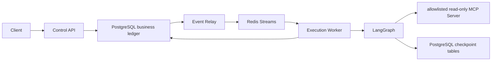

# Durable asynchronous execution

Status: Accepted for implementation increment
Owners: AgentMesh maintainers
Depends on: [Formal L2 design baseline](formal/README.md)

## 1. Scope

This increment replaces the synchronous bootstrap path with a durable asynchronous path.
It implements the first shared foundation for the formal Task Domain, Persistence,
Control API, Event Relay, Orchestrator, Local Runtime, and Deployment modules. It does not
claim that those complete formal modules are finished.

## 2. Runtime topology

The API never initializes or invokes LangGraph. It writes Task, Run, idempotency record,
and Outbox Event in one transaction. The Worker owns LangGraph and treats checkpointer
availability as an execution readiness requirement.

## 3. Implemented contracts

- `POST /api/v1/tasks/{task_id}/runs` returns `202 Accepted` and a resource `Location`.
- `Idempotency-Key` replays the original Run; reuse for another Task returns `409`.
- Concurrent use of the same key is serialized with a PostgreSQL transaction advisory lock.
- Task supports `READY|RUNNING -> PAUSE_REQUESTED|PAUSED -> READY` in addition to terminal states.
- Run supports `QUEUED|RUNNING -> PAUSE_REQUESTED|PAUSED -> QUEUED` before terminal states.
- Each execution lease creates an Attempt with a monotonically increasing fencing token.
- A running Worker renews the current Attempt lease while workflow execution is active.
- Outbox publication and Redis consumption are at least once.
- Inbox uniqueness gives one committed business effect per logical consumer and message.
- PostgreSQL is authoritative; Redis pending state and LangGraph state are not Task state.
- A completed LangGraph checkpoint can be reused after a crash before business finalization.
- Explicit read-only MCP calls create durable invocation audit records outside the Task transaction.

## 4. Failure behavior

| Failure | Behavior |
|---|---|
| Redis unavailable | API commit succeeds; Outbox remains pending for retry |
| Malformed Outbox envelope | Relay marks only that row `QUARANTINED`; valid batch peers continue |
| Relay publishes but cannot mark published | Event may be published again; Inbox deduplicates |
| Worker dies before Inbox commit | Redis message remains pending and can be reclaimed |
| Active Attempt lease exists | Another Worker leaves the message pending |
| Lease expires after missed renewal | A new Attempt receives a higher fencing token |
| Invalid envelope | Worker copies it to the dead-letter stream and acknowledges the source |
| Workflow fails | Task, Run, Attempt, and Inbox failure state commit atomically |
| LangGraph completed before process crash | Retry reads the completed checkpoint output |
| Pause arrives while queued | old wakeup is acknowledged without an Attempt; resume writes a new wakeup |
| Pause arrives while running | Worker stops at the durable post-node boundary and preserves checkpoint output |
| Paused Worker returns after lease expiry | Attempt fencing rejects the late result |

## 5. Process and migration boundaries

- `migrate`: one-shot Alembic deployment job for AgentMesh business tables.
- `api`: PostgreSQL only; accepts commands and serves authoritative queries.
- `relay`: claims PostgreSQL Outbox rows and publishes Redis messages.
- `worker`: consumes Redis, owns Attempt leases, invokes LangGraph, and finalizes state.
- LangGraph creates and migrates its own checkpoint tables; Alembic excludes those tables.

## 6. Verified acceptance criteria

- Domain, service, idempotency, duplicate delivery, API, and envelope tests run without
  external services.
- A real integration test covers API, PostgreSQL Outbox, Redis consumer group, Worker,
  LangGraph PostgreSQL Checkpoint, stdio MCP, Tool Invocation audit, Inbox, Attempt, and final Task
  result.
- Alembic upgrades legacy JSON columns to JSONB and reports no model drift.
- Docker Compose defines PostgreSQL, Redis, migration, API, Relay, and Worker services.

## 7. Deferred work

Admission control, scheduler DAGs, reconciler scans, operational replay APIs,
metrics, authentication, real model providers, A2A, review, approval, and the Web Console belong
to later implementation increments. Agent Registry, inline-small Artifacts, durable pause/resume,
Attempt lease renewal, and one gated read-only stdio MCP Tool are implemented by linked follow-up
increments. Governed MCP Registry/Gateway, credentials, remote HTTP, Resources/Prompts, and write
Tools remain deferred.
