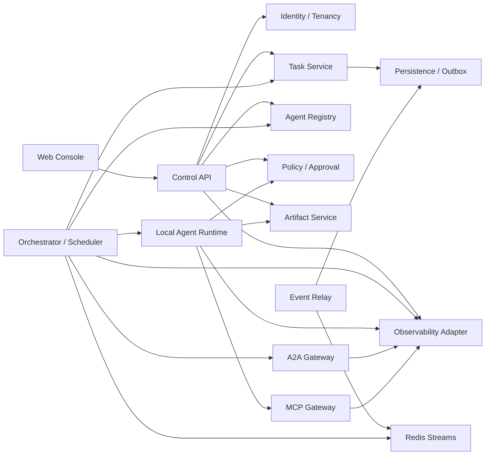

# Formal L2 design baseline

Status: Proposed
Last updated: 2026-07-16
Depends on: [L0 system design](../../L0-system-design.md), [L1 design plan](../../L1-design-plan.md)

## 1. Purpose

本目录定义 AgentMesh 正式版本的 L2 目标架构。它描述每个 L1 容器内部的组件、契约、状态、失败恢复、安全和运行边界，可作为后续 L3 API、数据库 Schema、算法和实现任务的输入。

现有父目录中的四份文档仍表示已经实现的 bootstrap MVP，不等于正式版已具备全部能力。正式 L2 是目标设计，只有在评审并标记为 `Accepted` 后才成为不可随意偏离的实现基线。

## 2. Design profile

- 单组织私有化部署优先，同时所有业务实体携带 `tenant_id`，为多租户演进留出边界。
- PostgreSQL 是业务事实的唯一权威来源；LangGraph Checkpoint、Redis Streams 和 Langfuse 都不能替代业务账本。
- 初始采用模块化单体 + 独立 Worker/Event Relay，不预设十多个微服务。
- 同进程协作用内部 Port；独立远程 Agent 才使用 A2A；工具与上下文使用 MCP。
- 所有网络、队列和回调均按至少一次、重复、乱序和响应丢失设计。
- Agent、模型输出、工具、远程 Peer、上传内容和检索内容默认不可信。
- 正式版默认异步执行；同步 API 只用于短查询和显式声明为短耗时的操作。

## 3. Module map

| L2 document | L1 owner/container | Core state owned |
|---|---|---|
| [Cross-module contracts](cross-module-contracts.md) | All | 无；定义稳定逻辑契约 |
| [Task and execution domain](task-and-execution-domain.md) | Task Service | Task、Subtask、Run、Attempt、Handoff |
| [Persistence and consistency](persistence-and-consistency.md) | Data plane | Outbox、Inbox、Idempotency、业务事务约定 |
| [Orchestrator and scheduler](orchestrator-and-scheduler.md) | Execution Worker | Workflow binding、Assignment、Lease、Wakeup |
| [Local Agent Runtime](local-agent-runtime.md) | Agent Runtime | 本地执行上下文和临时执行状态 |
| [Agent Registry](agent-registry.md) | Control API module | Agent Definition、Version、Deployment、Instance |
| [MCP integration](mcp-integration.md) | MCP Registry/Gateway | Server registration、Capability snapshot、Invocation audit |
| [A2A integration](a2a-integration.md) | A2A Gateway | Peer、Agent Card snapshot、Remote correlation、Delivery cursor |
| [Artifact Service](artifact-service.md) | Artifact Service | Artifact metadata、Blob、Version、Access grant、Scan |
| [Policy and approval](policy-and-approval.md) | Policy Engine | Policy bundle/version、Decision、Approval、Action intent |
| [Event Relay](event-relay.md) | Event Relay | Relay cursor、delivery attempt、dead letter metadata |
| [Observability and evaluation](observability-and-evaluation.md) | Observability Adapter | Telemetry configuration、evaluation metadata；Trace 在 Langfuse |
| [Identity, tenancy and secrets](identity-tenancy-and-secrets.md) | Cross-cutting control plane | Tenant、Principal、Role binding、Secret reference |
| [Control API](control-api.md) | Control API | API idempotency record、query projection；不拥有领域状态 |
| [Web Console](web-console.md) | Web Console | 客户端缓存和用户偏好；无业务权威状态 |
| [Deployment and operations](deployment-and-operations.md) | Platform operations | Deployment config、migration/backup operational state |

## 4. Logical dependency graph

依赖箭头表示逻辑调用，不代表必须使用同步 HTTP。模块化单体内优先使用显式 Port；跨进程命令通过队列或 Control API；领域事件通过 Outbox 和 Event Relay 发布。

## 5. Data ownership rules

1. 每张业务表只有一个模块拥有写语义；其他模块通过 Port、命令或只读投影访问。
2. 跨模块事务只允许在同一进程、同一数据库且由 Application Service 显式编排时使用；不得把这一便利暴露为永久耦合。
3. LangGraph 表只由 Checkpointer 访问；业务查询不得读取其内部表推断 Task 状态。
4. Redis 只保存可重建的投递状态、短期缓存和速率限制，不保存不可重建业务事实。
5. Artifact 内容进入对象存储，PostgreSQL 保存内容哈希、版本、来源、策略和访问元数据。
6. Langfuse/OTel 保存诊断与评价数据；任务完成与否仍以 Task Service 为准。

## 6. Contract and protocol baselines

- 内部命令、事件和引用遵循 [cross-module contracts](cross-module-contracts.md)。
- A2A 以官方 [latest specification](https://a2a-protocol.org/latest/specification/) 的 v1 语义为目标，通过 anti-corruption adapter 隔离具体 binding。
- MCP 以 [2025-11-25 specification](https://modelcontextprotocol.io/specification/2025-11-25/) 为正式目标，支持 stdio 与 Streamable HTTP；实验性 MCP Tasks 不承担 AgentMesh 全局调度。
- LangGraph 以持久化 Thread、Checkpoint、`interrupt()` 和可恢复执行为基础，遵循官方 [persistence](https://docs.langchain.com/oss/python/langgraph/persistence) 与 [interrupts](https://docs.langchain.com/oss/python/langgraph/interrupts) 约束。
- LLM 遥测优先采用 OpenTelemetry 语义并导出到 Langfuse；Task 对应 Session，Run 对应一个或多个 Trace。

协议版本是部署配置和兼容性测试对象，不能成为内部主键或数据库枚举的直接来源。

## 7. Cross-cutting invariants

- 所有 ID 在租户范围内不可复用；外部 ID 必须与 peer/server ID 组成复合关联。
- 时间使用 UTC 和 RFC 3339 表示，持久层使用 `timestamptz`。
- 任何可重试副作用都必须有稳定 idempotency key 或明确标记为不可自动重试。
- Command 表示请求，可能被拒绝；Event 表示已经提交的事实，不可修改。
- 每次状态改变记录 actor、reason、correlation、causation 和版本。
- 删除默认是可审计的逻辑删除或密钥销毁；物理清理由保留策略后台执行。
- 日志、Trace、Event 和错误响应不得携带明文密钥；敏感 Prompt/Artifact 由策略决定是否采集。
- 任何循环、重试、修订、委托和审批等待都有次数、时间或预算上限。

## 8. Initial deployment allocation

| Process | Included modules |
|---|---|
| `web-console` | Web Console |
| `control-api` | Control API、Task Service、Agent Registry、Policy/Approval、Artifact metadata、Identity/Tenancy |
| `execution-worker` | Orchestrator、Scheduler、Local Agent Runtime、A2A/MCP client adapters |
| `event-relay` | Outbox relay、projection consumers、dead-letter operations |

MCP Gateway 在凭证域、网络域或扩缩容要求出现时首先从 Worker 中拆出；A2A Gateway 在需要对外暴露服务端能力或独立公网入口时拆出。

## 9. Design maturity and change control

- 本目录当前统一为 `Proposed`。
- 单个模块可独立进入 `Accepted`，但其依赖契约必须先接受。
- 跨模块所有权、协议边界、事务语义或部署单元发生变化时需要 ADR。
- L3 实现文档必须引用对应 L2 版本或 commit，不得只引用“latest”。

## 10. Formal L2 exit criteria

- L1 候选容器均有明确 L2 所有者和文档。
- 核心实体、状态、命令、事件和引用没有冲突定义。
- 每个模块回答重试、重复、乱序、超时、取消、崩溃和人工处置。
- 身份、租户、凭证、审计和敏感数据路径完整。
- 单 Agent、Reviewed、Coordinated、Federated 和 Governed 模式可由同一契约组合。
- 可以从文档拆出 L3 Schema/API/Worker backlog，而无需重新决定系统边界。
