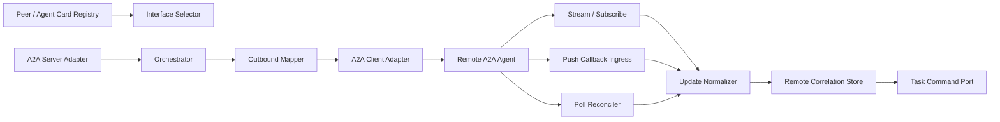

# A2A integration

Status: Proposed
Owners: Federation gateway maintainers
Depends on: [Agent Registry](agent-registry.md), [Artifact Service](artifact-service.md), [Identity and secrets](identity-tenancy-and-secrets.md)

## 1. Problem

AgentMesh 需要委托独立部署、跨语言或跨团队 Agent，同时在断流、重复 push、超时、版本升级和远程失败下保持内部 Task 最终收敛。A2A 对象必须通过适配层映射，不能直接定义内部业务模型。

## 2. Protocol baseline and roles

目标基线为官方 [A2A latest v1 specification](https://a2a-protocol.org/latest/specification/)，支持协议协商后的 JSON-RPC、HTTP+JSON/REST 或 gRPC binding；首个实现优先选择生态和 SDK 最成熟的一种，其他 binding 通过同一 Port 添加。

AgentMesh 支持两种角色：

- A2A Client：向已准入 Peer 委托内部 Run。
- A2A Server：将经过显式发布的 AgentMesh Agent/Skill 暴露给可信 Client。

两个角色共享 canonical adapter，但使用独立 ingress/egress 身份、网络和配额。

## 3. Responsibilities

- 发现、验证、缓存和版本化 Agent Card/extended card。
- 管理 Peer、endpoint/interface、协议版本、认证和 circuit breaker。
- 映射 Message、Task、TaskStatus、Artifact 和 context。
- 选择 streaming、subscribe、push notification 或 polling 更新方式。
- 保存 RemoteTaskCorrelation、delivery cursor 和 external operation evidence。
- 验证回调、去重、处理取消和 late result。
- 导入/导出 Artifact 时执行访问、扫描和分类策略。

## 4. Non-responsibilities

- 不用 A2A 替代同进程 LangGraph node 调用。
- 不相信 Agent Card 等于内部 verified capability。
- 不把 remote task ID 用作内部主键。
- 不向远程 Peer 暴露内部 Checkpoint、Prompt、secret 或完整审计。
- 不保证远程 cancel 能撤销已发生副作用。

## 5. Components

## 6. Peer and card model

`A2APeer`：owner、tenant visibility、trust tier、base discovery URL、allowed interfaces/bindings、auth profile、network policy、status。

`AgentCardSnapshot`：raw/canonical card ref、digest、signature result、fetched/expiry、protocol/interfaces、skills、security schemes、capabilities、extended-card access result。

`A2AEndpoint`：peer、interface URL、binding、protocol version range、health/circuit、region。Card refresh 使用 cache headers 和 TTL；签名/endpoint/schema 变化产生审核事件。

## 7. Outbound delegation flow

1. Scheduler 选择 verified remote Agent Version/Peer，并创建 Assignment。
2. Gateway 固定 Card snapshot、interface、protocol version 和 auth scheme。
3. 内部 objective/contract 映射为 A2A Message Parts；大输入使用受控 Artifact URL/ref。
4. 发送请求并使用稳定 internal message/invocation identity；保存 response 前不假设 remote ID。
5. Peer 可能立即返回 Message 或创建 stateful Task：
   - Message：规范化为候选结果，内部仍执行验收。
   - Task：创建 RemoteTaskCorrelation，Run 进入 WAITING_REMOTE。
6. 更新通过 stream/push/poll 进入同一 Normalizer 和 Inbox。
7. remote completed 只表示候选远程完成；Artifact ingest/scan/contract validation 后才提交内部 Run success。

## 8. State mapping

| A2A semantic state | Internal behavior |
|---|---|
| submitted/working | Run WAITING_REMOTE/RUNNING，更新 progress hint |
| input-required | 创建 InputRequest，Run WAITING_INPUT |
| auth-required | 创建受控 authorization/approval flow，不把 credential 发给模型 |
| completed | ingest artifacts/message，验证后提交 candidate success |
| failed | Run dependency failure，保留 remote error category |
| rejected | permanent business rejection，通常不原样重试 |
| canceled | 确认 remote cancel；内部按本地 cancel intent 收敛 |
| unknown/new future state | 保存原值，不推进终态；触发 compatibility/reconcile |

外部状态不会直接写入内部 enum；Mapper 输出版本化 normalized update。

## 9. Update delivery strategy

- 首选 streaming 用于活跃交互和低延迟进度。
- Subscribe 用于已知 Task 的重连/继续更新。
- Push 用于长任务和 Client 离线，必须使用 per-task opaque callback URL/config、强认证和去重。
- Polling 是恢复/兼容 fallback，使用 backoff、ETag/cursor 和 deadline。
- 任何单一通道断开都不等于 Task 失败；Poll Reconciler 查询权威 remote Task。
- 多通道同时收到相同更新时按 remote event identity/state version 去重。

## 10. Inbound A2A server flow

- 只暴露 Registry 中标记 `a2a-published` 的 Agent Version/Skill 和生成的 Agent Card。
- Client principal、tenant mapping、scope、quota 和 data classification 在入口验证。
- Stateless Message 仅用于明确短耗时/无跟踪需求；否则创建内部 Task/Run correlation。
- A2A Task 状态由内部业务事件投影，不能查询 LangGraph 表拼装。
- Push callback credential/config 按 client+task 隔离，delivery 至少一次。
- Client 的 Artifact/URL 先进入 quarantine/validation，不能直接注入 Runtime。

## 11. Identity and authorization

- 支持 Card 声明的 security scheme，但平台 policy 决定允许的组合。
- TLS server identity 必须验证；高信任 Peer 可要求 mTLS、signed card 或 workload identity。
- OAuth token 绑定目标 A2A resource/audience；禁止把用户/API bearer token透传给 Peer。
- remote auth-required 通过受控 user/delegated flow 处理，凭证不进入 A2A Message history。
- Push ingress 验证来源认证、callback token/audience、expected peer/task 和 replay window。
- 跨组织只传 opaque correlation，不暴露内部 tenant/user ID，除非有数据共享协议。

## 12. Idempotency and uncertainty

- 每次 send 使用稳定 outbound message identity 和内部 idempotency key；若 binding/peer 不保证去重，超时后先 get/list/reconcile。
- RemoteTaskCorrelation 在 peer + remote task scope 唯一。
- Push/stream update 通过 Inbox；artifact chunk/update 使用 artifact identity + append/last semantics 去重。
- cancel request 重复安全；remote “cannot cancel” 作为结果而非网络异常。
- 远程副作用 outcome unknown 时不自动创建第二个 remote task，除非策略允许并能识别重复风险。

## 13. Artifact exchange

- 首选内容哈希和受控短期 URL；URL 绑定 peer、artifact、method、expiry 和 size。
- 外部 file/data Part 映射为 Artifact ingest job，验证 media type、size、hash、malware、classification 和 provenance。
- Artifact streaming/chunks 保存在临时对象，final 标记后才可被 Task 完成使用。
- 外部 URL 不永久保存为可公开访问链接；需要保留时保存 external reference + access policy。
- 向外发送 restricted 内容需 egress PolicyDecision 和目的 Peer agreement。

## 14. Failure model

| Failure | Behavior |
|---|---|
| Card/endpoint unavailable | 使用未过期 verified snapshot 或 fail closed，按 trust tier |
| send timeout before remote ID | reconcile/list by correlation；不能证明则 outcome unknown |
| stream disconnect | subscribe/poll；不标 failed |
| duplicate/out-of-order push | Inbox + remote state/version guard |
| callback spoof/replay | 401/403、审计、安全告警，不推进任务 |
| peer returns unknown state/version | 保留原文、暂停自动推进、compatibility alert |
| remote completed but artifact invalid | 内部 validation failed/revision，不接受 remote terminal |
| local canceled, remote later completes | late result 保存，内部终态不覆盖 |

## 15. Observability and SLO

指标：card freshness/signature、peer health/circuit、delegation latency、remote task duration、stream reconnect、push duplicate/auth failure、poll rate、state lag、late result、artifact ingest failure。

Trace：outbound send、remote wait 使用 span link/periodic trace，stream/push update 独立 linked spans。记录 peer/card/version/binding/internal+opaque correlation，不默认记录 Message/Artifact 内容。

每 Peer 配置 SLO 和 maximum outstanding tasks；SLO 降级影响 Scheduler score/circuit，但不修改已完成历史。

## 16. Compatibility testing

- 使用官方 v1 conformance fixtures/SDK test server 验证 Card、Message/Task、stream、subscribe、push、cancel 和 bindings。
- 验证未知字段、未知 state、protocol negotiation 和 extension allowlist。
- 故障注入：响应丢失、重复 push、乱序、断流、callback spoof、late completion。
- 双向 contract tests 验证 AgentMesh client/server 的 Artifact 和 error mapping。
- Card refresh/rotation 时 active correlation 仍使用绑定的 snapshot。

## 17. Acceptance criteria

- 任一 remote update 可追溯到 peer、card snapshot、interface、internal Run 和原始 delivery。
- stream/push/poll 任一故障不会单独造成错误终态。
- 远程 completed 必须经过内部 Artifact/contract/policy 验证。
- A2A 对象不直接成为内部 Task/Run/Artifact 数据库模型。
- AgentMesh 作为 Client 和 Server 时均执行身份、租户、配额和数据策略。
