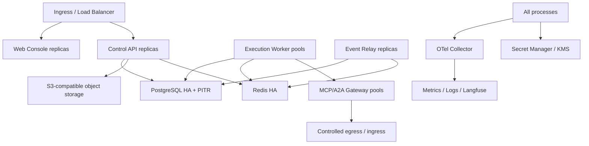

# Deployment and operations

Status: Proposed
Owners: Platform operations maintainers
Depends on: All formal L2 modules

## 1. Problem

正式版需要从单机开发平滑演进到单区域高可用私有化部署，支持升级、备份、恢复、扩缩容和安全运营。部署拓扑必须尊重数据/凭证/公网入口信任边界，而不是简单把每个模块拆成微服务。

## 2. Responsibilities

- 定义开发、测试、生产部署单元和依赖。
- 定义配置、feature flag、secret、migration 和 release 流程。
- 定义 readiness/liveness/startup、graceful shutdown 和 autoscaling。
- 定义备份、PITR、灾难恢复、数据保留和 restore drill。
- 定义容量模型、SLO、告警、runbook 和故障处置。
- 定义安全网络、镜像/供应链和运维权限边界。

## 3. Non-responsibilities

- 不要求首版多区域 active-active。
- 不用 Redis 持久化替代 PostgreSQL backup。
- 不在应用容器内自动执行生产 migration。
- 不因“云原生”预先拆分所有模块。
- 不承诺底层 Langfuse/Object Store/Secret Manager 产品的全部运维，由部署 profile 选择。

## 4. Deployment profiles

### Local development

Docker Compose：PostgreSQL、Redis、S3-compatible storage、可选 Langfuse + API/Worker/Relay/Console。支持 deterministic Agent，无云密钥即可跑核心路径。

### Single-node private preview

同一主机/小集群，应用进程分开，数据库和对象存储可由外部托管。只用于非关键工作，明确无 HA。

### Production single-region

## 5. Process allocation and scaling

| Process | Scale signal | Failure isolation |
|---|---|---|
| Web Console | HTTP traffic/CDN | 静态发布独立回滚 |
| Control API | request/latency/CPU | 不运行长 Agent |
| Execution Worker pools | ready queue age、active slots、provider quota | 按 trust/resource/model pool 隔离 |
| Event Relay | outbox age/rate | 与 API/Worker 独立 |
| MCP Gateway | tool QPS/session/egress trust | 凭证和网络边界 |
| A2A Gateway | remote tasks/stream/push ingress | 公网入口和 Peer circuit |
| Scanner/Evaluator/Reconciler | own queue age | 低优后台独立资源 |

初始 MCP/A2A adapter 可在 Worker，但生产 restricted credential/public ingress profile 应拆出。

## 6. Configuration and secrets

- 配置分层：immutable build defaults → deployment config → tenant policy；环境变量只用于 bootstrap references。
- 配置有 schema/version、startup validation 和 redacted effective-config endpoint。
- feature flag 有 owner、scope、expiry 和 rollback；安全 guard 不能由普通 flag 关闭。
- secret 只通过 SecretReference/workload identity 加载，不进入 image、Git、ConfigMap 或日志。
- Prompt/Agent/Policy/Graph 使用版本化业务资源，不混在未审计环境变量。

## 7. Startup and health

- startup：加载配置、验证 DB schema compatibility、初始化 connection/telemetry、编译必要 graph/version cache。
- liveness：只证明进程 event loop 可响应，不检查所有外部依赖，避免级联重启。
- readiness：检查必需数据库/Checkpointer、队列角色和 secret bootstrap；Gateway 检查基础网络/credential provider。
- dependency health（model/MCP/A2A/Langfuse）作为能力级状态，不必让整个 API not ready。
- migration mismatch、revoked build、invalid policy signature 应 fail startup/readiness。

## 8. Graceful shutdown

- API 停止新请求，完成短事务，关闭 SSE 并发 reconnect hint。
- Worker 停止领取，标记 draining，等待安全 node boundary；无法完成则保存 checkpoint/释放或让 lease expiry。
- Relay 停止 claim，完成或放弃当前 batch claim。
- Gateway 关闭新 session，等待有上限的 active calls，保存 outstanding operation refs。
- shutdown grace 到期后强制退出不能伪造成功；新副本/Reconciler 收敛。

## 9. Release and migration

Release artifact：签名 container image、SBOM、provenance、Python/JS dependency lock、Graph/Agent/Policy compatibility manifest。

顺序：

1. preflight backup/health/capacity。
2. expand database migration job。
3. 部署兼容 API/Relay/Worker canary。
4. backfill/dual read-write/feature flag。
5. 部署全部副本并观察 SLO。
6. contract migration 在旧实例、旧 events、active threads 清零后执行。

Active Run 固定 Graph/Agent Version；新代码必须恢复支持窗口内旧版本。不能恢复时升级前暂停接新任务并完成/迁移 active Run。

## 10. High availability

- Control API/Worker/Relay 无状态多副本，session/lease 在共享系统。
- PostgreSQL 使用同步/异步 HA 按 RPO profile、自动 failover 需防 split brain。
- Redis 使用主从/Sentinel/cluster 或托管 HA；丢失可从 DB recovery，但会造成延迟。
- Object store 启用 versioning、replication/erasure code 和 lifecycle。
- OTel/Langfuse outage 与业务隔离，bounded buffer。
- 单个 provider/MCP/A2A peer circuit 不拖垮 Worker pool；bulkhead 按依赖隔离。

## 11. Backup and disaster recovery

权威备份：PostgreSQL base backup + WAL/PITR、对象存储 version/replication、Secret Manager/KMS backup policy、部署配置/registry/policy export。Redis 无需作为业务恢复源。

初始生产目标候选：

- PostgreSQL/业务 RPO ≤ 5 分钟，RTO ≤ 30 分钟。
- 对象内容 RPO 取决于存储 replication，metadata/content 必须按一致恢复点 reconcile。
- 单可用区应用故障 RTO ≤ 10 分钟。
- 多区域灾难恢复为后续 profile，不在首版承诺。

每季度 restore drill：恢复隔离环境、校验 schema/row counts/hashes、启动 Reconciler、抽样 Task→Run→Artifact→Audit 链路。未演练的备份不视为可用。

## 12. Failure operations

Runbook 至少覆盖：DB failover、Redis loss/backlog、object store outage、Worker stuck/lease storm、Outbox lag、Langfuse/OTel outage、model provider rate limit、MCP compromise、A2A callback attack、secret revoke、bad Agent/Policy/Graph release、artifact malware。

运维动作使用 authenticated admin command 和 reason，不直接修数据库。必要的 break-glass SQL 需双人审批、只读优先、完整记录和事后领域修复。

## 13. Security posture

- 网络分区：public ingress、control plane、worker、integration egress、data stores、observability。
- 默认 deny network policy；Worker 不直接任意访问公网，走 MCP/A2A/Model gateways 或 egress proxy。
- 容器 non-root、read-only rootfs、seccomp/capability drop、resource limits、image signature policy。
- PostgreSQL/Redis/Object/OTel/Langfuse TLS 和独立 workload identities。
- dependency/image 定期扫描；critical vulnerability 有 revoke/rollout SLO。
- 管理面、backup、KMS 和 break-glass 权限分离。

## 14. Capacity model

关键量：API RPS、Task creation rate、ready/active Runs、average graph steps、model/tool concurrency、Outbox events、checkpoint bytes、Artifact bytes、SSE connections、A2A streams、MCP sessions。

容量规划从 Little's Law 和 provider quotas 推导 Worker slots，不仅按 CPU。每 tenant/Agent/model/tool/peer 设置 concurrency 和 queue cap。达到 70/85/95% 分级预警，自动扩容前仍受外部 quota 和 DB connection budget 限制。

## 15. SLO and error budgets

首个正式单区域候选：

- Control API read/command availability 99.9%（不含已接受长任务完成）。
- 已 commit Command/Domain Event 不因应用重启丢失。
- execution wakeup p95 < 10 秒（资源/配额可用时）。
- expired Worker lease p95 在 2 个 lease interval 内被发现。
- Outbox oldest age 正常 p95 < 5 秒。
- critical approval/cancel command p95 < 2 秒提交。

最终值在压测和目标场景明确后接受；SLO 违反使用 error budget 控制发布速度。

## 16. Observability and runbooks

每个部署单元提供 golden signals、build/version、config revision、dependency/circuit、queue/lease 和 readiness reason。Dashboard 以用户 Task 成功/等待为入口，而不只看 CPU。

告警链接 owner、severity、impact query、runbook 和 rollback/reconcile 操作。告警/运维事件进入平台 Audit/incident timeline。

## 17. Testing and release gates

- Compose smoke + production-like integration environment。
- migration from previous release、mixed-version compatibility、rollback window。
- chaos：kill API/Worker/Relay/Gateway、DB failover、Redis flush、network partition、OTel outage。
- load：大 DAG、长 SSE、大 Artifact、provider throttling 和 approval surge。
- backup/restore、secret rotation/revoke、image rollback。
- security scan/SBOM/signature/policy、tenant isolation and egress tests。

## 18. Acceptance criteria

- 任意一个应用进程重启不会丢已提交业务事实或造成无法解释的重复副作用。
- 生产 migration 独立执行，支持 mixed-version expand/contract 窗口。
- PostgreSQL 和 Artifact 可从备份恢复，并由 Reconciler 收敛到一致业务状态。
- 依赖故障有 bulkhead/backpressure，不会无限耗尽 Worker/DB/磁盘。
- 部署、回滚、revoke、restore 和 break-glass 都有可演练 runbook 与审计。
