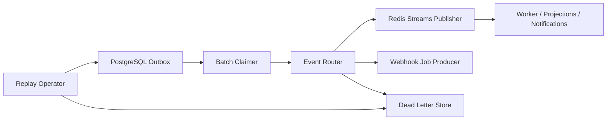

# Event Relay

Status: Proposed
Owners: Platform runtime maintainers
Depends on: [Cross-module contracts](cross-module-contracts.md), [Persistence and consistency](persistence-and-consistency.md)

## 1. Problem

业务事务需要可靠唤醒 Worker、更新投影和通知外部消费者，但数据库提交不能与 Redis 或 webhook 形成原子事务。Event Relay 将 Transactional Outbox 转为至少一次投递，并提供可操作的重试和死信机制。

## 2. Responsibilities

- 批量领取、发布并确认 Outbox Event。
- 将领域事件路由到 Redis Streams、内部 webhook job 或 projection topic。
- 管理 retry schedule、delivery attempt、dead letter 和 replay。
- 暴露 backlog、lag、错误和消费者健康状态。

## 3. Non-responsibilities

- 不拥有业务状态，不修改领域聚合。
- 不提供 exactly-once 承诺。
- 不把 Redis 消费位置当审计记录。
- 不在 Relay 中实现领域补偿或修改 Event payload。

## 4. Components

## 5. Routing

逻辑 channel 按用途分离：

- execution wakeups：低延迟、严格背压。
- domain events：投影、审计导出、通知。
- integration callbacks：A2A/MCP 异步处理。
- maintenance jobs：reconcile、scan、cleanup。

物理 Stream 数量不是按 Task 创建。partition key 默认 tenant + aggregate ID，保证同一聚合事件尽量落到同一有序分区。跨聚合不承诺全局顺序。

## 6. Publish flow

1. Claimer 使用 SKIP LOCKED 获取 available、未发布 rows，并写短期 claim owner/expiry。
2. Router 校验 schema/version 和 destination allowlist。
3. Publisher 写 Redis Stream，metadata 包含 message ID、schema、partition、trace context。
4. 成功后在 PostgreSQL 标记 published_at 和 broker reference。
5. 失败按分类设置 next_attempt_at；达到上限进入 dead letter metadata 并告警。

单个坏消息不得阻塞整个 batch；同一 aggregate 的后续事件可以暂缓，避免明显乱序。

## 7. Consumer contract

- 使用 consumer group 获取消息。
- 开始处理前检查 Inbox；业务 commit 与 Inbox complete 同事务。
- transient failure 不 ack，或记录 retry job 后 ack 原消息。
- permanent validation/security failure 写 rejection/dead letter 并 ack，防止无限循环。
- consumer reclaim pending messages 前检查 idle time 和当前 owner heartbeat。
- 处理顺序缺口时重新读取权威聚合，不依赖等待丢失事件。

## 8. Retry and dead letter

错误分类：

- transient dependency：指数退避 + jitter。
- rate limit：尊重 retry-after 和租户配额。
- schema unsupported：暂停对应 route，要求部署兼容 consumer。
- authorization/configuration：进入运营队列，不快速重试。
- poison payload：隔离并触发安全/开发告警。

Replay 必须由有权限 Operator 发起，指定范围、原因、目标 consumer 和速率；Replay 产生新的 delivery ID，但保留原 message ID 以便 Inbox 选择“重新处理授权”或正常去重。

## 9. Backpressure

- Outbox backlog 超阈值时，Control API 可以拒绝非关键批量工作，但不能丢弃已提交 Event。
- Worker Stream backlog 影响 Scheduler admission control。
- 每租户设置发布/消费公平性，避免单个大租户占满 batch。
- Webhook 与外部通知使用独立 queue/limit，不能阻塞内部 execution wakeup。

## 10. Failure model

- Relay 副本崩溃：claim 过期后其他副本重新领取。
- Redis 不可用：Outbox 累积，业务事务仍可在容量阈值内提交；超过保护阈值启用 admission control。
- Redis 写成功、DB 标记失败：重复发布，consumer Inbox 去重。
- Consumer 崩溃：pending entry 由同组实例 reclaim。
- Redis 全部数据丢失：从未过保留期的 Outbox 和业务状态生成 recovery wakeup；Redis 不是权威源。
- 错误 replay：Inbox 和 domain guards 阻止重复业务变化；所有 replay 可审计。

## 11. Security

- Producer destination 来自代码/配置 allowlist，不能由用户任意指定 Stream。
- Redis 使用 TLS、ACL、独立 service identity，不暴露公网。
- Event visibility 决定哪些字段可进入外部 webhook；internal event 不直接外发。
- dead letter payload 可能敏感，访问权限和保留期不低于源数据要求。
- webhook delivery 与 A2A push 由各自 integration 模块签名和验证，Relay 只派发 job。

## 12. Observability

指标：outbox oldest age、publish rate/error、claim expiry、stream length/pending、consumer lag、retry distribution、dead letter count、replay throughput、tenant fairness。

每次 publish/consume 建 span link 到原 trace，不制造无限长 parent-child Trace。日志包含 message、schema、aggregate、attempt、broker ref，不记录敏感 payload。

## 13. Capacity and deployment

- Relay 是无状态独立进程，可水平扩展。
- batch size、claim TTL、poll interval、max attempts 和 Stream trim 由配置管理。
- Stream trim 只影响可重建投递历史；Outbox/Audit 保留独立。
- 首版使用 Redis Streams；Publisher/Consumer Port 允许未来切换 NATS JetStream，不改变领域 Event。

## 14. Testing

- fault injection 覆盖 claim、publish、mark、consume、commit 和 ack 的每个崩溃窗口。
- 重复、乱序、缺口、poison payload、consumer reclaim 和 schema unsupported fixtures。
- Redis flush/restart 后从 PostgreSQL 恢复必要 wakeup 的演练。
- 多租户 backlog/weighted fairness/背压负载测试。
- replay 权限、scope、rate 和 audit 安全测试。

## 15. Acceptance criteria

- 故障注入证明 publish/mark 和 process/ack 窗口只导致重复、不丢业务事实。
- 同一 message 重复 10 次仍只产生一次领域结果。
- Redis 清空后可以从 PostgreSQL 恢复必要 wakeup。
- poison message 可隔离、告警、检查和受控 replay。
- backlog 会触发可观测背压，不会静默耗尽数据库或内存。
