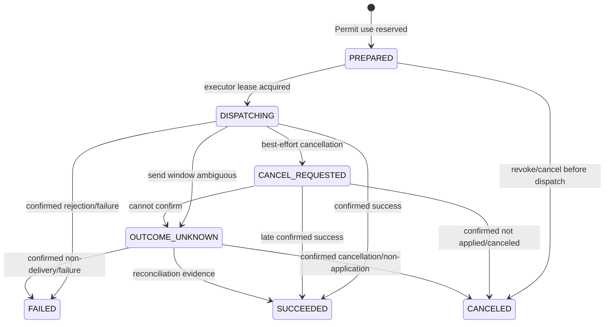

# Governed Action Protocol v0.1

Status: Accepted design baseline
Owners: Governance, identity, and integration maintainers
Parent decision: [ADR 0007](../../../adr/0007-framework-neutral-agent-control-plane.md)
Tracks: [#137](https://github.com/0YHR0/AgentMesh/issues/137)

## 1. Purpose

This protocol turns an Agent's proposed real-world action into narrowly scoped, auditable execution
authority:

```text
ActionIntent
  → PolicyDecision
  → ApprovalRequest/Decision (optional)
  → ExecutionPermit
  → ActionExecution
  → ExecutionReceipt
  → Reconciliation (when required)
```

It is shared by MCP writes, A2A delegation, credential-affecting operations, external adapters, and
future runtime SDKs. It does not grant an Agent general tool access and does not promise
exactly-once behavior from an external system.

## 2. Trust boundary and invariants

1. An Agent/runtime may propose an `ActionIntent`; only the trusted Policy/Governance service may
   evaluate it, record approval, or issue a Permit.
2. A Permit is bound to one canonical action hash, effective Agent Principal/delegation, policy
   decision, obligations, resource, environment, use limit, and expiry.
3. The executor validates current identity, resource, policy/revocation, Permit, schema/version, and
   constraints immediately before reserving execution.
4. Permit use is reserved atomically with creation of a durable `ActionExecution` before any network
   side effect. Success is not required to consume that use.
5. Repeating the same execution uses the same `action_execution_id`, external operation ID, and
   idempotency key. A new execution/Permit is not silently minted after failure.
6. Non-idempotent/irreversible actions with an ambiguous dispatch window become `OUTCOME_UNKNOWN`.
   They are never blindly replayed.
7. Approval is evidence and consent, not authority by itself. Only a valid Permit authorizes the
   gateway.
8. Parameter, principal, delegation, resource version, tool/schema digest, side-effect class, or
   security obligation changes invalidate the old action hash/Permit.
9. Policy/approval/Permit state is PostgreSQL authority. Runtime memory, headers, model output, and
   telemetry cannot create or widen authority.
10. Every transition records tenant, actor, principal chain, correlation/causation, reason, version,
    and safe evidence.

## 3. Entity separation

The existing `GovernedAction` implementation may remain as a compatibility aggregate during
migration, but protocol v0.1 has distinct logical records:

| Entity | Mutability and owner |
|---|---|
| `ActionIntent` | immutable proposal; Governance owner |
| `PolicyDecision` | immutable evaluation result; Policy owner |
| `ApprovalRequest` | stateful request bound to intent/decision/action hash |
| `ApprovalDecision` | immutable human/service decision event |
| `ExecutionPermit` | stateful bounded authority; Governance owner |
| `PermitUse` | immutable reservation/consumption record |
| `ActionExecution` | durable external-operation lifecycle; integration owner |
| `ExecutionReceipt` | immutable normalized outcome evidence |
| `ReconciliationRecord` | immutable operator/automatic resolution evidence |

Separating them prevents an approval status update from rewriting the original intent/decision and
allows multiple explicitly authorized uses only when policy requested `max_uses > 1`.

## 4. Canonical ActionIntent

```json
{
  "schema_name": "agentmesh.action-intent",
  "schema_version": 1,
  "intent_id": "uuid",
  "tenant_id": "default",
  "requester_principal_ref": "principal-context-ref",
  "task_id": "uuid",
  "run_id": "uuid",
  "attempt_id": "uuid",
  "action": "github.pull-request.merge",
  "resource": {
    "type": "github.pull-request",
    "id": "repo/name#123",
    "version": "head-sha"
  },
  "parameters": {},
  "parameter_schema_digest": "sha256",
  "provider_binding": {
    "kind": "mcp-tool",
    "provider_version_id": "uuid",
    "operation": "merge",
    "operation_schema_digest": "sha256"
  },
  "side_effect_class": "irreversible",
  "idempotency_strategy": "provider_key",
  "requested_external_operation_id": "opaque-stable-id",
  "data_classification": "internal",
  "budget_impact": {},
  "evidence_refs": [],
  "requested_at": "RFC3339",
  "expires_at": "RFC3339",
  "canonicalization_version": "agentmesh-action-v1",
  "action_hash": "sha256"
}
```

Rules:

- `parameters` are validated before canonicalization and size-bounded; large content is an
  ArtifactRef.
- Secret values are replaced by stable SecretReference/audience/purpose metadata.
- Maps sort by Unicode key, arrays preserve order unless the schema explicitly marks them as sets,
  numbers use canonical JSON representation, timestamps normalize to UTC, and absent differs from
  null.
- The canonical hash includes tenant, effective requester/delegation digest, action/resource and
  resource version, parameters, provider/tool/schema version, side-effect class, idempotency
  strategy, budget/data classification, expiry, and canonicalization version.
- Cross-language golden vectors define the exact byte representation. Implementations must not use
  language-default object serialization as the authority.

## 5. PolicyDecision

Immutable fields:

```text
decision_id, intent_id, action_hash
policy_bundle_id/version/digest
subject/delegation snapshot digest
resource/environment snapshot digests
result = ALLOW | DENY | REQUIRE_APPROVAL | ALLOW_WITH_CONSTRAINTS
reason_codes
obligations/constraints
evaluated_at, expires_at
decision_digest
```

Security-relevant obligation names are versioned closed identifiers. An executor that does not
understand an obligation rejects the Permit. Examples include argument caps, approved endpoint,
redaction, evidence retention, network profile, approver stages, execution window, or required
reconciliation method.

Commit-time validation re-evaluates immutable guards and current revocation. Full policy
re-evaluation is required when the decision expired, a decision input changed, or the Permit says
`recheck_at_execution=true`.

## 6. Approval

### 6.1 ApprovalRequest state

```text
PENDING
  → APPROVED | REJECTED | EXPIRED | CANCELED | SUPERSEDED
```

`APPROVED` means the configured stages/quorum completed. It does not execute the action. Parameter
or decision changes create a new Intent/Request and mark the old request `SUPERSEDED`.

### 6.2 ApprovalDecision

Each immutable decision includes request/stage, approver Principal, outcome, reason, evidence
snapshot digest, authentication strength, decided time, and idempotency key. Eligibility and
separation-of-duty are evaluated at decision time, not trusted from UI state.

Repeated same-key/same-content decisions return the original result. Same key/different content is
a conflict. Concurrent approve/reject uses request version/CAS; the first legal transition wins and
all evidence remains visible.

## 7. ExecutionPermit

```text
permit_id
tenant_id
intent_id/action_hash
decision_id/decision_digest
approval_request_id/approval_digest (optional)
principal_context_ref/delegation_digest
action/resource/provider binding
obligations_digest + normalized constraints
allowed_environment/profile
idempotency_strategy
max_uses (default 1, bounded)
reserved_uses/remaining_uses
issued_at/not_before/expires_at
revocation_epoch/status
permit_digest
```

Permit states:

```text
ISSUED → PARTIALLY_USED → EXHAUSTED
ISSUED/PARTIALLY_USED → EXPIRED | REVOKED
```

`max_uses > 1` is allowed only for an explicitly batch-safe/idempotent policy. Each use has a unique
stable use key and its own ActionExecution. A Permit is an opaque reference at untrusted runtime
boundaries; possession alone is insufficient because the gateway reloads authoritative state and
effective principal.

Revocation does not rewrite an in-flight external outcome. It prevents unreserved uses and causes
reserved-but-not-dispatched executions to stop. Already ambiguous dispatches reconcile.

## 8. ActionExecution state machine



`FAILED` is allowed only when the provider or reconciliation evidence proves the effect was not
successfully applied. Transport timeout after possible send is `OUTCOME_UNKNOWN`, not `FAILED`.

ActionExecution fields include Permit use, Run/Attempt/fencing token at creation, gateway/provider,
stable external operation/idempotency identity, dispatch lease/fencing, status, request/response
digests, safe error, receipt refs, timestamps, and version.

## 9. Execution protocol

### 9.1 Reserve authority transaction

Under Governance lock order (Intent → Permit → PermitUse/ActionExecution):

1. authenticate effective Principal and tenant;
2. load current Intent/Decision/Approval/Permit;
3. validate action hash, schemas, resource/provider versions, constraints, time, environment,
   revocation, separation-of-duty, and remaining uses;
4. create `PermitUse` and `ActionExecution(PREPARED)` with stable use/execution keys;
5. increment reserved use and write audit/outbox/idempotency outcome;
6. commit.

No external call occurs in this transaction. Reserving a use consumes that authority even when the
external call later fails; policy may explicitly authorize a new Intent/use.

### 9.2 Dispatch

1. executor claims ActionExecution with lease/fencing token;
2. commits `DISPATCHING` before crossing the external boundary;
3. calls provider with stable external operation/idempotency identity when supported;
4. normalizes and commits one receipt/outcome with fencing validation;
5. emits outcome event and wakes the waiting Runtime/Run through normal commands.

If the process dies after `DISPATCHING`, the replacement executor first queries provider state using
the same external operation ID. It may replay only when provider idempotency semantics prove replay
safe. Otherwise it records `OUTCOME_UNKNOWN`.

## 10. Provider side-effect classes

| Class | Default behavior |
|---|---|
| `read_only` | no Permit required unless data policy says otherwise; normal bounded retry |
| `idempotent_write` | Permit required; stable provider key; retry same ActionExecution |
| `non_idempotent_write` | Permit required; query/reconcile before any retry |
| `irreversible` | Permit + explicit policy/approval; default one use; no blind retry |

Provider registration must declare operation identity/query/cancel guarantees. Self-declared
guarantees are reviewed and version-pinned; schema drift suspends incompatible execution.

## 11. ExecutionReceipt

Normalized immutable fields:

```text
receipt_id, action_execution_id
provider/provider_version/operation
external_operation_id
outcome = SUCCEEDED | FAILED | CANCELED | OUTCOME_UNKNOWN
provider_status + safe reason category
request_digest/response_digest
result Artifact/evidence refs
usage/cost
started_at/completed_at/observed_at
receipt_digest
```

Raw provider response is stored only when policy allows and usually as classified Artifact evidence.
The receipt cannot contain a credential, signed URL, full sensitive parameters, or arbitrary stack
trace.

## 12. Reconciliation

Reconciliation is a governed command, not a database edit. It records:

- ActionExecution and prior `OUTCOME_UNKNOWN` evidence digest;
- method (`provider_query | external_ledger | callback | operator_evidence`);
- normalized evidence refs and observed external version/time;
- resolution (`SUCCEEDED | FAILED | CANCELED`);
- actor Principal, authorization/Permit where required, reason, and idempotency key.

Automatic reconciliation may resolve only with a registered deterministic method. Operator
resolution requires the `outcome:reconcile` permission, cannot be performed by the requester for
configured high-risk actions, and preserves both original and resolution evidence. Resolution never
pretends the original response was received.

## 13. Application ports and SDK

Illustrative ports:

```python
class GovernedActionPort(Protocol):
    def propose(self, intent: ActionIntentDraft, *, idempotency_key: str) -> IntentResult: ...
    def get(self, intent_id: UUID) -> GovernedActionSnapshot: ...
    def reserve_execution(
        self, permit_id: UUID, request: ExecutionRequest, *, idempotency_key: str
    ) -> ActionExecutionRef: ...

class ActionGateway(Protocol):
    def execute(self, execution: ActionExecutionRef) -> ExecutionReceipt: ...
    def inspect(self, execution: ActionExecutionRef) -> ExecutionReceipt | None: ...
    def request_cancel(self, execution: ActionExecutionRef) -> LifecycleReceipt: ...
```

The external SDK exposes DTO construction/validation, canonicalization test vectors, safe proposal,
status query, and governed gateway invocation. It does not expose repository or Permit-minting APIs.

## 14. Error contract

Stable protocol errors include:

```text
ACTION_SCHEMA_INVALID
ACTION_HASH_CONFLICT
POLICY_DENIED
APPROVAL_REQUIRED / APPROVAL_NOT_EFFECTIVE
PERMIT_REQUIRED / EXPIRED / REVOKED / EXHAUSTED / MISMATCH
OBLIGATION_UNSUPPORTED
RESOURCE_VERSION_CHANGED
EXECUTION_ALREADY_RESERVED
EXECUTION_FENCE_STALE
PROVIDER_SCHEMA_DRIFT
EXTERNAL_OUTCOME_UNKNOWN
RECONCILIATION_EVIDENCE_INVALID
```

Errors use the common category/retry contract. Security denial details shown to an Agent are safer
and less specific than operator/audit evidence.

## 15. Persistence and migration

Target logical tables:

- `action_intents`
- `policy_decisions`
- `approval_requests`
- `approval_decisions`
- `execution_permits`
- `permit_uses`
- `action_executions`
- `execution_receipts`
- `action_reconciliations`

Migration from current `GovernedAction`:

1. expand new nullable/link tables and protocol DTOs;
2. dual-read existing action/approval/Permit through a compatibility projector;
3. route one MCP idempotent-write path through the new reserve/execute flow behind a gate;
4. backfill immutable intent/decision/permit snapshots for active records where evidence is
   sufficient; mark incompatible history `legacy` without inventing missing facts;
5. migrate A2A and remaining governed action types;
6. remove the combined write path after active legacy actions drain and rollback window closes.

## 16. Versioning

- DTO major versions follow cross-module rules.
- Canonicalization has its own version and cross-language golden vectors.
- An action hash never changes in place; changed canonicalization creates a new Intent version.
- Executors support the current and previous protocol major during the compatibility window.
- Unknown obligations or side-effect classes fail closed even when the JSON schema accepts them.
- Historical receipts remain readable without re-evaluating them under new policy.

## 17. Conformance and security tests

Required black-box cases:

1. same proposal key/same content is stable; different content conflicts;
2. canonical hash vectors match across implementations;
3. self-approval and ineligible approver fail;
4. changed arguments/resource/tool/principal/policy invalidate authority;
5. expired/revoked/exhausted Permit cannot reserve execution;
6. concurrent reservations never exceed `max_uses`;
7. reserve transaction creates no external call;
8. duplicate dispatch uses one ActionExecution/external operation ID;
9. crash before/after DISPATCHING converges according to provider guarantees;
10. response loss after successful fake external write creates no duplicate write;
11. ambiguous non-idempotent result becomes `OUTCOME_UNKNOWN`;
12. only valid reconciliation authority/evidence resolves unknown outcome;
13. stale executor fencing cannot record a receipt;
14. unknown obligation/provider drift fails closed;
15. SDK payload/log/error contains no secret value.

The deterministic fake provider keeps an append-only external ledger so tests can independently
count actual side effects rather than trusting AgentMesh state.

## 18. Implementation exit criteria

- MCP idempotent writes and one fake non-MCP action use the same protocol path.
- A non-LangGraph runtime can propose an Intent and wait/resume without receiving authority to mint
  PolicyDecision, Approval, or Permit.
- Every execution query reconstructs requester/delegation, policy, approval, Permit use, provider
  operation, receipt, and reconciliation evidence.
- Ambiguous external outcomes cannot expose a normal Retry action in API/Console.
- Existing governed operations migrate without weakening current authorization or losing audit.
