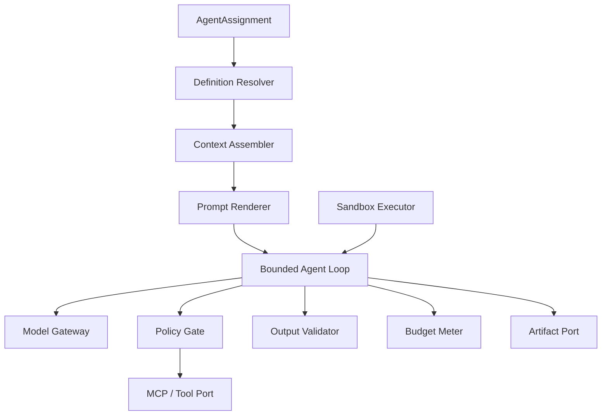

# Local Agent Runtime

Status: Proposed
Owners: Agent Runtime maintainers
Depends on: [Orchestrator and scheduler](orchestrator-and-scheduler.md), [Agent Registry](agent-registry.md), [MCP integration](mcp-integration.md)

## 1. Problem

本地 Agent 执行需要统一装配指令、模型、上下文、工具、权限和输出契约，同时限制循环、成本和副作用。若每个 Agent 自建运行循环，将无法统一治理、观察和恢复。

## 2. Responsibilities

- 解析不可变 Agent Definition Version 和 Assignment。
- 装配最小执行上下文、Prompt、Artifact 和 memory view。
- 通过 Model Gateway 调用配置的模型策略。
- 执行受控 tool loop，所有工具经 MCP/Tool Port 和 Policy。
- 校验结构化输出、成本、Token、deadline 和 cancellation。
- 将结果、Tool intents、usage 和安全错误返回 Orchestrator。
- 在需要时运行隔离 sandbox/plugin，而非直接执行任意代码。

## 3. Non-responsibilities

- 不改变 Task/Subtask 业务状态。
- 不做跨 Agent 全局调度。
- 不自行扩大工具权限、预算或上下文范围。
- 不持有长期第三方凭证。
- 不把完整聊天记录当唯一 Handoff 载体。

## 4. Components

## 5. Runtime input/output

Input：Assignment、Agent Definition Version、Work Item snapshot/version、ArtifactRefs、ExecutionCredentialRef、trace context 和 cancellation handle。

Output 使用 `AgentExecutionResult`：status、structured output 或 ArtifactRefs、usage/cost、tool invocation refs、model call refs、quality hints、input/approval request、safe error 和 resume data。

Runtime 输出必须通过 schema validator；自由文本只能作为声明允许的字段或 Artifact。

## 6. Context assembly

上下文来源按确定优先级：system policy → Agent instructions → task objective/constraints → acceptance criteria → Handoff summary → selected Artifact excerpts → allowed memory → current user input。

规则：

- 每个来源保留 provenance、classification 和 token estimate。
- 先使用结构化字段和摘要，再按预算检索原文。
- 不把 secret、signed URL、内部策略细节或其他租户内容加入 Prompt。
- Retrieved content 标记为不可信数据，不能被解释为 system instruction。
- 超预算时按可配置策略压缩/丢弃低优来源，并记录 context manifest。
- Runtime memory 通过 Memory Port 获取命名空间化内容；不得直接读 LangGraph/数据库任意表。

## 7. Model gateway

ModelPolicy 不是单一模型名，包含允许 provider/model、fallback、temperature/structured output、max tokens、region/data policy、timeout、retry、cost ceiling 和 capability requirements。

Gateway：

- 统一 request/response usage 和错误分类。
- 支持 provider client 的 connection/circuit breaker。
- 在 fallback 前重新检查数据 residency、预算和能力。
- 不在日志记录完整 Prompt/response，除非采集策略允许。
- 记录真实模型版本；若 provider 只提供 alias，保存 alias 与观测到的元数据。

## 8. Bounded agent loop

每次循环：model call → parse response → validate requested tool/action → policy → execute → normalize result → append bounded observation。

终止条件：有效 final output、input/approval required、cancellation、deadline、max steps、token/cost budget、连续无进展、重复相同 tool call、不可恢复错误。

无进展检测至少使用 action/tool+argument digest 和 state/output delta，不仅依赖模型自报。达到阈值后可请求 Reviewer/Operator，不继续无限循环。

## 9. Tool execution

- Tool 列表由 Assignment + Agent Version + current Policy 交集生成。
- 调用前按当前 Tool schema 校验参数，并绑定 invocation ID/idempotency strategy。
- read-only、idempotent write、non-idempotent write、irreversible 四类分别处理。
- write/irreversible 默认经过 ActionIntent；需要 approval 时 Runtime 返回 interrupt request。
- ToolResult 进行大小、类型、classification 和 prompt-injection 标注；大结果转 Artifact。
- 外部超时且无法确认结果时返回 outcome unknown，不自动重复 non-idempotent call。

## 10. Output validation

层次：JSON/schema → business constraints → Artifact existence/scan → acceptance pre-check → policy/data leakage check。Validation failure 返回可机器处理 reason codes，可触发 limited repair attempt；repair 使用剩余预算并保留原始候选结果。

Runtime 不自行宣布 Task completed，只报告 candidate/succeeded execution result。

## 11. Sandbox and plugins

- 默认 Agent 只调用注册 Tool，不执行模型生成代码。
- 需要代码执行时使用短生命周期 sandbox：只读 base image、受限 CPU/memory/time/pids、临时文件系统、网络 deny-by-default、显式 egress allowlist。
- 输入/输出通过 Artifact Port，不挂载 control plane secret 或宿主 Docker socket。
- 自定义 Runtime plugin 需签名、版本固定、SBOM/扫描和 allowlist。
- sandbox termination、resource usage 和 output files 全部可审计。

## 12. Cancellation and recovery

- Runtime 在 model/tool/sandbox 边界检查 cancellation；可中断 client 使用主动 cancel。
- 无法中断的外部 call 记录 outstanding operation，结果晚到时由 reconciler 处理。
- Runtime 进程内不保存恢复真相；恢复输入来自 Checkpoint + business snapshot。
- temporary files 在 Attempt 终止后清理；需保留内容先 finalize Artifact。
- 相同 node 重放时复用 operation/invocation ID，避免副作用重复。

## 13. Security

- execution token 绑定 tenant、run、agent version、tool set、data scope 和 expiry。
- Credential Broker 在调用时换取目标 audience 的短期凭证；禁止 token passthrough。
- Prompt injection 防御依赖 trust labels、tool hard policy 和 output validation，而不是仅靠提示词。
- 模型不能看到 MCP/OAuth token、数据库 URL 或 secret ref 的解析值。
- 高敏数据使用允许的 model endpoint，必要时禁用 Prompt/response tracing。
- egress DNS/IP/host policy 与 HTTP redirect policy共同执行，防 SSRF。

## 14. Observability and evaluation

Span：context assembly、prompt render、model generation、tool policy、tool call、sandbox、output validation。记录 token、cost、latency、model、prompt version、tool/agent version、context source counts 和 redaction stats。

质量信号：schema success、criterion pre-check、repair count、loop steps、tool error、citation/provenance coverage。Prompt 正文采集由 tenant policy 决定。

## 15. Capacity and limits

- 每 Agent Version 定义 max context、steps、parallel tools、artifact bytes、runtime seconds。
- Runtime 实例同时受 CPU/memory slot、provider QPS 和 MCP connection limit。
- ToolResult/Model response 超过 inline limit 转 Artifact 或截断并标记；不能无提示截断安全数据。
- Context assembler 的 token estimate 与 provider actual usage 偏差需要监控和校准。

## 16. Testing

- Fake model/tool 的 deterministic transcript 覆盖成功、repair、approval、cancel、budget 和 repeated action。
- Prompt snapshot 测试只保存脱敏 fixture。
- 各 provider adapter contract test 统一错误和 usage。
- sandbox escape、network deny、resource exhaustion 和 malicious artifact 安全测试。
- node replay 测试证明副作用 invocation ID 稳定。

## 17. Acceptance criteria

- 同一 Agent Definition Version 在相同输入与 deterministic fake 下产生可复现执行轨迹。
- 模型无法绕过 tool allowlist、预算、policy 或 approval。
- Agent loop 在所有路径都有明确上限和安全终态。
- Runtime 崩溃不丢业务真相，恢复不会重复已确认副作用。
- 输出不符合 schema 或 Artifact 不可用时不能报告成功。
