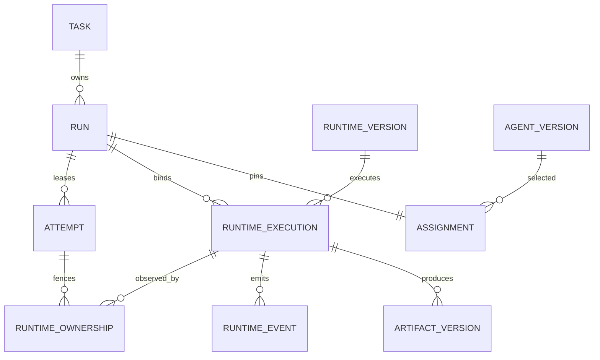
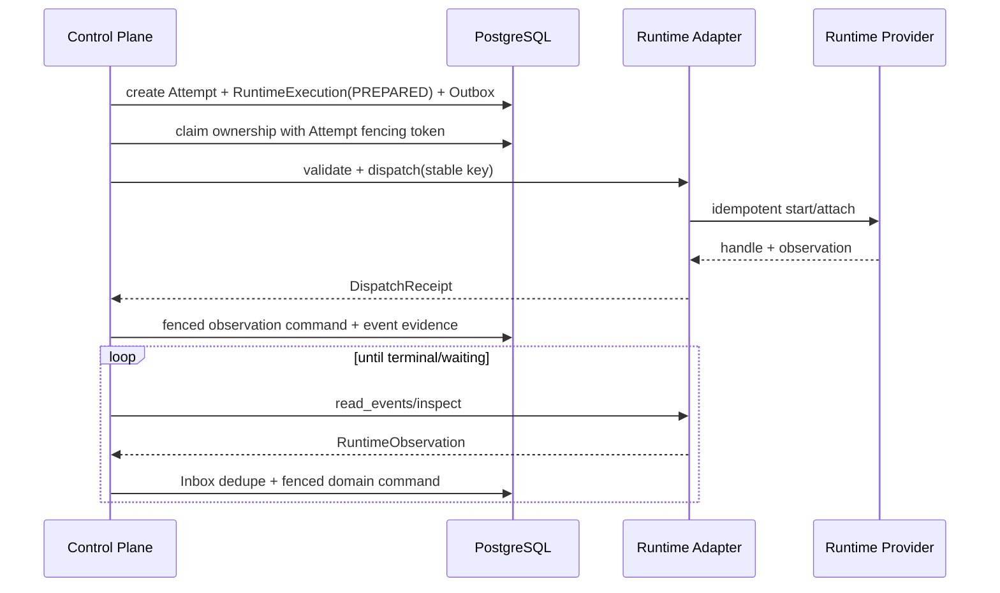

# Managed Agent Runtime API v0.1

Status: Accepted design baseline
Owners: Runtime and execution platform maintainers
Parent decision: [ADR 0007](../../../adr/0007-framework-neutral-agent-control-plane.md)
Tracks: [#135](https://github.com/0YHR0/AgentMesh/issues/135),
[#136](https://github.com/0YHR0/AgentMesh/issues/136)

## 1. Purpose

This specification is the implementable boundary between AgentMesh's authoritative control plane
and an Agent runtime. It replaces framework-shaped orchestration calls with versioned DTOs,
capability negotiation, fenced lifecycle operations, and conformance tests.

It does not standardize how an Agent reasons. A runtime may use LangGraph, an Agent SDK, a coding
harness, a subprocess, a container, or a remote service.

## 2. Normative ownership and invariants

1. PostgreSQL-owned Task/Run/Attempt records are authoritative.
2. A runtime never directly changes Task, Run, Attempt, Policy, Permit, Artifact, or budget state.
3. A `Run` is one logical trajectory. Ordinarily it has at most one nonterminal
   `RuntimeExecution`.
4. An `Attempt` is a fenced lease. Only the current Attempt and fencing token may submit a runtime
   observation that advances a Run.
5. A `RuntimeExecution` is one provider-side execution identity. It may outlive the Worker process.
6. Replacement Attempts inspect and explicitly claim an existing RuntimeExecution before starting
   another. They do not blindly redispatch.
7. Runtime status is evidence. It maps to normal Task commands after validation; it is never copied
   directly into Task status.
8. Every dispatch, lifecycle command, event, result, and Artifact reference is bounded,
   tenant-scoped, versioned, correlated, and idempotent.
9. Unknown security obligations, capabilities, status values, and major schema versions fail closed.
10. Secrets are resolved at the narrow gateway boundary and never enter Assignment DTOs,
    checkpoints, logs, or runtime events.

## 3. Relationship to existing entities



### 3.1 Attempt and runtime ownership

`RuntimeOwnership` is immutable history containing runtime execution ID, Attempt ID, fencing token,
claimed/released time, claim reason, and previous owner. `RuntimeExecution` stores the current owner
Attempt/fencing token for compare-and-swap.

A replacement Attempt may claim an existing nonterminal execution only when:

- the previous Attempt is terminal or its lease has expired;
- the provider reports the same execution handle and immutable Assignment digest;
- the Runtime Version declares `reattach`;
- the control-plane transaction atomically records the new ownership fencing token;
- no unresolved incompatible side effect or cancellation intent exists.

Old Worker observations remain as late evidence but cannot advance the Run.

## 4. Runtime registry model

### 4.1 RuntimeRegistration

Mutable administrative identity:

| Field | Rule |
|---|---|
| `runtime_id` | stable UUID |
| `tenant_id` | nullable only for platform built-ins |
| `name` | unique in visibility scope |
| `owner_principal_id` | required |
| `visibility` | `platform | tenant | private` |
| `status` | `ACTIVE | SUSPENDED | REVOKED` |
| `default_version_id` | points to published compatible version |

### 4.2 RuntimeVersion

Immutable after publication:

| Field | Rule |
|---|---|
| `runtime_version_id` | UUID |
| `runtime_id` | parent registration |
| `api_version` | exactly `1` for this contract |
| `adapter_kind` | stable logical kind, not an import path exposed to users |
| `artifact_digest` | code/image/package digest |
| `configuration_digest` | non-secret canonical configuration digest |
| `descriptor` | validated `RuntimeDescriptor` |
| `trust_profile` | `built_in | trusted_process | isolated | remote` |
| `compatibility` | supported Assignment/result schema majors |
| `status` | `DRAFT | PUBLISHED | DEPRECATED | REVOKED` |

Runs pin `runtime_version_id`; changing a default never changes active or historical Runs.

## 5. RuntimeDescriptor and capabilities

```json
{
  "schema": "agentmesh.runtime-descriptor",
  "version": 1,
  "runtime_key": "agentmesh.langgraph",
  "display_name": "LangGraph Runtime",
  "adapter_kind": "python-in-process",
  "capabilities": {
    "execution_mode": ["inline", "managed_async"],
    "reattach": true,
    "cancel": "cooperative",
    "pause_resume": true,
    "checkpoint": true,
    "fork": true,
    "event_stream": true,
    "tool_bridge": ["governed_action_v1"],
    "artifact_io": ["reference"],
    "isolation_profiles": ["trusted-in-process"],
    "modalities": ["text", "structured"]
  },
  "limits": {
    "max_assignment_bytes": 262144,
    "max_event_bytes": 65536,
    "max_result_bytes": 262144,
    "max_artifact_refs": 128
  }
}
```

Capability values are closed enums for major version 1. Optional features are negotiated at
Assignment admission and pinned in the Assignment snapshot. A runtime cannot announce a new
capability mid-Run to gain authority.

Minimum v0.1 capability set:

- accept one immutable Assignment;
- expose a stable provider execution handle or terminal inline observation;
- inspect current state;
- receive cancellation intent;
- return a bounded terminal result/error;
- preserve dispatch idempotency;
- expose runtime/version identity.

Checkpoint, reattach, pause/resume, streaming, fork, direct tool bridge, and isolated workspace are
optional. Admission rejects a Run whose required capability is absent.

## 6. Canonical DTOs

All DTOs use JSON-compatible primitives, RFC 3339 UTC timestamps, UUID strings, canonical SHA-256
digests, and the common Envelope rules. Large content is an `ArtifactRef`.

Canonical bytes follow [RFC 8785 JSON Canonicalization Scheme (JCS)](https://www.rfc-editor.org/rfc/rfc8785):

- UTF-8 output, deterministic property ordering, string escaping, and ECMAScript number rendering;
- duplicate object keys, lone Unicode surrogates, NaN/Infinity, and values that cannot round-trip
  through the canonical representation are rejected before digesting;
- generic JSON numbers follow JCS/IEEE-754 binary64 semantics; fields declared as integers must be
  exact integers inside the interoperable safe range. A canonical number such as `1e20`, which JCS
  renders in fixed notation, must still decode and re-canonicalize to identical bytes;
- quantities needing greater precision use a versioned decimal-string field, never a
  language-specific decimal/float encoding;
- golden vectors include Unicode ordering/escaping, `-0`, exponent thresholds, numeric limits,
  and invalid inputs, so Python is not the protocol oracle.

Every v1 DTO object is closed: unknown top-level or nested contract fields fail validation unless
they are inside the explicit bounded `extensions` map. This prevents misspelled security fields
from being silently ignored. A future additive field therefore requires a schema-version change or
an agreed extension identifier. JSON decoding at a protocol boundary must reject duplicate keys.

All constructors and decoders enforce exact JSON types (`bool` is not an `int`), finite values,
per-field count/length limits, and the DTO byte limit after canonicalization. The same validation
applies whether a DTO is decoded from JSON or constructed directly in an adapter.

The canonical discriminator fields are exactly `schema_name` and `schema_version`; v1 decoders do
not accept ambiguous `schema`/`version` aliases or two competing version fields. Validation errors
use bounded static reason codes/messages and never echo untrusted field names, values, provider
bodies, prompts, or credentials.

### 6.1 RuntimeAssignment

Immutable fields:

```text
schema_name/schema_version (= agentmesh.runtime-assignment/1)
assignment_id, tenant_id, task_id, run_id
agent_definition_id, agent_version_id, agent_version_digest
runtime_version_id, runtime_descriptor_digest
execution_mode, run_role, revision
objective + structured input OR input ArtifactRefs
work_item_snapshot_version + digest
acceptance_contract + output_schema_digest
required_capabilities
tool_profile_version + immutable Tool snapshot refs
capability_bundle refs
policy_snapshot_ref + required obligations
principal_context_ref + delegation_grant_ref
budget_slice, deadline, per-operation limits
input ArtifactRefs and allowed Artifact operations
trace context and safe correlation IDs
assignment_digest
```

The Assignment contains secret references/lease request descriptors only, never a credential value.
The runtime must echo `assignment_id` and `assignment_digest` in every observation.

### 6.2 RuntimeExecutionHandle

Opaque to business modules:

```text
runtime_execution_id        # AgentMesh ID
runtime_version_id
provider_execution_ref      # encrypted/opaque if sensitive
provider_generation         # provider revision, optional
assignment_id/digest
created_at
```

The provider reference is never used as an internal primary key and is not included in model input.

### 6.3 RuntimeObservation

```text
observation_id
runtime_execution_id
assignment_id/digest
provider_event_id or snapshot_digest
provider_sequence (optional monotonic integer)
phase
observed_at
progress: safe bounded summary
checkpoint_ref/workspace_ref (optional opaque refs)
output candidate or ArtifactRefs (terminal success only)
usage delta/cumulative usage
governed action requests
input/approval wait refs
safe error
extensions
```

`RuntimePhase` values:

```text
PREPARED
DISPATCHING
ACCEPTED
RUNNING
WAITING_INPUT
WAITING_APPROVAL
PAUSE_REQUESTED
PAUSED
CANCEL_REQUESTED
SUCCEEDED
FAILED
CANCELED
TIMED_OUT
LOST
OUTCOME_UNKNOWN
```

Only `SUCCEEDED`, `FAILED`, `CANCELED`, `TIMED_OUT`, `LOST`, and `OUTCOME_UNKNOWN` are terminal for a
specific RuntimeExecution. `LOST` means the provider proves no execution can be recovered but does
not itself prove external side effects were absent. `OUTCOME_UNKNOWN` always blocks automatic
redispatch until reconciliation policy permits it.

### 6.4 RuntimeError

```text
code                         # stable namespaced code
category                     # validation/authentication/authorization/conflict/
                             # rate_limit/transient/dependency/permanent/unknown
message                      # safe, bounded
retry_disposition            # NEVER/SAME_EXECUTION/NEW_EXECUTION/RECONCILE/OPERATOR
retry_after                  # optional
provider_code_digest         # optional, no raw sensitive body
evidence_refs
```

Adapters map raw exceptions at their boundary. Stack traces, prompts, credentials, and unbounded
provider bodies do not enter this contract.

### 6.5 RuntimeResult

Terminal success requires:

- structured output matching the Assignment's schema, or output ArtifactRefs;
- complete runtime/Agent/Assignment identity;
- final usage and conservative estimation flags;
- produced Artifact and governed-action evidence refs;
- terminal reason and safe summary;
- result digest over canonical content.

The control plane still validates Artifact availability, budget settlement, acceptance criteria,
current Attempt fencing, cancellation, and policy before advancing the Run.

## 7. Adapter port

The Python application port is illustrative; JSON fixtures are normative:

```python
class ManagedAgentRuntime(Protocol):
    def descriptor(self) -> RuntimeDescriptor: ...
    def validate(self, assignment: RuntimeAssignment) -> ValidationReport: ...
    def dispatch(
        self, assignment: RuntimeAssignment, *, dispatch_key: str
    ) -> DispatchReceipt: ...
    def inspect(self, handle: RuntimeExecutionHandle) -> RuntimeObservation: ...
    def read_events(
        self, handle: RuntimeExecutionHandle, *, cursor: str | None, limit: int
    ) -> RuntimeEventPage: ...
    def request_cancel(
        self, handle: RuntimeExecutionHandle, *, cancellation_id: str, deadline: datetime
    ) -> LifecycleReceipt: ...
    def request_pause(self, handle: RuntimeExecutionHandle, *, operation_id: str) -> LifecycleReceipt: ...
    def request_resume(self, handle: RuntimeExecutionHandle, *, operation_id: str) -> LifecycleReceipt: ...
    def close(self) -> None: ...
```

Rules:

- `validate` has no side effect and runs before Attempt/runtime reservation.
- `dispatch_key = runtime-dispatch:{tenant_id}:{runtime_execution_id}` is stable for every retry of
  the same RuntimeExecution. Different bytes with the same key return conflict.
- `dispatch` may return an accepted handle plus observation, or a terminal inline observation. It
  must not return an untracked background execution.
- `inspect` is authoritative only about provider state and must be safe to repeat.
- `read_events` is optional when `event_stream=false`; `inspect` remains mandatory.
- lifecycle operation IDs are stable and repeated calls return the original receipt.
- Adapter methods have bounded timeouts and never hold a database transaction.
- `close` releases client resources; it does not cancel executions.

## 8. Dispatch and observation flow



Database transactions surround control-plane commands only. No adapter call occurs while a Task,
Run, Attempt, budget, or governance row lock is held.

## 9. State mapping

| Runtime observation | Permitted control-plane command |
|---|---|
| ACCEPTED/RUNNING | record evidence/heartbeat; Run remains active |
| WAITING_INPUT | `RequestInput` after wait contract validation |
| WAITING_APPROVAL | validate linked Governed Action; `RequestApprovalWait` |
| PAUSED | `RecordAttemptPaused` only when pause was requested/allowed |
| SUCCEEDED | `RecordAttemptCandidate`; then output/Artifact/budget/criteria guards |
| FAILED/TIMED_OUT | `RecordAttemptFailure`; retry policy decides same Run/new Attempt |
| CANCELED | confirm persisted cancel intent, then `RecordAttemptCanceled` |
| LOST | reconcile; new execution only if side-effect safety is proven |
| OUTCOME_UNKNOWN | create/retain operator reconciliation item; never blind retry |

No adapter can send `TaskCompleted`, `PermitIssued`, or `ApprovalGranted`.

## 10. Duplicate, ordering, and late observations

- Inbox key is tenant + runtime consumer + observation/event ID.
- If the provider lacks event IDs, use runtime execution + provider sequence; without either, use
  bounded snapshot digest dedupe and inspect before transition.
- Sequence gaps trigger `inspect`; consumers do not infer the missing state.
- A lower sequence or repeated digest is retained only as duplicate telemetry.
- An observation from a non-owner Attempt/fencing token is stored as late evidence and cannot
  advance business state.
- A terminal observation after Run cancellation is a late result. Produced content may be
  quarantined/retained by policy but cannot overwrite the terminal Run.
- Conflicting terminal observations for one provider execution enter `OUTCOME_UNKNOWN`/operator
  review and raise an integrity signal.

## 11. Retry, reattach, and redispatch

Decision order for a stale/lost Worker:

1. Read current Run/Attempt/RuntimeExecution under the fixed lock order.
2. Inspect provider with no database lock held.
3. Re-read and compare versions.
4. If execution exists and `reattach=true`, create/claim replacement Attempt ownership and continue
   observation.
5. If provider proves terminal, process its observation through normal fencing/guard rules.
6. If provider proves absent, evaluate side-effect and retry disposition.
7. If absence or side-effect outcome cannot be proven, enter `OUTCOME_UNKNOWN`.
8. Only then create a new RuntimeExecution and dispatch key.

Same RuntimeExecution retries never create another provider execution. New RuntimeExecution retries
consume Run retry budget and receive a new ID/key. `Attempt` replacement alone does not increment
logical Run/revision count.

## 12. Cancellation and pause

- Cancel/pause is a persisted intent and Outbox command before adapter invocation.
- A runtime receipt means the provider accepted the request, not that execution stopped.
- Reconciler inspects until terminal or operation deadline.
- A runtime without cancel support is admitted only when policy accepts best-effort abandonment.
- Irreversible outstanding actions are reconciled independently of runtime cancellation.
- Resume revalidates Agent/Runtime Version, principal/delegation, policy, credentials, Artifact
  availability, budget, deadline, checkpoint compatibility, and workspace compatibility.
- If resume guards fail, the Run enters an explicit waiting/failure state; it never silently starts
  with empty context.

## 13. Persistence model

Logical tables (exact DDL is an implementation task):

### Registry-owned

- `runtime_registrations`
- `runtime_versions`

### Execution-owned

- `runtime_executions`: tenant, Run, Assignment, Runtime Version, handle cipher/ref, phase,
  assignment/result digests, current owner Attempt/fence, event cursor/sequence, checkpoint/workspace
  opaque refs, timestamps, version.
- `runtime_ownership_history`: execution, Attempt, fencing token, claim/release reason and time.
- `runtime_observations`: immutable observation identity/digest, sequence, phase, safe summary,
  Artifact/evidence refs, received time, processing outcome.
- `runtime_lifecycle_operations`: cancel/pause/resume operation ID, intent, receipt, status, deadline.

`TaskRun` expands with nullable pinned `runtime_version_id` and `runtime_execution_id`. Existing rows
remain valid during migration. Provider handles are encrypted or stored as Secret/opaque references
when they reveal infrastructure details.

## 14. Security model

- Adapter construction receives only adapter-specific configuration and narrow service ports.
- Runtime Assignment uses a short-lived execution authorization bound to tenant, Run, Agent Version,
  Runtime Version, Artifact operations, allowed tool/capability set, and expiry.
- Credentials are audience-specific leases resolved at the tool/model gateway; raw values never
  cross the runtime contract unless an isolated adapter's protected channel explicitly requires it.
- `trusted-in-process` is a trust label, not isolation. Third-party code defaults to an isolated or
  remote profile once available.
- Runtime-produced instructions, events, tool output, and Artifacts are untrusted data.
- Direct network/tool access outside declared gateway/profile is a policy violation.
- Runtime revoke blocks new dispatch immediately and enumerates active executions for operator
  disposition; it does not falsify their history.

## 15. Versioning and compatibility

- Contract names use independent integer major versions.
- Additive optional fields are compatible; changed meaning, required fields, enum removal, or
  tightened semantics require a new major.
- Producers support current and previous supported major during the published compatibility window.
- Consumers ignore unknown non-security extensions but reject unknown obligations/capabilities
  required by an Assignment.
- Runtime Versions declare supported contract majors and result schemas before publication.
- Canonical JSON fixtures and cross-language digest vectors are published with the SDK.
- Active Runs stay pinned to their Runtime Version; deprecated adapters remain deployable until no
  compatible active Run exists or an explicit operator migration is accepted.

## 16. Error and readiness behavior

Runtime selection/admission fails before Attempt creation for incompatible capability or contract.
Adapter/provider unavailability after admission produces a visible dependency/waiting state and
bounded backoff. Worker readiness requires every locally selected adapter to load and validate its
published descriptor; it does not require every remote runtime to be healthy.

Error retry dispositions are normative:

| Disposition | Meaning |
|---|---|
| NEVER | permanent validation/security/business failure |
| SAME_EXECUTION | repeat inspect/event/lifecycle operation using same key |
| NEW_EXECUTION | allowed only after absence/side-effect proof and budget check |
| RECONCILE | provider/external outcome must be queried |
| OPERATOR | automated evidence is insufficient |

## 17. Conformance suite

Every adapter must pass the same black-box suite using a deterministic fixture Agent:

1. descriptor/schema validation and digest stability;
2. incompatible capability rejection before dispatch;
3. same dispatch key/same bytes returns one execution;
4. same key/different bytes conflicts;
5. success result schema, Artifact lineage, usage, and identity;
6. duplicate and out-of-order observation handling;
7. cancellation idempotency and late terminal result;
8. timeout and safe retry classification;
9. Worker death followed by inspect/reattach or explicit non-support behavior;
10. old Attempt/fencing token cannot finalize;
11. revoked Runtime Version cannot accept a new dispatch;
12. oversized/malformed/unknown-major response fails closed;
13. no database/secret leakage into Assignment or child environment;
14. `OUTCOME_UNKNOWN` never causes blind redispatch;
15. adapter close/restart preserves provider execution authority.

The first required adapters are:

- existing LangGraph runtime wrapped behind this contract;
- independently packaged deterministic generic subprocess Agent with no LangGraph import.

## 18. Architecture tests

CI must assert:

- `agentmesh.domain` and canonical runtime contracts do not import framework/provider/transport
  packages;
- experience packages do not become dependencies of runtime/application contracts;
- adapter packages depend inward only through ports/DTOs;
- canonical fixtures round-trip through Python and raw JSON;
- the generic Agent distribution can run against the public SDK without repository-relative
  imports.

## 19. Implementation exit criteria

- Both LangGraph and generic subprocess adapters pass conformance.
- The Worker selects a pinned Runtime Version rather than importing a framework path from domain
  policy.
- Worker restart can reattach/reconcile without duplicate provider execution.
- All result finalization uses current Attempt fencing and normal Task commands.
- Legacy direct `WorkflowRunner` composition can be disabled with a feature gate and removed after
  rollback window.
- Runtime inventory/status is available to the future Fleet Console without framework-specific
  branches.
