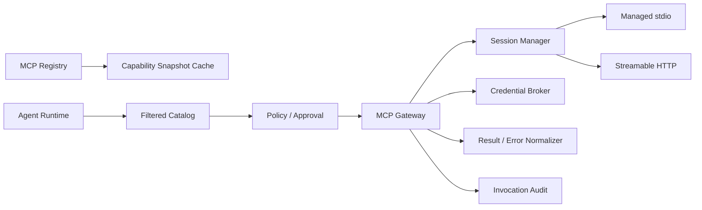

# MCP integration

Status: Proposed
Owners: Integration and security maintainers
Depends on: [Agent Registry](agent-registry.md), [Policy and approval](policy-and-approval.md), [Identity and secrets](identity-tenancy-and-secrets.md)

## 1. Problem

Agent 需要访问工具、资源和提示模板，但不能直接持有长期凭证或任意连接未审查 MCP Server。正式版通过 Registry + Gateway 提供发现、版本、授权、凭证、限流、审计和协议兼容边界。

## 2. Protocol baseline

目标基线为 MCP [2025-11-25 specification](https://modelcontextprotocol.io/specification/2025-11-25/)。支持：

- 本地受控 stdio Server。
- 远程 Streamable HTTP Server。
- Tool、Resource、Resource Template 和 Prompt discovery/use。
- logging/progress/cancellation 等基础 utility 的受控映射。

Sampling、Elicitation、Roots 和实验性 MCP Tasks 按 capability/policy 显式启用。MCP Tasks 不替代 AgentMesh Task/Run/Scheduler；它只作为某次 MCP invocation 的远程延迟执行细节。

## 3. Responsibilities

- 注册、审查、版本化和健康检查 MCP Server。
- 初始化连接、协商协议版本和缓存 capability snapshot。
- 向 Runtime 暴露经过过滤的 Tool/Resource/Prompt 目录。
- 调用前执行身份、Policy、Approval、Schema 和预算检查。
- 通过 Credential Broker 获取目标 audience 的短期凭证。
- 标准化响应、进度、错误、取消和异步任务结果。
- 保存 ToolInvocationRecord 和安全审计。

## 4. Non-responsibilities

- 不让 MCP Server 调度全局 Agent。
- 不把 Server 自报 Tool schema 当成安全授权。
- 不向模型暴露 OAuth token、MCP session ID 或内部地址。
- 不保证第三方副作用 exactly-once。
- 不将 Resource 内容自动加入 Prompt，必须经过 Context/Policy。

## 5. Components

## 6. Registry model

`McpServerRegistration`：tenant/owner、name、transport、endpoint/launch spec ref、trust tier、auth profile、network policy、lifecycle、allowed environments。

`McpServerVersion`：protocol range、implementation metadata、configuration digest、supply-chain evidence、declared capabilities、risk class，发布后不可变。

`CapabilitySnapshot`：server version、negotiated protocol、tools/resources/prompts schema + digest、fetched_at/expiry、health、verification results。Snapshot 更新不自动扩大已有 Agent ToolProfile；新增高风险 Tool 需重新审核。

`CredentialBinding`：tenant/principal/agent、server、scope/audience、secret ref、consent/expiry metadata，不保存 token value。

## 7. Registration and discovery flow

1. Provider 提交 endpoint/launch spec、owner、auth/network 和风险声明。
2. Validator 阻止明文 secret、任意 shell、非法 URL/redirect 和不受信镜像。
3. 隔离环境执行 initialize/capability discovery。
4. 保存原始 schema snapshot、digest 和 normalized catalog。
5. Security/Owner 审核 Tool side-effect class、data access 和 credential scopes。
6. 发布 Server Version；Agent ToolProfile 通过显式 binding 引用允许项。

远程 Server 按 TTL/ETag/notification 刷新；schema digest 变化会产生事件并暂停不兼容 invocation。运行时不得每次让模型直接探索未经审查的新 Tool。

## 8. Invocation flow

1. Runtime 请求 logical tool key，并传 Assignment/Principal/arguments/idempotency context。
2. Catalog Resolver 固定 Server Version、snapshot 和 tool schema。
3. 参数按 JSON Schema 2020-12、大小和业务 guard 校验。
4. Policy 返回 allow/deny/approval/constraints；必要时中断。
5. Credential Broker 获取目标 resource/audience 的短期凭证。
6. Gateway 执行 MCP request，传播 trace/cancellation，不传播上游 bearer token。
7. 响应按 content type、size、classification、malware/prompt-injection policy 处理；大内容转 Artifact。
8. 保存 invocation outcome、usage、external operation reference 和审计摘要。

Tool execution error 与 protocol/transport error 分开；前者可反馈模型做受限纠正，后者进入 Runtime retry policy。

## 9. Session and transport management

### stdio

- 仅运行发布的 executable/image digest 和结构化 argv，不拼接 shell 字符串。
- 独立非特权用户、resource limits、working directory 和 environment allowlist。
- stdout 只解析 MCP message；stderr 受限采集并脱敏。
- 每 tenant/server 的 process pool 有上限和 idle TTL。

### Streamable HTTP

- HTTPS、证书验证、DNS/redirect/egress allowlist 和 Origin policy。
- 初始化后按协商版本发送 protocol version；session ID 作为敏感 opaque value。
- GET/SSE 断连按协议 event ID 恢复；重复消息由 request/session/invocation identity 去重。
- session 失效时只对安全操作重新初始化；未知副作用先 reconcile。

## 10. Authorization and credentials

- HTTP authorization 遵循 MCP 对 OAuth protected resource discovery、resource indicators 和目标 audience 的要求。
- MCP Client 获取给 MCP Server 的 token；MCP Server 调上游 API 必须使用另一枚面向上游 audience 的 token。
- 禁止 token passthrough、日志 token、将 token 写入 Checkpoint/Artifact。
- user-delegated consent 与 service credential 分开，缓存按 subject+tenant+resource+scope 隔离。
- scope step-up 产生新的 Policy/Approval 或用户 authorization flow，不能由模型自动同意。
- stdio credential 从受控 Broker 注入环境/IPC，Server Definition 不保存值。

## 11. Tools, resources, prompts and server-initiated requests

- Tools：按 side-effect class、schema digest 和 Agent binding 过滤。
- Resources：读取后生成 provenance/classification；订阅更新只产生 context invalidation event。
- Prompts：视为版本化不可信模板内容，不能覆盖平台 system policy。
- Sampling：默认关闭；启用时 server request 仍通过 ModelPolicy、预算和数据策略，不能指定未允许模型。
- Elicitation：结构化请求映射为 WAITING_INPUT；URL mode 需 URL allowlist 和防钓鱼 UI。
- Roots：只暴露任务专用虚拟 workspace，不暴露宿主目录。
- MCP Tasks：绑定 invocation ID，状态仅影响该 invocation，不创建第二套顶层 Task。

## 12. Side effects and idempotency

- Registry 标注 tool 为 read_only、idempotent_write、non_idempotent_write、irreversible。
- 若 Tool/schema 支持 operation/idempotency key，Gateway 使用稳定 invocation ID。
- 不支持去重的 non-idempotent Tool 在超时后进入 outcome unknown；自动 retry 默认禁止。
- approval 绑定 canonical arguments + server/tool/schema digest；任何变化重新审批。
- cancellation 是 best effort；晚结果保留并交 Reconciler，不直接覆盖 canceled Run。

## 13. Failure model

| Failure | Behavior |
|---|---|
| Server unavailable | circuit breaker、受限 retry、可选 approved fallback |
| initialize/schema changed | snapshot invalid，暂停不兼容调用并告警 |
| auth expired/insufficient scope | refresh/step-up；不向模型泄露 token details |
| stream disconnect | 按 event ID/session 恢复；否则查询 task/result 或 outcome unknown |
| oversized/malicious result | quarantine/reject，Runtime 收到安全错误 |
| stdio process crash | 终止 session；只重放安全 invocation |
| response lost after side effect | external operation query；不能确认则人工 reconcile |

## 14. Security

- MCP Gateway 是独立信任边界候选，生产可部署在受控 egress 网络。
- 所有 Server、Tool 和 schema 有 owner、trust tier、classification 和 revoke path。
- 防 SSRF、DNS rebinding、redirect 到私网、恶意 content type、压缩炸弹和 stdout 注入。
- ToolResult 标记 provenance，模型不得把其指令当 system policy。
- Prompt/argument/result 的采集遵循数据策略；Audit 至少保存 hash、分类和 decision。
- Server revoke 立即阻止新 session，并列出 active invocation 供处置。

## 15. Observability and limits

指标：server health、initialize latency、catalog age、tool QPS/error/latency、session count、auth step-up、policy deny、outcome unknown、result bytes、circuit state。

限制：每 Agent 可见 tools、每 session 并发 request、result bytes、SSE duration、stdio process、server QPS、elicitation wait 和 MCP Task duration。

Trace span 使用 server/version/tool/invocation，参数和结果默认只记录 hash/size/classification。

## 16. Testing and compatibility

- 对支持的 protocol revisions 运行官方 SDK/conformance tests。
- mock servers 覆盖 stdio/HTTP、SSE resume、schema change、sampling/elicitation 和 MCP Tasks。
- OAuth audience、token passthrough、redirect/SSRF 和 session fixation 安全测试。
- non-idempotent timeout 故障注入证明不重复调用。
- capability snapshot golden fixtures 验证旧 Agent binding 不因新增 Tool 自动扩大。

## 17. Acceptance criteria

- Agent 只能发现和调用 Registry + Policy 共同允许的能力。
- Gateway 不向 Agent/Server 泄露不属于目标 audience 的凭证。
- schema/version 改变不会静默改变历史 Assignment 语义。
- stdio 与 Streamable HTTP 的取消、断连和重复消息有收敛路径。
- MCP Tasks 不成为 AgentMesh Task/Run 的替代状态机。
