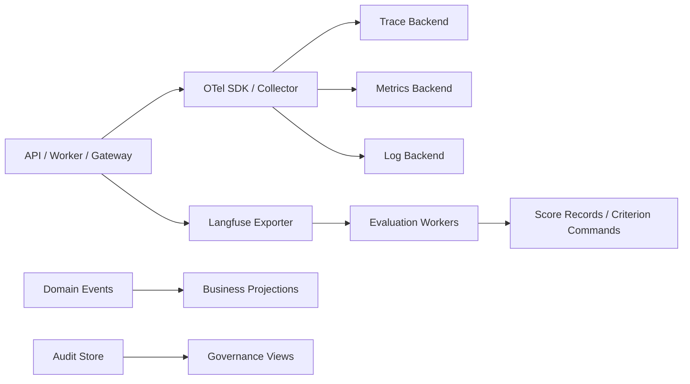

# Observability and evaluation

Status: Proposed
Owners: Observability and quality maintainers
Depends on: [Cross-module contracts](cross-module-contracts.md), [Identity and tenancy](identity-tenancy-and-secrets.md)

Implemented increment: [Attempt Trace and durable usage/cost ledger](../observability-usage-implementation.md).
Budget enforcement baseline: [Task budget and admission control](../task-budget-admission-implementation.md).
Evaluation, collector pipelines, budget enforcement, and the remaining target scope below are
still proposed.

## 1. Problem

用户需要看业务进度，工程团队需要诊断模型、工具和远程 Agent，产品团队需要衡量质量和成本。这三类数据语义不同；如果只依赖 Langfuse Trace，会丢失业务真相和审计完整性。

## 2. Responsibilities

- 定义统一 OTel resource/span/log/metric 属性和 ID 映射。
- 将 LLM/Agent Trace 导出到 Langfuse，将基础设施 telemetry 导出到标准 backend。
- 提供业务状态投影、实时进度和运营指标。
- 采集 token、模型/工具成本、延迟、错误和预算偏差。
- 管理 Score taxonomy、人工反馈、自动 evaluator、dataset 和 regression gate。
- 执行采样、脱敏、数据保留和 telemetry access policy。

## 3. Non-responsibilities

- 不用 Trace 重建 Task/Run 权威状态。
- 不把日志作为不可变安全审计的唯一副本。
- 不默认保存完整 Prompt、Tool arguments 或 Artifact 内容。
- 不让 evaluator 直接修改业务状态；只提交 Criterion/Score 命令。
- 不承诺所有 provider 的 token/cost 实时绝对准确，需区分 actual/estimated。

## 4. Three views

### Business view

Task/Subtask/Run 状态、owner/agent、进度、deadline、budget、Artifact、Approval 和安全摘要。来源是业务 schema/projection。

### Engineering view

Trace、Graph node、model generation、MCP/A2A span、retry、checkpoint、queue、error 和 resource usage。来源是 OpenTelemetry/Langfuse/infra backend。

### Governance view

Audit、PolicyDecision、Approval、credential/tool use、data egress、quality score、cost allocation 和 retention。来源是业务/审计事实 + 受控 telemetry link。

UI 可以关联三种视图，但必须显示数据来源和更新时间。

## 5. Identifier mapping

| AgentMesh | Telemetry mapping |
|---|---|
| tenant/project | resource/attribute；按策略脱敏或 pseudonymize |
| task_id | Langfuse session ID；业务 correlation |
| run_id | 一个或多个 Trace 的 run attribute |
| attempt_id | attempt span/attribute |
| thread_id | checkpoint correlation，restricted engineering attribute |
| trace_id | OTel/Langfuse distributed trace |
| message/invocation ID | span/event link 和去重关联 |
| agent/tool/model version | immutable span attributes |

长任务不保持一个数小时/数天的单 Trace。每次 wakeup/attempt/remote callback 创建新 Trace，并通过 run/task + span links 关联；Langfuse Session 聚合 Task 级历史。

## 6. Component model

Langfuse 接入优先通过原生 OTel/SDK 兼容路径；adapter 封装具体版本，业务代码只依赖 telemetry Port。

## 7. Span taxonomy

- `agentmesh.api.command/query`
- `agentmesh.task.transition`
- `agentmesh.scheduler.match/lease`
- `agentmesh.workflow.run/node/interrupt/resume`
- `agentmesh.agent.execute/context/validate`
- `gen_ai.request` / model generation semantic span
- `agentmesh.mcp.invoke`
- `agentmesh.a2a.send/update`
- `agentmesh.artifact.upload/scan/download`
- `agentmesh.policy.evaluate/approval`
- `agentmesh.event.publish/consume`

每类规定低基数属性。objective、Prompt、arguments、error stack 不作为 metric label。

## 8. Business and platform metrics

Business：Task success/cancel/fail、state duration、SLA/deadline、revision、human wait、quality score、Artifact validation、cost per Task/tenant/Agent。

Execution：queue age、assignment/lease、run/attempt duration、checkpoint step/size、resume/reconcile、model/tool/A2A latency/error、token/cost、loop steps。

Platform：API rate/error、DB/Redis/object store、worker slots、outbox/projection lag、collector/exporter dropped telemetry、secret/policy availability。

安全：auth/policy deny、approval anomaly、cross-tenant attempt、tool outcome unknown、callback replay、artifact quarantine。

## 9. Cost accounting

`UsageRecord` 保存 provider/model/tool、actual/estimated units、unit price version、currency、tenant/task/run/agent、occurred_at、source。价格表版本化；历史成本不因新价格重算，除非生成独立 restatement。

预算执行使用保守预留 + actual settlement：调用前 reserve，完成后 settle/release。provider 未返回 usage 时明确 estimated 和 confidence。Langfuse 用于分析，业务 budget ledger 是执行门禁权威。

## 10. Evaluation model

Score 目标层级：Artifact/criterion、model observation、Trace/Run、Task/Session、Agent Version、dataset run。

标准 Score taxonomy：correctness、completeness、groundedness、safety、format compliance、review pass、human satisfaction、cost efficiency、latency。每个 Score 定义 name/version、type（numeric/categorical/boolean/text）、range/labels、evaluator、evidence 和 calibration。

来源：deterministic validator、LLM judge、independent Reviewer Agent、human annotation、end-user feedback。Score 记录 evaluator/model/prompt version 和 confidence，不能只存一个数字。

## 11. Evaluation pipelines

- Online：结构/安全/关键 criterion，同步或近实时，可能影响完成门禁。
- Async：深度质量、LLM judge、采样人工评审，不阻塞低风险任务。
- Offline regression：版本化 dataset + Agent/Prompt/Model candidate，对比基线。
- Shadow/canary：新 Agent Version 不影响主结果或只接少量 traffic。

只有显式绑定 AcceptanceCriterion 的 evaluator 才能通过 Task Command 影响业务状态；普通 Langfuse Score 不自动完成/失败 Task。

## 12. Sampling and redaction

- Metrics 和业务/audit events 不采样。
- Error/high-risk/approval/outcome unknown Trace 优先保留。
- 正常低风险 Trace 按 tenant/policy/dynamic rate 采样。
- Prompt/response/tool arguments/resources 分字段采集；restricted 默认只记录 hash/size/classification。
- 在 SDK 和 Collector 两层脱敏；出口前扫描 secret/PII。
- baggage 有 allowlist/size limit，跨组织边界移除内部 tenant/user 标识。
- telemetry export 失败不阻塞普通业务，但审计写失败对高风险动作 fail closed。

## 13. Alerting and SLO

初始 SLI：API availability、command durability、queue-to-start、run recovery、outbox/projection lag、approval wait、model/tool/A2A dependency、budget enforcement、telemetry drop。

Alert 使用 burn-rate/持续阈值，避免单个模型错误制造告警风暴。按 tenant/peer/provider circuit 和全局平台分层。Runbook 链接包含安全的 query，不包含 secret。

## 14. Failure model

- Langfuse unavailable：Trace buffer/batch 后丢弃或重试，业务继续；不得丢业务/audit。
- OTel Collector unavailable：bounded local queue，达到上限丢低优 telemetry 并计数，不耗尽磁盘。
- exporter backpressure：采样/降级正文，不阻塞 Worker heartbeats。
- projection lag：Console 显示 freshness，关键命令后读取权威聚合。
- evaluator unavailable：required criterion 对应 Run 保持 REVIEWING 并记录 dependency reason；非 required async score 延迟。
- cost price missing：使用 unknown/estimated，保守预算策略并告警。

## 15. Security and access

- Langfuse project/access 与 tenant/环境隔离；生产和开发数据分开。
- Trace viewer 权限不自动等于 Artifact/Prompt 内容权限；敏感字段按查看时 policy redaction。
- 公开分享 Langfuse Session/Trace 默认禁用。
- 审计与 telemetry 管理员分权；导出受审计。
- 数据保留按 classification/tenant，删除请求同时处理 telemetry index 和对象附件。

## 16. Capacity and retention

- 高基数 ID 只进入 trace/log，不作为 metrics label。
- Span/event attribute 和 body 有大小上限；大正文转受控 ArtifactRef 或不采集。
- Collector tail sampling/batching 有内存/磁盘上限。
- 热 Trace、冷归档、metrics、audit 和 score 分别定义保留期。
- Evaluation queue 受 budget/rate 控制，避免 judge 成本失控。

## 17. Testing

- telemetry contract tests 验证 span name/attribute、ID mapping、redaction 和 unknown fields。
- secret/PII fixtures 确认 SDK/Collector/Exporter 后不泄露。
- exporter/collector/Langfuse outage 不影响业务 commit 与 Worker recovery。
- cost reserve/settle 与 provider usage round-trip。
- evaluation datasets、judge calibration 和 regression threshold 可重复。
- Console business status 与 Langfuse failure 注入下仍显示权威状态。

## 18. Acceptance criteria

- 任一 Task 可从业务视图跳转到相关 Runs/Traces，但 Trace 丢失不改变 Task 状态。
- 成本记录区分 actual/estimated、价格版本和归属。
- required criterion 与普通 quality score 的业务影响明确分离。
- Prompt/Tool/Artifact 敏感正文默认不采集且有可验证 redaction。
- telemetry backend 故障不会耗尽 Worker 资源或破坏业务恢复。
