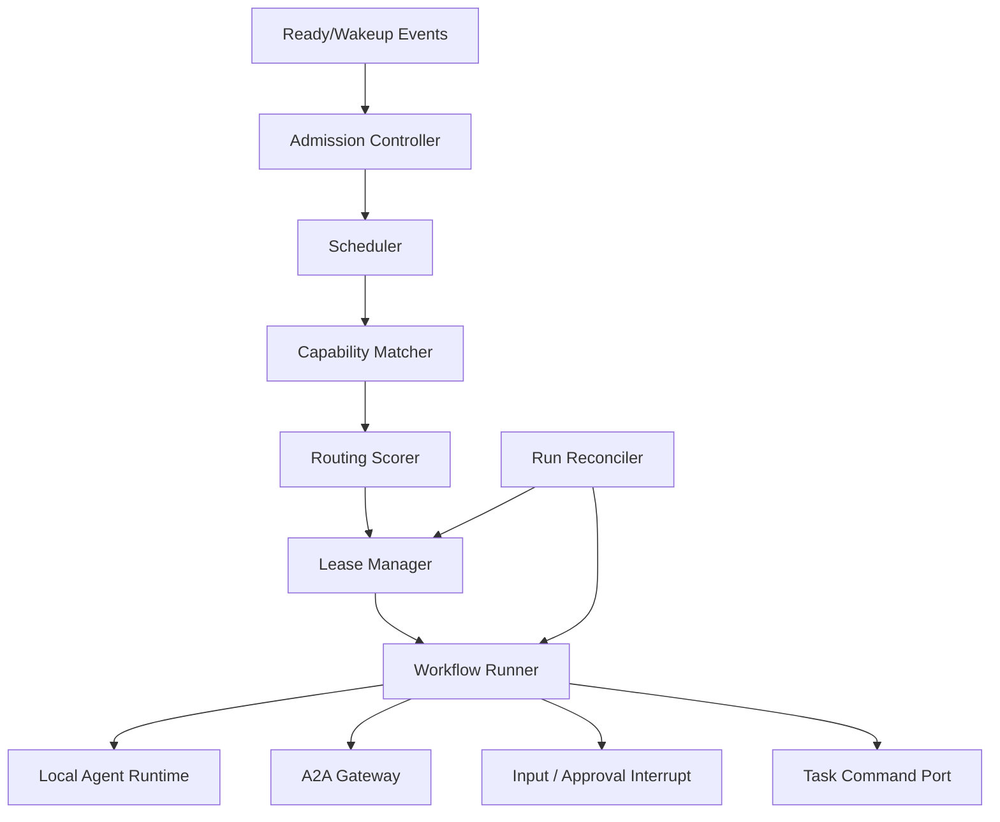

# Orchestrator and scheduler

Status: Proposed
Owners: Execution platform maintainers
Depends on: [Task domain](task-and-execution-domain.md), [Agent Registry](agent-registry.md), [Policy and approval](policy-and-approval.md)

## 1. Problem

正式版需要将可执行业务工作可靠映射为 LangGraph Workflow，选择合适 Agent，管理并行、租约、预算、中断和恢复。自然语言 Supervisor 不能承担队列、状态机或并发控制职责。

## 2. Responsibilities

- 注册和选择版本化 Graph Template。
- 将 READY Work Item 转为 Run/Assignment/Attempt。
- 执行硬性能力过滤、策略检查、配额和可解释路由。
- 管理 Worker lease、heartbeat、fencing token、deadline 和 cancellation。
- 驱动 LangGraph Thread、Checkpoint、interrupt/resume 和子图。
- 处理 execution event，向 Task Service 提交状态命令。
- Reconcile 卡住、失租约和业务/Checkpoint 不一致的 Run。

## 3. Non-responsibilities

- 不直接写 Task/Registry/Approval 所有表。
- 不执行模型和工具细节；委托 Local Agent Runtime 或 A2A Gateway。
- 不将调度决策隐藏在不可审计 Prompt 中。
- 不保证外部副作用的 exactly-once。
- 不把 Redis pending 状态当 Run 状态。

## 4. Components



## 5. Inputs and outputs

Inputs：WorkItemReady、RunWakeup、InputProvided、ApprovalDecided、RemoteTaskUpdated、LeaseExpired、CancelRequested、operator resume/reconcile command。

Outputs：RunRequested/Started/Waiting/Succeeded/Failed commands，AgentAssignment，AttemptLease，ActionIntent，A2A delegation，execution telemetry 和 reconciliation finding。

Orchestrator 只通过 Task Command Port 改变业务状态。Port 在模块化单体中可为进程内调用，在 Worker 中可为 authenticated internal API/command queue。

## 6. Graph templates

Graph Template 是不可变版本化定义，至少包含 state schema version、node registry、edge/condition、interrupt contract、allowed execution modes、migration compatibility 和 code artifact digest。

正式模板族：

- Direct：prepare → execute → validate → publish result。
- Reviewed：execute → independent review → accept/revise/escalate。
- Coordinated：plan validation → schedule DAG → join → synthesize → review。
- Federated：delegate A2A → wait remote → ingest artifacts → validate。
- Governed：在任意模板的 action node 前插入 policy/approval gate。

Graph State 只保存恢复所需值、ID 和 ArtifactRefs。业务 Task 快照带版本；恢复时若关键业务版本已变化，先执行 resume guard 而非盲目继续。

## 7. Scheduling algorithm

调度分两阶段：

### 7.1 Hard filters

- tenant/environment 与 Agent visibility 匹配。
- Agent version 已发布且 deployment healthy。
- required capability、input/output schema、language/modality 满足。
- policy 允许该 Agent、模型、MCP tools 和数据分类。
- deadline、最大输入、上下文窗口和预算可行。
- concurrency/quota/circuit breaker 有容量。

任何硬条件失败都不能由较高“智能评分”覆盖。

### 7.2 Explainable scoring

候选按可配置权重评分：capability specificity、历史质量、预计成本、预计延迟、当前负载、数据 locality、版本稳定性和 tenant preference。每个 Assignment 保存候选集摘要、过滤原因、分项得分和 routing policy version。

LLM 可以生成 routing hint，但只能作为一个有上限的评分特征，不能绕过硬过滤。

## 8. Admission and fairness

- 优先级只在同一 policy class 内比较；高优任务不能突破安全/预算上限。
- 使用 tenant weighted fair queue，保留 system recovery lane。
- 分层配额：platform → tenant → project → Agent/model/tool。
- admission reservation 在 lease 前原子占用，Attempt 终态或 lease expiry 后释放。
- deadline-aware aging 防止低优任务永久饥饿。
- 队列和数据库压力达到阈值时停止接收非关键新 Run，继续处理取消和恢复。

## 9. Lease lifecycle

```text
AVAILABLE -> RESERVED -> LEASED -> STARTED -> RELEASED
                         |            |
                         +-> EXPIRED <-+
```

Lease 包含 owner worker、attempt、fencing token、issued/expiry、heartbeat interval。Worker 的状态提交必须携带当前 fencing token；过期 Attempt 的晚结果只能作为 late result 保存。

Heartbeat 只证明 Worker 活跃，不证明节点有业务进展。Node progress 和 checkpoint age 单独监控。

## 10. LangGraph execution semantics

- 每 Run 固定 graph name/version 和 thread_id。
- durable Checkpointer 是 production readiness 必需项。
- node 输入输出必须可序列化并受 schema 校验。
- side-effect node 前后建立明确 checkpoint boundary；使用稳定 operation id。
- `interrupt()` payload 只含 JSON 值和受控引用；恢复必须使用同 thread_id。
- 因 resume 会从 node 开头重放，interrupt 前代码必须幂等；多个 interrupt 的顺序保持确定。
- 并行 super-step 的成功 pending writes 可复用，但业务完成仍需 Task Command 确认。
- replay/time-travel 只用于 debug 或显式 fork Run，不允许覆盖原业务历史。

## 11. Cancellation, timeout and pause

- Cancel 是持久化意图，优先级高于普通工作；Scheduler 停止新 Assignment。
- Local Runtime 接收 cooperative cancellation，并在 grace period 后终止 sandbox/process。
- A2A cancel 是 best effort，内部 Task 可先进入 canceling/canceled，但保存 remote late result。
- Tool/side effect 已提交时执行模块尝试 reconcile/compensate；无法确认则 outcome unknown。
- Pause 保存业务状态并在安全 checkpoint 中断；若当前节点不可安全中断，状态显示 pause requested。
- deadline 使用业务 UTC 时间；单次 call timeout、node timeout 和 overall deadline 分开配置。

## 12. Retry policy

错误分类决定行为：

| Category | Action |
|---|---|
| transient infra/network | 同 Attempt 内受限 retry 或新 Attempt |
| rate limit | retry-after + budget/deadline check |
| model/tool recoverable | 新 Attempt，可降级 provider/tool |
| invalid output | Reviewer/revision 或换 Agent |
| policy denied | 不重试，等待变更/人工 |
| auth required/input required | interrupt 等待 |
| permanent business rejection | Run failed/rejected |
| outcome unknown | reconcile，不直接重复副作用 |

Retry budget 是 Assignment 的一部分；重试不能无限继承完整预算。

## 13. Recovery and reconciliation

Worker 启动时不扫描全部任务，依赖 queue wakeup + 定期分片 Reconciler。检查：expired lease、stale checkpoint、waiting state 已具备 resume event、remote terminal mismatch、canceled Run 仍在调用、graph version unavailable。

恢复动作：renew/replace Attempt、re-enqueue wakeup、resume same Thread、create fork Run、mark outcome unknown 或转人工。每个动作使用确定 idempotency key，并记录 evidence snapshot。

## 14. Security

- Worker 使用 service identity；每 Assignment 获得短期 scoped execution token。
- Graph 不能动态 import 用户代码；自定义节点通过签名插件/隔离 Runtime 加载。
- Agent/Tool/Artifact 访问在执行时重新授权，Assignment 快照不能永久授予权限。
- Graph State 和 queue payload 不保存明文 secret。
- Operator replay/fork/cancel 需要强授权和完整审计。
- 来自模型的“调用某 Agent/工具”只是一项建议，必须经过 Registry 与 Policy。

## 15. Observability

业务指标：ready queue age、admission rejection、assignment latency、lease expiry、attempt count、run duration、interrupt duration、reconcile action、routing quality/cost。

Span：schedule、capability match、policy check、lease、graph step、interrupt/resume、runtime/A2A child spans。Graph State 默认不进入日志；节点只记录 schema-safe 摘要。

## 16. Capacity and deployment

- Scheduler/Worker 无状态水平扩展，协调依赖数据库 reservation/lease 和 Redis consumer groups。
- 每实例设置最大 active runs、model calls、tool calls 和 memory/CPU slots。
- Graph compilation 按 version 缓存并设置上限；旧版本在 active Run 清零前保留。
- 大型 DAG 由 Scheduler 分批激活 READY 节点，不把全 DAG 放入一个 Thread state。
- 单任务并行度、全局 fan-out 和 join 等待均有硬上限。

## 17. Testing

- deterministic scheduler fixtures 验证相同输入与 policy version 得到相同排序解释。
- property tests 验证配额不超卖、lease fencing 和取消/完成竞争。
- crash tests 覆盖 node 前后、checkpoint 前后、business command 前后。
- 使用 fake clock 测 lease、deadline、backoff 和 waiting timeout。
- Graph compatibility tests 确认 active Thread 可由目标部署版本恢复。

## 18. Acceptance criteria

- 所有执行模式可由版本化模板组合，且 Task API 不感知 LangGraph node。
- 过期 Worker 不能用旧 fencing token 提交成功结果。
- 重启任意 Worker 后 active Run 能恢复、重派或进入明确人工状态。
- 调度选择可解释并可复现，安全硬过滤不可被 LLM 覆盖。
- 暂停、取消、审批和 input-required 均通过持久状态而非进程内等待。
