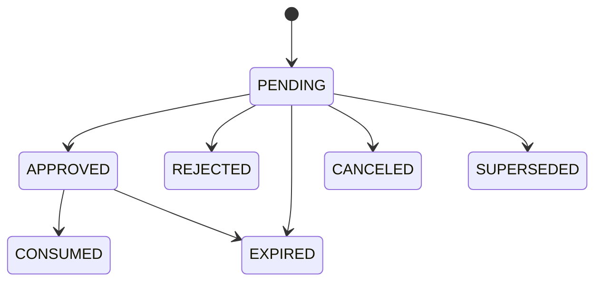

# Policy and approval

Status: Proposed
Owners: Security and governance maintainers
Depends on: [Cross-module contracts](cross-module-contracts.md), [Identity and tenancy](identity-tenancy-and-secrets.md)

## 1. Problem

Agent 的模型输出不能直接决定权限。正式版需要在 Agent、工具、数据、预算、远程 Peer 和副作用边界执行一致策略，并将需要人类判断的动作转为可审计、不可被参数替换的 Approval。

## 2. Responsibilities

- 管理版本化 Policy Bundle、Profile 和 rollout。
- 对 subject/action/resource/environment 作 deterministic decision。
- 返回 allow、deny、require approval 或带 obligations 的 allow。
- 管理 ActionIntent、ApprovalRequest 和 ApprovalDecision 生命周期。
- 绑定审批与 canonical action hash，防 TOCTOU/参数替换。
- 为 Runtime/API/Gateway 提供同步决策和审计查询。

## 3. Non-responsibilities

- 不执行最终副作用。
- 不用 Prompt 代替授权规则。
- 不保存外部 secret 或 Artifact 内容。
- 不让 Approver 通过修改数据库直接恢复 Workflow。
- 不把 Langfuse Score 当安全决策真相。

## 4. Decision model

PolicyInput：

- subject：Principal/AgentVersion/delegation chain。
- action：create/run/cancel、tool invoke、artifact read/write/share、A2A delegate、model use、admin operation。
- resource：tenant、Task、Tool、Artifact、Peer、model endpoint 等稳定属性。
- environment：deployment、time、network、risk、budget remaining、data classification、task mode。
- request：canonical parameters hash 和有限结构化 attributes。

Decision：result、reason codes、policy bundle/version、obligations、action hash、expiry。未知 obligation 对执行方是 fail closed。

## 5. Policy evaluation points

- API command authorization。
- Agent Version publish/deploy。
- Scheduler candidate hard filter。
- Model provider/data residency selection。
- MCP Tool/Resource/Prompt access。
- A2A peer/delegation/artifact egress。
- Artifact upload/download/share/delete。
- Budget increase、retry/revision、operator replay。
- 高风险副作用 commit 前。

早期 allow 不替代 commit-time re-evaluation；长期运行中策略、身份或资源可能变化。

## 6. Action intent

ActionIntent 是执行前的不可变规范：action type、target、canonical args、expected side effect、idempotency strategy、actor/delegation、risk/classification、budget impact、evidence refs、expiry。

Canonicalization 使用版本化算法，产生 action hash。对顺序无意义的字段排序，对 secret 只包含 stable ref/audience 而非值。算法版本写入 Intent/Approval。

ActionIntent 经 policy 后：

- allow：得到短期 ExecutionPermit。
- allow_with_constraints：得到 obligations，例如参数上限、脱敏、指定 endpoint。
- deny：结束/返工，不自动转审批。
- require_approval：创建 ApprovalRequest 并中断 Workflow。

## 7. Approval lifecycle

- `APPROVED` 不等于副作用已执行；Permit 只能消费一次或按明确 idempotency scope 使用。
- 修改参数创建新 Intent/Approval，旧请求 SUPERSEDED。
- 审批过期、subject 权限撤销或 policy major revision 使 Permit 失效。
- Reject reason 可公开给 Agent 的安全摘要与内部审计说明分离。

## 8. Approver selection and separation of duties

Approver set 根据 tenant、action、risk、resource owner、金额/数据分类和组织关系计算。支持：

- any-of / all-of / quorum。
- sequential stages，例如 owner → security → finance。
- self-approval prohibition。
- requester/Agent author/tool owner 与 approver 分离。
- break-glass：强认证、短期、双人复核、即时告警和事后审计。

审批委托有范围和期限，不能用普通角色绑定永久绕过高风险策略。

## 9. Workflow integration

1. Runtime/Gateway 创建 Intent 并调用 Policy。
2. require approval 时 Task Service 保存 Approval 和 Run WAITING_APPROVAL；LangGraph `interrupt()` payload 只含 approval ID/安全摘要。
3. Console 读取权威 Approval 与 evidence，提交 decision command。
4. Task/Event 唤醒原 Thread；node 从头重放并读取 decision。
5. commit 前重新计算 action hash/Policy，获取 Permit。
6. Side-effect executor 用 invocation ID + Permit 执行，并记录 consume/outcome。

Approval 决策不通过直接调用 Worker 内存恢复。

## 10. Consistency and idempotency

- Intent、Decision、Approval、Outbox 与 Run waiting transition 在明确事务/命令链中提交。
- CreateApproval 使用 decision+action hash 去重。
- 同一 Approver 重复 decision 返回首次结果；冲突决定按状态机拒绝。
- Permit consumption 使用 compare-and-swap；执行响应丢失仍按 external operation ID reconcile。
- Policy cache key 包含 bundle version 和所有 decision-relevant attributes；deny/revoke 失效优先。
- 审批 UI 的 evidence snapshot 记录版本，打开后资源变化会提示并要求重新评估。

## 11. Policy engine implementation boundary

首版使用内置 Policy Port + 声明式规则，支持将 engine 外置。规则语言必须：可版本、可测试、无网络副作用、确定性、有执行时间/内存上限。

业务代码可以实现不可变安全 guard（例如跨租户永不允许），Policy Engine 负责可配置规则。外置引擎不可用时：高风险 fail closed；只读低风险是否使用未过期 signed decision 由 profile 明确。

## 12. Security

- Policy author、reviewer、publisher 分权；Bundle 签名、diff、测试和 rollback。
- Input attributes 来自可信 owner；用户/模型自报 risk/tenant/role 不可信。
- Approval link 不携带可直接决策的 bearer secret；Console 要求正常身份和 CSRF 防护。
- reason/evidence 按角色脱敏，防将 secret/PII 暴露给不相关 Approver。
- decision/approval/audit append-only；高风险导出 WORM 或签名归档。
- 防 prompt injection：自然语言理由只作为 evidence，不驱动授权结果。

## 13. Observability

指标：decision count/latency/result、policy error/cache、approval queue age、approve/reject/expire、self-approval blocked、permit consume、re-evaluation change、break-glass。

Trace 只记录 action/resource type、bundle/version、result/reason codes、approval ID；参数正文默认 hash/分类。安全拒绝可进入专用告警，不向 Agent 暴露规则细节。

## 14. Capacity and limits

- 同步 decision p95 目标低于 50 ms（不含外部 identity lookup）；规则执行有 100 ms 硬上限候选。
- 单 Intent attributes/obligations 大小有限，证据通过 ArtifactRef。
- 每 Task pending Approvals 和 revision 次数设上限，防 approval spam。
- Approval retention 不短于关联 Task/Audit；expired decision cache 硬删除。
- 批量低风险操作可用 bounded batch intent，但每个资源结果仍可审计。

## 15. Testing

- policy table/property tests 覆盖角色、tenant、classification、risk、budget 和 unknown attribute。
- canonical action hash 跨语言 golden vectors。
- 参数修改、policy update、approver revoke、expiry 后 Permit 失效。
- concurrent approve/reject/consume 和重复 callback。
- engine unavailable、cache stale、break-glass 和 evidence access 安全测试。

## 16. Acceptance criteria

- 模型/Agent 无法直接创建 allow 或 ApprovalDecision。
- Approval 与 exact action hash、policy version、evidence 和 approver identity 绑定。
- action 参数、身份或安全策略变化会阻止使用旧 Permit。
- 所有关键执行点使用同一 PolicyDecision 契约并理解未知 obligation 为拒绝。
- Policy/Approval 故障不会静默放宽权限。
