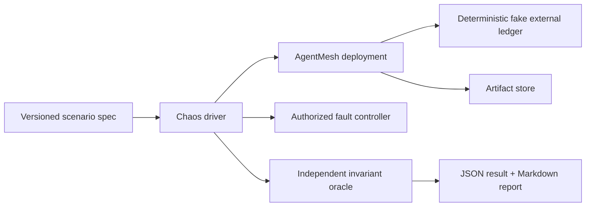

# AgentMesh Reliability Model and Chaos Qualification v1

Status: Accepted design baseline
Owners: Execution, persistence, and operations maintainers
Parent decision: [ADR 0007](../../../adr/0007-framework-neutral-agent-control-plane.md)
Tracks: [#138](https://github.com/0YHR0/AgentMesh/issues/138),
related [#26](https://github.com/0YHR0/AgentMesh/issues/26)

## 1. Purpose

AgentMesh's reliability claim is not that every dependency is always available or that an external
side effect is exactly once. The claim is:

> Every accepted operation preserves authority and evidence, and converges to a correct terminal,
> recoverable waiting, or explicit outcome-unknown state after bounded failures.

This document defines invariants, crash windows, required recovery, a deterministic fault harness,
machine-readable results, and qualification gates. It benchmarks control-plane correctness rather
than model quality.

## 2. Authorities

| State | Authority | Recoverable evidence only |
|---|---|---|
| Task/Run/Attempt/Assignment | PostgreSQL owner tables | Redis, Runtime state, Trace |
| Policy/Approval/Permit/ActionExecution | PostgreSQL governance/integration tables | runtime wait state, UI cache |
| Artifact metadata/version | PostgreSQL Artifact tables | object listing, browser cache |
| Artifact bytes | content-addressed storage | runtime workspace |
| Runtime execution | provider for provider phase; PostgreSQL binding for control-plane mapping | Worker memory |
| external real-world effect | target system/registered external ledger | HTTP response, model claim |
| delivery | PostgreSQL Outbox/Inbox authority + Redis transient transport | consumer memory |
| telemetry | Langfuse/OTel | never business authority |

Recovery always compares evidence to owner state and issues normal idempotent commands. A
reconciler cannot directly edit another module's state machine.

## 3. Correctness invariants

The qualification suite must independently assert:

| ID | Invariant |
|---|---|
| R1 | Every accepted command has one durable idempotency outcome. |
| R2 | No committed business transition is missing its Outbox fact. |
| R3 | Duplicate/redistributed messages do not duplicate Run, Attempt reservation, Approval,
Permit use, Artifact version, or ActionExecution. |
| R4 | Only the latest valid Attempt/runtime/action-executor fencing token can advance authority. |
| R5 | No confirmed irreversible external effect is executed more than its authorized Permit uses. |
| R6 | Ambiguous non-idempotent/irreversible dispatch never becomes ordinary retryable failure. |
| R7 | Task completion requires valid outputs/Artifacts/criteria and no unresolved required action. |
| R8 | Cancellation/pause/revocation is durable intent; late results cannot silently overwrite it. |
| R9 | Runtime/checkpoint/remote state cannot directly manufacture a Task terminal state. |
| R10 | Every nonterminal accepted operation either progresses, waits with an explicit reason and
deadline, or enters an attention/reconciliation queue. |
| R11 | Budget/quota reservations are neither double-spent nor leaked after terminal/expired work. |
| R12 | Historical evidence is append-only; reconciliation records resolution without rewriting
what was previously unknown. |

The primary hard gates are counts of invariant violations, not service uptime percentages.

## 4. Defined crash windows

### 4.1 Command and event delivery

| Window | Expected convergence |
|---|---|
| before DB commit | no fact; retry same key |
| after DB commit, before response | same key returns stored outcome |
| after Outbox commit, before publish | Relay publishes later |
| after publish, before published mark | duplicate delivery; Inbox dedupe |
| after consumer commit, before queue ack | duplicate delivery returns processed result |
| poison/permanent rejection | durable rejection/quarantine; no infinite hot loop |

### 4.2 Attempt and RuntimeExecution

| Window | Expected convergence |
|---|---|
| Attempt reserved, before runtime dispatch | lease expires; replacement sees PREPARED and dispatches once |
| provider started, receipt lost | inspect by stable dispatch key/handle before redispatch |
| Worker dies while provider runs | replacement Attempt fenced claim/reattach or explicit unsupported path |
| old Worker reports after replacement | late evidence; stale fence cannot finalize |
| provider execution disappears | prove absence and side-effect safety before new execution; otherwise unknown |
| checkpoint advances, business command absent | compare checkpoint summary; issue guarded completion/wait command |
| business terminal, runtime reports later | preserve late evidence; do not overwrite terminal state |

### 4.3 Governed external action

| Window | Expected convergence |
|---|---|
| Permit use reserved, before DISPATCHING | same ActionExecution can be claimed; no new Permit use |
| DISPATCHING commit, before/after network send | provider query/idempotent replay; otherwise OUTCOME_UNKNOWN |
| effect succeeds, response lost | external ledger/query proves success; duplicate effect count stays zero |
| reconciliation process dies | same reconciliation key resumes; original unknown evidence remains |
| Permit/revocation changes during dispatch | no new dispatch; in-flight outcome still reconciled honestly |

### 4.4 Artifact

| Window | Expected convergence |
|---|---|
| PENDING metadata, upload absent | TTL cleanup/failure; never available |
| bytes uploaded, finalize absent | hash inspection/finalize retry or orphan cleanup |
| finalized Artifact, Attempt result absent | reconciler links via producer identity or retains late Artifact |
| delete metadata committed, object delete fails | deletion-pending retry; no metadata resurrection |

## 5. Outcome taxonomy

Every scenario ends in one of:

- `CONVERGED_SUCCESS`
- `CONVERGED_FAILURE`
- `CONVERGED_CANCELED`
- `RECOVERABLE_WAIT` with reason, owner, and deadline
- `OUTCOME_UNKNOWN` with reconciliation path and evidence
- `INVARIANT_VIOLATION` (qualification failure)
- `HARNESS_ERROR` (benchmark invalid; not a product pass/fail)

“Process is running” and “HTTP 200” are not convergence outcomes.

## 6. Benchmark architecture



Components:

- **scenario spec** defines seed, workload, fault point, trigger, recovery actions, deadline, and
  assertions;
- **driver** creates workload with stable IDs and observes only public/operator APIs plus explicitly
  read-only benchmark probes;
- **fault controller** can stop/restart selected processes, pause network, duplicate a delivery, or
  activate compiled test hooks;
- **fake external ledger** records every requested/confirmed effect under stable operation ID and
  independently exposes query/cancel behavior;
- **oracle** compares owner tables/APIs, external ledger, Artifact hashes, queue evidence, and audit;
- **reporter** emits schema-validated JSON and a concise human report.

Fault control is never exposed by production API. Test hooks compile/activate only under an explicit
`AGENTMESH_CHAOS_TEST_MODE=true` profile, bind to loopback/test credentials, and fail startup in
production environment.

## 7. Scenario schema

```yaml
schema: agentmesh.chaos-scenario/v1
id: worker-dies-after-runtime-start
seed: 42
profile: compose-smoke
workload:
  fixture: generic-runtime-success
  count: 10
fault:
  target: execution-worker
  hook: after_runtime_dispatch_before_receipt_commit
  occurrence: 1
  action: kill_process
recovery:
  restart_after_seconds: 2
  run_reconcilers: true
deadline_seconds: 60
assertions:
  - no_lost_accepted_work
  - no_duplicate_provider_execution
  - stale_fence_commits: 0
  - all_operations_explained
```

Scenario version/digest, AgentMesh commit, image digests, database migration revision, dependency
versions, host resources, clock mode, and start/end timestamps are included in every result.

## 8. Required initial scenario matrix

### CI smoke (required on pull requests touching reliability paths)

1. duplicate Run request/Redis delivery;
2. Relay publish succeeds before published mark;
3. Worker dies after Attempt lease before execution;
4. Worker dies after runtime start before receipt commit;
5. stale Worker attempts terminal commit after replacement;
6. Redis unavailable then restored while PostgreSQL remains available;
7. checkpoint terminal observation before business finalization;
8. MCP idempotent write succeeds but response is lost;
9. non-idempotent fake write dispatch becomes ambiguous;
10. reconciliation worker dies before resolution commit;
11. cancel races terminal runtime result;
12. finalized Artifact arrives after canceled Attempt.

### Scheduled extended profile

- repeated worker/relay restarts during mixed direct/reviewed/coordinated workloads;
- hundreds of Agents/Runs with queue pressure and bounded resource limits;
- Redis restart with pending groups;
- PostgreSQL connection interruption (not HA failover certification);
- Runtime adapter process/container disappearance and orphan cleanup;
- approval expiry/revoke races;
- rollout-group fan-out from #26 when implemented.

## 9. Fault injection mechanisms

Prefer the narrowest deterministic mechanism:

1. pure domain/property tests with fake clock;
2. application service hooks at named durability boundaries;
3. adapter fake that loses/duplicates/delays selected messages;
4. process kill/restart in Compose;
5. network proxy/toxicity for dependency interruption;
6. database failpoint only in disposable integration environment.

Named hooks are semantic (`after_outbox_publish_before_mark`), not source line numbers. Each hook
declares whether the triggering operation is before/after authoritative commit. Tests must prove a
hook fired; a scenario that misses its trigger is `HARNESS_ERROR`.

## 10. Independent oracle

The oracle must not trust the service response being tested. It uses:

- stable command/idempotency outcomes;
- Task/Run/Attempt/RuntimeExecution/ActionExecution query projections;
- read-only consistency queries against a disposable test database;
- fake external ledger operation counts;
- Artifact content hashes and producer lineage;
- Outbox/Inbox/audit counts and unresolved attention items.

Oracle rules are versioned separately from scenario code. When possible, they reconstruct derived
state from append-only facts and compare it with projections.

## 11. Metrics and result schema

Each result includes:

```text
accepted/completed/failed/canceled/waiting/unknown counts
lost accepted work count
duplicate business entity count
duplicate confirmed external effect count
stale fence commit count
unexplained nonterminal/terminal count
budget/quota reservation leak count
recovery latency per operation and p50/p95/p99
outbox and projection lag
runtime reattach/redispatch/reconcile counts
attention queue and unresolved unknown count
invariant violations with evidence refs
```

The JSON schema is `agentmesh.chaos-result/v1`. Evidence too large for JSON is stored as Artifact
with digest/reference. Markdown reports are generated from JSON, never maintained independently.

## 12. Qualification gates

For every required scenario:

- `lost_accepted_work = 0`
- `duplicate_confirmed_irreversible_effects = 0`
- `stale_fence_commits = 0`
- `unexplained_terminal_states = 0`
- `silent_stuck_operations = 0` after scenario deadline
- `budget_or_quota_reservation_leaks = 0`
- `invariant_violations = 0`
- scenario trigger fired and oracle completed

`OUTCOME_UNKNOWN` may be the correct result and is not itself failure when the scenario intentionally
removes proof. It fails qualification only if no explicit attention/reconciliation path exists or a
blind retry occurred.

Latency/throughput baselines are recorded and regression-thresholded only after enough stable runs.
They never override correctness gates. Hardware-specific results must not be generalized as
production capacity certification.

## 13. CLI and profiles

Target operator/developer interface:

```bash
agentmesh-chaos list
agentmesh-chaos run --profile compose-smoke --scenario worker-dies-after-runtime-start
agentmesh-chaos run --profile compose-smoke --suite ci
agentmesh-chaos report .agentmesh/chaos/<run-id>/result.json
```

Compose uses an explicit `chaos` profile and disposable database/artifact namespaces. The driver
refuses to target a deployment without the test-mode marker and matching environment fingerprint.
Cleanup verifies no benchmark containers, leases, or credentials remain.

## 14. CI and evidence publication

- Unit/property reliability tests run on every PR.
- Bounded Compose smoke runs when execution, messaging, persistence, runtime, governance, or
  Artifact paths change; maintainers can run it manually for other changes.
- Extended suite runs scheduled/manual on free infrastructure while feasible.
- Checked-in baseline metadata contains scenario/oracle versions and links to CI artifacts, not
  megabytes of generated logs.
- Release qualification publishes result JSON, Markdown summary, commit/image digests, and known
  limitations.
- A failed or flaky scenario is visible and never silently retried until green without preserving
  the first failure evidence.

## 15. Security and safety

- Chaos credentials have no production audience and expire with the run.
- Fault hooks cannot alter authorization outcomes or mint Permit; they only interrupt configured
  boundaries.
- Logs/reports are redacted and use deterministic fake secrets/data.
- External fake ledger is isolated and cannot call a real provider.
- Process/network controls validate target labels and workspace paths before mutation.
- Database destructive tests run only against a fingerprinted disposable database.

## 16. Implementation slices

### R0 — oracle and deterministic component faults

- result/scenario schemas;
- fake external ledger;
- invariant oracle for existing Task/Attempt/Outbox/MCP records;
- duplicate delivery, stale fence, and response-loss component tests.

### R1 — Compose smoke harness

- `agentmesh-chaos` CLI;
- explicit Compose profile and authorized process/network controller;
- first 12 scenarios and report generator;
- CI integration.

### R2 — Managed Runtime and Governed Action qualification

- runtime dispatch/reattach scenarios from #135/#136;
- Permit reserve/dispatch/reconcile scenarios from #137;
- common release evidence.

### R3 — scale/rollout extensions

- scheduled mixed workload;
- resource/capacity baselines;
- #26 rollout-group isolation/evaluation scenarios.

## 17. Exit criteria

- One command runs the bounded CI suite from a clean checkout.
- Every named fault proves it triggered and ends in a classified convergence outcome.
- The independent fake ledger demonstrates zero duplicate confirmed irreversible effects.
- Worker/Relay/Redis interruption cannot lose accepted Task authority.
- Runtime and governed-action crash windows are covered before their feature gates become default.
- Release documentation states tested environment and limitations instead of using an unqualified
  “production ready” label.
