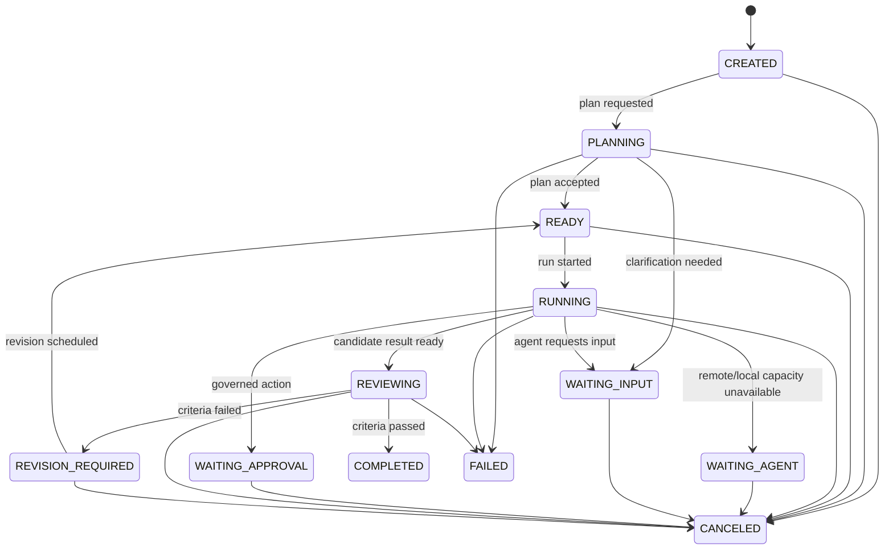

# Task and execution domain

Status: Proposed
Owners: Task Service maintainers
Depends on: [Cross-module contracts](cross-module-contracts.md), [Persistence and consistency](persistence-and-consistency.md)

Implemented budget increment: [Task budget and admission control](../task-budget-admission-implementation.md).
Implemented intervention increment: [Human Task resolution](../human-task-resolution-implementation.md).

## 1. Problem

正式版需要用统一业务模型表达单 Agent、多 Agent、复核、人工审批和远程委托，同时不能让 LangGraph、A2A 或队列状态成为用户可见真相。本模块定义任务账本和合法状态转换。

## 2. Responsibilities

- 管理 Task、Subtask、Run、Attempt、Handoff 和 Acceptance Criterion。
- 校验创建、规划、调度、暂停、恢复、取消、返工和完成命令。
- 保存目标、约束、预算、截止时间、进度、结果和失败分类。
- 发布不可变领域事件，并为 Orchestrator 提供稳定业务快照。
- 保证每个工作项的活动 Run、修订次数和依赖关系满足不变量。

## 3. Non-responsibilities

- 不执行 LangGraph 或模型。
- 不选择具体 Agent Instance。
- 不保存 Artifact 内容、Prompt/Trace 或外部协议原文。
- 不直接发布 Redis 消息；只在事务中写 Outbox。
- 不根据模型自由文本绕过状态守卫。

## 4. Aggregate boundaries

### 4.1 Task aggregate

Task 是顶层一致性边界，拥有：

- Task 基本信息和顶层状态。
- Acceptance Criteria 与最终 Artifact 引用。
- 顶层预算、截止时间、执行模式和策略 Profile。
- 当前计划版本、当前顶层 Run 和汇总进度。

Subtask 数量较小时可在 Task command 中校验 DAG；正式持久化时 Subtask 是独立行和锁边界，避免锁住整个大型 Task。跨 Subtask 不变量通过事务性 PlanVersion 与依赖边维护。

### 4.2 Work item

Task 和 Subtask 都是可执行 Work Item，但数据库不强制使用多态单表。共享语义包括 objective、input refs、status、priority、budget slice、deadline 和 acceptance criteria。

### 4.3 Run aggregate

Run 表示某个 Work Item 的一次完整执行轨迹，拥有一个稳定 LangGraph `thread_id`。重试、改派、返工或从旧 Checkpoint 分叉都创建新 Run；历史 Run 不覆盖。

Attempt 表示 Run 内一次具体执行租约。Worker 崩溃、租约过期并重新派发会创建新 Attempt，而不必创建新 Run；业务策略决定何时将多次 Attempt 升级为新 Run。

## 5. Core entities

| Entity | Important fields |
|---|---|
| Task | tenant、owner、objective、constraints、mode、status、priority、budget、deadline、plan_version、version |
| Subtask | task、parent、objective、status、required_capabilities、budget、deadline、revision_of、version |
| Dependency | predecessor、successor、condition、required_artifact_kind |
| Run | target type/id、thread_id、status、agent assignment、budget snapshot、policy snapshot、result/error |
| Attempt | run、assignment、lease owner/token/expiry、status、heartbeat、external operation refs |
| Handoff | source/target、reason、contract、status、accepted_by |
| AcceptanceCriterion | type、definition、required、evaluator、threshold、result |
| StateTransition | from/to、actor、reason、command/event、occurred_at |

Budget 至少表示 token、模型成本、工具成本、wall-clock、attempt/revision count；货币值使用明确币种和定点数，不使用浮点数。

## 6. Task state machine



`PAUSED` 作为显式操作状态时保存 `paused_from_status`，只允许恢复到经重新校验后的 READY/WAITING 状态。实现可以将 PAUSED 作为顶层状态，也可以用 `suspension` 子状态；公共 API 语义必须稳定。

Task 完成守卫：所有 required criteria 通过、required Subtasks 终态成功、最终 Artifact 可用、没有未决 Approval、成本已结算或明确标为估算。

## 7. Subtask and Run states

Subtask：

```text
BLOCKED -> READY -> ASSIGNED -> RUNNING
RUNNING -> WAITING_INPUT | WAITING_APPROVAL | REVIEWING
REVIEWING -> COMPLETED | REVISION_REQUIRED
REVISION_REQUIRED -> READY
Any non-terminal -> FAILED | CANCELED | SKIPPED (only by dependency policy)
```

Run：

```text
QUEUED -> LEASED -> RUNNING
RUNNING -> WAITING_INPUT | WAITING_APPROVAL | WAITING_REMOTE | REVIEWING
WAITING_* -> QUEUED | RUNNING
REVIEWING -> SUCCEEDED | REVISION_REQUIRED
Any active -> FAILED | TIMED_OUT | CANCELED | ABANDONED
```

Attempt：`CREATED -> LEASED -> STARTED -> SUCCEEDED | FAILED | TIMED_OUT | CANCELED | LEASE_EXPIRED | OUTCOME_UNKNOWN`。

`OUTCOME_UNKNOWN` 用于外部副作用请求超时且无法证明是否执行。它不能被普通重试自动转成 FAILED，必须先 reconcile 或人工处置。

## 8. Commands

- `CreateTask`
- `RequestPlan` / `AcceptPlan` / `ReplacePlan`
- `AddSubtask` / `LinkDependency`
- `MarkWorkReady`
- `RequestRun` / `StartRun` / `RecordAttemptOutcome`
- `PauseTask` / `ResumeTask` / `CancelTask`
- `RequestInput` / `ProvideInput`
- `RequestReview` / `RecordCriterionResult`
- `RequestRevision`
- `CompleteTask` / `FailTask`
- `RequestHandoff` / `AcceptHandoff` / `RejectHandoff`

用户/API 命令和 Worker 命令使用不同授权范围。Worker 不能修改目标、扩大预算或跳过 required criterion。

## 9. Domain events

- TaskCreated、TaskPlanningStarted、PlanAccepted、PlanReplaced
- SubtaskCreated、DependencyAdded、WorkItemReady
- RunRequested、RunQueued、RunStarted、RunWaiting、RunSucceeded、RunFailed
- AttemptLeased、AttemptHeartbeatMissed、AttemptOutcomeUnknown
- TaskPaused、TaskResumed、TaskCanceled
- InputRequested、InputProvided
- ReviewRequested、CriterionEvaluated、RevisionRequested
- HandoffRequested、HandoffAccepted、HandoffRejected
- TaskCompleted、TaskFailed

事件 payload 保存事实和稳定引用，不嵌入完整 Task 快照。

## 10. Planning and DAG invariants

- PlanVersion 一旦接受即不可修改；变更创建新版本并记录 diff/reason。
- 有效计划必须无环；最大节点数和深度由租户策略限制。
- READY Subtask 的所有强依赖必须满足；软依赖失败时按 condition 决定继续、降级或跳过。
- 替换计划不得删除已有不可逆副作用的历史，只能标记旧节点 superseded/canceled。
- 子任务预算总和可小于顶层预算以留 buffer，但不能超过可分配余额。
- Planner 建议不直接落库，必须经过 deterministic validator 和策略检查。

## 11. Main flows

### 11.1 Direct

CreateTask → RequestRun → 单 Subtask/Run → candidate Artifact → criteria → CompleteTask。

### 11.2 Reviewed

Executor Run 生成候选结果 → Reviewer 使用独立 Run/Agent Definition → criterion results → 完成或有限次 revision。

### 11.3 Coordinated

Planner 生成 PlanVersion → 验证 DAG/预算 → Scheduler 并行领取 READY Subtasks → Handoff/Artifact 汇聚 → Reviewer → 完成。

### 11.4 Federated

内部 Run 创建 Assignment → A2A Gateway 建 Remote correlation → WAITING_REMOTE → 远程状态/Artifact 事件唤醒 → 内部验证 → 终态。

### 11.5 Governed

任何 Run 在副作用前产生 ActionIntent → PolicyDecision → WAITING_APPROVAL → decision 绑定 action hash → 恢复或拒绝。

## 12. Consistency and concurrency

- 所有聚合使用乐观版本；竞争激烈的开始/取消/完成路径使用行锁或 compare-and-swap。
- 同一 Work Item 最多一个 active Run，除非 execution policy 明确允许 speculative execution；后者必须有 winner/loser 收敛规则。
- 每个命令使用 tenant + command type + idempotency key 去重。
- 状态、StateTransition、Outbox Event 和 idempotency result 在同一事务提交。
- 取消与完成竞争时，以数据库首先成功的合法终态转换为准；后到命令返回 stable conflict/terminal result。
- 进度是派生字段，可从 Subtask/criterion 投影重建，不参与关键完成判定。

## 13. Failure and recovery

| Failure | Required behavior |
|---|---|
| 事务提交前崩溃 | 无业务变化，命令可安全重试 |
| 事务提交后响应丢失 | 相同 idempotency key 返回首次结果 |
| Run 已 QUEUED 但无 Worker | Scheduler 重新投递；Task 保持可解释等待状态 |
| Worker lease 过期 | 新 Attempt；旧 Attempt 结果需 fencing token 校验 |
| Checkpoint 已推进但业务状态未更新 | Reconciler 对比 Run binding 和 Checkpoint 摘要，发恢复命令 |
| Artifact/remote result 到达终态后 | 保存为 late result，不能改写终态；允许人工 fork |
| 预算耗尽 | 停止创建新 Attempt/Revision，按策略 FAILED 或 WAITING_APPROVAL |

Reconciler 只能发正常 Domain Command，不能直接修表绕过状态机。

## 14. Security and audit

- tenant_id 来自可信身份上下文，不接受 payload 自报。
- objective/input 视为不可信内容；展示和日志执行转义/脱敏。
- 每次目标、约束、预算、计划和状态变化保留 actor 与 reason。
- Agent 只能读取 Assignment 授予的 Work Item 快照和 ArtifactRefs。
- Task Owner、Operator、Approver 权限分离；高风险场景禁止自提自批。
- 软删除不删除审计链；数据清理由租户保留策略控制。

## 15. Observability

业务指标：各状态数量/停留时间、计划节点数、成功率、revision/attempt 分布、late result、outcome unknown、预算偏差。

关键 Span：command handling、state transition、plan validation、run reconciliation。日志字段必须包含 tenant、task、run、command/message 和 aggregate version。

## 16. Capacity and limits

- 单 Task 默认最多 500 Subtasks、2,000 dependency edges、10 层嵌套。
- 每 Work Item 默认最多 5 Runs；每 Run 默认最多 3 Attempts；Reviewer revision 默认最多 3 次。
- Task 目标和结构化输入受 API 限制；大输入必须转 Artifact。
- 超大 DAG 通过分页查询和批量投影，不在单个 Event/Checkpoint 中嵌入全图。

限制均可按租户收紧；扩大需要容量评估。

## 17. Testing

- 状态机 property tests 覆盖所有命令、终态和取消/完成竞争。
- DAG validator 覆盖环、缺失依赖、条件边、预算溢出和 superseded plan。
- 并发测试覆盖同一 Work Item 重复 Run、Attempt late result 和 fencing token。
- 故障 fixture 覆盖 transaction response loss、Checkpoint mismatch、budget exhaustion 和 outcome unknown。
- 五种 execution mode 使用 canonical scenario fixtures 验证相同领域不变量。

## 18. Acceptance criteria

- 五种 execution mode 都能用同一实体和事件组合表达。
- 状态机 property tests 覆盖所有非法转换和取消/完成竞争。
- DAG validator 检测环、缺失依赖、预算溢出和 superseded 节点。
- 重复命令、Worker lease 过期和 late result 最终收敛且不覆盖历史。
- Task 完成不依赖 LangGraph、Redis、A2A 或 Langfuse 状态枚举。
