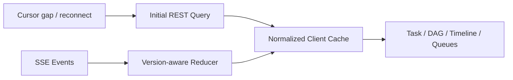

# Web Console

Status: Proposed
Owners: Product frontend maintainers
Depends on: [Control API](control-api.md), [Observability and evaluation](observability-and-evaluation.md)

## 1. Problem

用户希望只发布任务并监视 Agent 协作，Operator 需要快速发现卡住、失败、超预算和待审批工作。Console 必须将业务状态、执行细节和诊断 Trace 分层展示，而不是模拟一个不可控的 Agent 群聊。

## 2. Responsibilities

- 提供 Task 创建、状态、DAG、Run、Agent、Artifact 和 Approval 用户体验。
- 提供 Operator 队列、错误、等待、预算、成本、质量和审计视图。
- 通过 SSE 增量更新并在断线/乱序后重新同步。
- 对高风险命令提供 evidence、确认、reason 和并发冲突处理。
- 根据角色、租户、数据分类和 feature flags 控制可见能力。
- 提供可访问、国际化、可测试的交互基础。

## 3. Non-responsibilities

- 不在浏览器保存业务权威状态。
- 不直接连接 PostgreSQL、Redis、LangGraph、MCP/A2A Peer 或对象存储主接口。
- 不通过隐藏按钮替代服务端授权。
- 不把聊天气泡作为 Task 状态或 Handoff 的唯一表示。
- 不在 localStorage 保存长期 access token、secret 或 restricted Artifact。

## 4. Information architecture

### Home / Operations

全局状态、active/blocked/approval/failed queues、SLO、成本、质量、Worker/Peer/Tool health 和 recent incidents。

### Tasks

列表支持 owner/status/mode/agent/tag/deadline/risk 筛选；detail 分页签：

- Overview：目标、约束、owner、状态、进度、预算、最终结果。
- Plan：Subtask DAG、依赖、负责人、critical path。
- Runs：Run/Attempt 时间线、Agent Version、waiting/retry/reconcile。
- Artifacts：版本、scan、classification、lineage、preview/download。
- Approvals/Input：当前和历史请求。
- Activity/Audit：业务事件和人工操作。
- Traces：有权限时深链到 Langfuse/工程视图。

### Agents

Definition/Version diff、capabilities、tools/models/policy、verification、deployments/health、quality/cost 趋势、publish/deprecate/revoke。

### Integrations

MCP Server/Tool catalog、A2A Peer/Card/health、auth status、schema changes、invocation/delegation error。

### Governance

Approvals inbox、Policy bundles/decisions、role bindings、secret refs metadata、audit/export、retention。

## 5. Task creation flow

1. 选择 workspace/template 或空白任务。
2. 填 objective、constraints、acceptance criteria、inputs/Artifacts。
3. 选择自动 mode 或高级 mode hint；用户无需选择 Agent 拓扑。
4. 设置预算、deadline、risk/data classification。
5. 前端本地 schema validation，提交带 idempotency key 的 CreateTask。
6. 显示 accepted Task 和下一步 planning/run 状态。

刷新/网络超时后复用同 idempotency key 查询结果，不能生成重复 Task。大文件先经 Artifact upload flow。

## 6. Monitoring model

- 初始 GET 建立快照和 projection freshness。
- SSE patch 只在 resource version 更新时应用；重复/旧事件忽略。
- cursor gap、未知 event version 或长断线触发 scoped refetch。
- optimistic UI 只用于低风险可逆偏好；Task status/Approval 不在服务器确认前伪装成功。
- 相对时间显示同时可查看 UTC absolute time。

## 7. Task graph and timeline

- DAG 节点颜色/图标区分 READY/RUNNING/WAITING/REVIEW/TERMINAL，不只靠颜色。
- 大 DAG 使用分层/虚拟化/聚合，默认 critical path 和异常节点；不一次渲染全部 500 节点细节。
- Timeline 将业务 transition、Run/Attempt、Handoff、Approval、Artifact 和 operator action 对齐。
- 工程 Trace 是可选 drill-down，不能取代业务 timeline。
- 每个 waiting 状态显示原因、owner、等待时长、deadline 和可执行操作。

## 8. Intervention and approval UX

- Pause/Resume/Cancel/Reassign/Retry/Fork 使用最新 resource version (`If-Match`) 和 reason。
- 不可逆 Cancel/Reject/Revoke 显示影响范围和已发生副作用；需要二次确认但不依赖模糊“确定吗”。
- Approval 页面展示 exact action summary/hash、参数 diff、risk、evidence、requester/delegation、policy reason、expiry。
- 参数修改产生新 Intent/Approval，UI 明确旧 Approval superseded。
- self-approval/权限不足由服务端返回稳定原因，前端不隐藏审计。
- outcome unknown 提供 reconcile evidence 和 Operator escalation，不显示简单 Retry 主按钮。

## 9. Artifact UX

- preview 仅针对安全 media type，active HTML/office/script 默认下载或 sandboxed renderer。
- 显示 classification、scan、hash、size、producer、lineage 和 version。
- signed URL 仅点击时获取，过期自动重试授权，不存永久 URL。
- restricted 内容禁用浏览器缓存/公开分享，按策略水印/审计。
- quarantine 仅安全角色可见摘要，不能直接 preview 恶意内容。

## 10. Authentication and frontend security

- OIDC + PKCE/BFF secure session，HttpOnly/SameSite/Secure cookie，CSRF token。
- CSP、Trusted Types 候选、严格 output escaping，用户/模型 Markdown 使用安全 renderer 和 URL allowlist。
- 防 reverse tabnabbing、open redirect、clickjacking；外部 Agent/Artifact 链接明确标记。
- sourcemap、client telemetry 和 error report 不包含 token/Prompt/Artifact 内容。
- 权限变化/tenant switch 清空 client cache、SSE 和 sensitive preview。
- 管理操作要求近期认证/step-up 时引导正常 IdP 流程。

## 11. Accessibility and internationalization

- 目标 WCAG 2.2 AA。
- 键盘可完成创建、筛选、审批和图导航；DAG 提供等价表格视图。
- 状态不只靠颜色，屏幕阅读器有 live region 但控制更新频率。
- 中英文文案、日期/数字/货币本地化，ID/时间可复制原值。
- reduced motion、高对比度、焦点管理和长列表虚拟化兼容。

## 12. Failure and offline behavior

- API/SSE failure 显示 last updated/freshness 和 retry，不把陈旧状态当实时。
- 命令超时先按 idempotency key/query 确认，不直接重复创建。
- 409 concurrent update 展示服务器最新状态和用户原意，允许重新评估。
- Langfuse unavailable 时隐藏/降级 Trace 面板，业务页面仍可用。
- browser refresh 不丢未提交表单草稿；restricted 内容草稿只存 session memory 或 encrypted server draft。
- 前端发布失败可回滚静态版本，不影响 Worker。

## 13. Performance and capacity

- 首屏按 route code split；Task detail 分页/延迟加载 Trace/Artifact。
- 列表和 DAG 使用 server pagination/virtualization，不把全租户数据放浏览器。
- SSE 每 tenant/user 连接数和订阅 scope 有上限，多 tab 可选 BroadcastChannel 共享但不能泄露 tenant。
- 客户端 cache 有 TTL/size，Artifact/Prompt content 不长期缓存。
- 设定 Web Vitals 和 API/SSE freshness SLO，并在真实大 DAG fixture 下测试。

## 14. Testing

- component/contract tests 使用生成 API types 和 unknown enum fixtures。
- E2E 覆盖 create→run→waiting input/approval→resume→complete/cancel。
- SSE duplicate/乱序/断线/resync、409、202、expired signed URL。
- RBAC/tenant/step-up 和 XSS/Markdown/external URL 安全测试。
- accessibility automated + keyboard/screen reader manual checks。
- 大任务/DAG/Timeline 性能基准和 visual regression。

## 15. Acceptance criteria

- 用户可在一个 Task detail 中理解当前状态、责任 Agent、等待原因、预算、产物和下一步。
- Operator 可发现并处置卡住、失租约、outcome unknown、失败和待审批工作。
- SSE 断线、重复或乱序不会让 UI 显示比服务器更新的错误状态。
- Console 在 Langfuse/Redis 部分不可用时仍显示权威业务状态。
- 所有管理/审批操作具备服务端授权、并发保护、reason 和审计。
