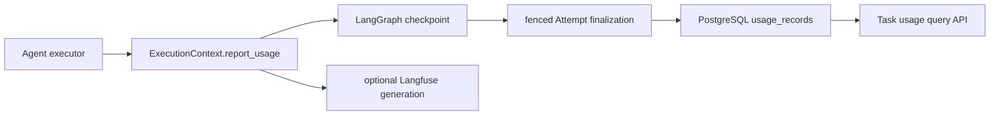

# Observability and usage implementation

Status: Accepted for implementation increment
Owners: AgentMesh maintainers
Depends on: [Durable asynchronous execution](durable-async-execution.md),
[Formal observability and evaluation](formal/observability-and-evaluation.md),
[Feature Gates](feature-gates.md)

## 1. Scope

This increment establishes correlation and cost-accounting contracts without claiming the full
evaluation or OpenTelemetry platform is complete. Every Execution Attempt receives a persistent
W3C-compatible 32-character Trace ID. An Agent executor may report provider/model usage through
its `AgentExecutionContext`; the Worker checkpoints and commits those reports to PostgreSQL.

When explicitly configured, a Langfuse v4 adapter mirrors safe Attempt and generation metadata.
Langfuse remains a diagnostic projection: Task state, Usage records, and cost totals do not depend
on the exporter being installed or available.

## 2. Identity and lifecycle

| AgentMesh identity | Current mapping |
|---|---|
| Task ID | Langfuse Session ID and API correlation |
| Run ID | Trace attribute; one Run may have several Attempts |
| Attempt ID | root Agent observation attribute |
| Attempt Trace ID | explicit Langfuse/OTel trace context |
| Usage record ID | idempotency key in the business ledger and exporter metadata |

One wake-up Attempt creates one Trace. Pause/resume creates a new Attempt and Trace instead of
holding an unbounded Trace open. The same LangGraph thread and Task Session preserve higher-level
correlation. Trace loss never changes Task, Run, or Attempt state.

## 3. Usage contract

Executors report:

- provider and model;
- `PROVIDER` or `ESTIMATED` source;
- arbitrary non-negative integer usage buckets such as `input`, `output`, and `total`;
- optional non-negative cost buckets in integer micros;
- one three-letter currency and optional pricing version.

Bucket names are preserved rather than guessed. The query API sums like-named usage buckets and
groups cost totals by currency. Historical costs therefore never change because a dashboard or
external price table changed. Floating-point money is not stored in PostgreSQL.

The schema follows Langfuse's distinction between `usage_details` and `cost_details`, while the
business ledger remains authoritative. See the official
[Token and Cost Tracking](https://langfuse.com/docs/observability/features/token-and-cost-tracking)
contract.

## 4. Durable and idempotent flow

The generated Usage record ID and its originating Attempt/Trace IDs are part of checkpoint state.
If the Task pauses after the Agent node and later resumes, the completed node is not re-executed.
The new Attempt replays the checkpointed report into `add_if_absent`, so exactly one business
record remains. Finalization verifies tenant, Task, Run, originating Attempt, and Trace ownership
before insertion.

Provider usage emitted immediately before a node-level exception is not yet guaranteed to reach a
checkpoint. A future provider adapter may use a direct durable usage sink for that failure window.

## 5. Langfuse adapter and privacy

The adapter uses Langfuse v4 `start_as_current_observation` and `propagate_attributes`; it does not
install a generic LangChain callback because that callback can capture the complete LangGraph
state. The current root observation exports only IDs, fencing/version metadata, tenant, Agent,
status, tags, and error type. Generation observations export model, usage, cost, and provenance.

Objective, Task input/output, prompts, model response bodies, Tool arguments/results, secrets, and
error stacks are excluded by default. Non-USD costs stay in the AgentMesh ledger and are not sent
to Langfuse as if they were USD. The adapter is isolated behind `AttemptTelemetry`; setup, update,
export, and shutdown failures are logged and cannot fail business execution.

## 6. Feature and configuration contract

- `minimal` and `standard` disable the `observability` Feature Gate; `full` enables it.
- `GET /api/v1/tasks/{task_id}/usage` is tenant-scoped and requires the Gate.
- Attempt Trace IDs and durable internal accounting contracts remain schema-level capabilities;
  disabling the Gate hides the advanced API and prevents exporter activation, but does not delete
  records.
- Langfuse export additionally requires `AGENTMESH_LANGFUSE_ENABLED=true`, the Gate, and public and
  secret keys. Both `AGENTMESH_LANGFUSE_*` and official `LANGFUSE_*` credential names are accepted.
- The base image includes the optional `observability` dependency so one image supports every
  profile. Source installs can omit it while export is disabled.

The adapter targets the official
[Langfuse Python SDK v4](https://langfuse.com/docs/observability/sdk/upgrade-path/python-v3-to-v4)
contract and is version-bounded to `langfuse>=4,<5`.

## 7. Deferred scope

This increment does not provide model-provider executors, budget reserve/settlement enforcement,
Tool pricing, OpenTelemetry Collector pipelines, metrics/log backends, dynamic sampling, content
capture policies, Score/evaluator/dataset storage, retention jobs, or the Web Console Trace view.
The deterministic built-in Agent deliberately reports zero model usage rather than fabricated
tokens.

## 8. Verified acceptance criteria

- every persisted Attempt exposes a stable W3C Trace ID;
- provider and estimated usage validate and persist with integer-micro costs;
- pause/resume checkpoint replay cannot duplicate a Usage record;
- task usage queries are tenant-scoped, currency-aware, and Feature-Gated;
- Langfuse receives Task Session, Attempt Trace, and content-free generation usage metadata;
- Langfuse outages do not change execution success or the PostgreSQL ledger;
- migrations and repositories run against real PostgreSQL in the integration suite.
