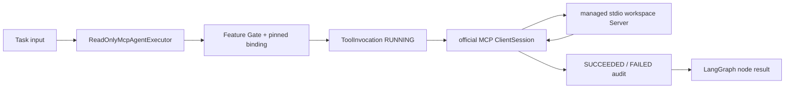

# Read-only MCP Tool implementation

Status: Accepted for implementation increment
Owners: AgentMesh maintainers
Depends on: [Durable asynchronous execution](durable-async-execution.md),
[Formal MCP integration](formal/mcp-integration.md),
[Feature Gates](feature-gates.md)

## 1. Scope

This increment proves one real MCP path without claiming the governed MCP ecosystem is complete.
When the `mcp_read_tools` Feature Gate is enabled, a Task may explicitly request the logical Tool
`workspace.read_text`. The Execution Worker invokes a bundled MCP Server through the official
Python SDK and stdio transport, then returns a normalized result with durable audit provenance.

The negotiated protocol is MCP `2025-11-25`. The dependency is constrained to official Python SDK
`mcp>=1.28,<2`; the SDK remains behind an AgentMesh Port and anti-corruption adapter.

## 2. Task contract

```json
{
  "objective": "Read project documentation",
  "input": {
    "tool_call": {
      "tool": "workspace.read_text",
      "arguments": {"path": "README.md"}
    }
  }
}
```

`tool_call` contains exactly `tool` and `arguments`. It is opt-in and does not change ordinary
deterministic Tasks. Unknown Tool keys, non-object arguments, non-JSON values, and disabled Feature
Gate requests are rejected before a Task is created. The Worker repeats Gate and allowlist checks.

## 3. Runtime flow



The binding pins logical key, expected Server identity, protocol Tool name, and `READ_ONLY`
side-effect class. Each connection performs MCP initialize and Tool discovery, then verifies:

1. Server identity matches `agentmesh-workspace`;
2. exactly one `read_text` Tool exists;
3. the Tool declares `readOnlyHint=true`;
4. its input schema is valid JSON Schema 2020-12;
5. arguments validate against the discovered schema;
6. normalized result size stays within `AGENTMESH_MCP_MAX_RESULT_BYTES`.

## 4. Workspace Server boundary

The bundled Server reads one UTF-8 file below `AGENTMESH_MCP_WORKSPACE_ROOT`. It receives a minimal
stdio environment from the official SDK plus only the configured root and byte limit. It rejects:

- absolute paths, traversal, and symlinks resolving outside the root;
- directories, missing files, and invalid UTF-8;
- files over `AGENTMESH_MCP_WORKSPACE_MAX_BYTES`.

The structured result contains relative path, media type, byte count, SHA-256, and content. In the
Compose image the default root is `/app`; operators must mount and select another root explicitly
to expose project data. No arbitrary command, URL fetch, Resource, Prompt, Sampling, Elicitation,
Root negotiation, or write operation is available.

## 5. Durable audit

`tool_invocations` records invocation ID, tenant, Task, Run, Server, logical/protocol Tool names,
side-effect class, negotiated protocol, schema/arguments/result digests, result byte size, status,
safe error summary, and timestamps. Raw arguments and result bodies are deliberately absent from
this table. The Task input/output ledger may still contain user-visible values and follows its own
future classification and retention policy.

The RUNNING record commits before the external call. Success or failure commits afterward in a
separate transaction, so database locks are never held during MCP I/O. A Worker crash can leave a
RUNNING audit record; a later Reconciler will classify it. Because the only Tool is read-only,
re-execution after a crash is safe but may produce more than one auditable invocation.

## 6. Feature and failure behavior

- `minimal` and `standard` keep the capability off; `full` enables it.
- `GET /api/v1/tasks/{task_id}/tool-invocations` is gated and tenant-scoped.
- Tool errors fail the current workflow and are reduced to safe type-based summaries in audit and
  Task execution state; MCP stderr and protocol internals are not exposed through the API.
- A completed LangGraph checkpoint prevents a successful Tool node from being executed again when
  pause/resume happens after node completion.
- MCP calls are cooperative node work and are not preempted mid-call by Task pause.

## 7. Current boundary

This is a code-configured local binding, not the formal Registry/Gateway. Deferred work includes
Server registration and immutable capability snapshots, Streamable HTTP, OAuth/credential broker,
Policy/Approval, schema-change quarantine, health/circuit breaking, cancellation/progress,
Resources/Prompts, large-result Artifact conversion, write idempotency, and orphan reconciliation.

## 8. Verified acceptance criteria

- the official client negotiates MCP `2025-11-25` with a real stdio subprocess;
- Tool discovery enforces identity, allowlist, read-only annotation, schema, and result limit;
- path confinement and file byte limits reject escape attempts;
- normal Tasks remain unchanged when no `tool_call` is present;
- disabled profiles reject Tool requests and audit APIs;
- success and failure create tenant-scoped digest-only durable audit records;
- the PostgreSQL/Redis/LangGraph integration test executes the MCP Tool and queries its audit.
