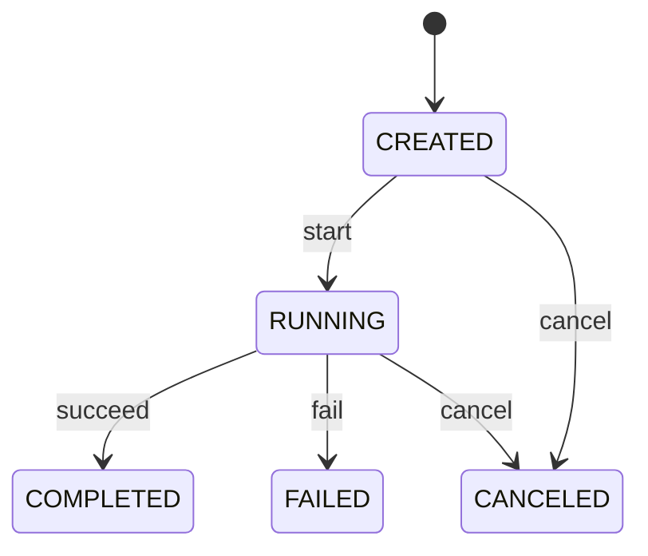

# Task domain and execution model

Status: Accepted for MVP
Owners: AgentMesh maintainers
Depends on: [L0 system design](../L0-system-design.md)

## 1. Problem

首个垂直切片需要一个独立于 LangGraph、A2A 和 HTTP 的业务任务模型。否则外部协议状态或执行引擎 Checkpoint 会变成用户可见的业务事实，后续难以演进。

## 2. Responsibilities

- 定义 Task、Run 及其身份和生命周期。
- 校验状态转换和业务不变量。
- 保存目标、输入、输出、失败原因和时间。
- 为后续 Subtask、Handoff、Approval 和 Artifact 建立稳定扩展点。

## 3. Non-responsibilities

- 不执行 Agent 或模型。
- 不保存 LangGraph State。
- 不定义 HTTP Schema。
- 不定义 A2A Task 状态。
- 不承担队列投递。

## 4. MVP entities

### Task

| Field | Meaning |
|---|---|
| id | 平台生成的 UUID |
| objective | 用户目标，MVP 为非空文本 |
| input | 可选 JSON 输入 |
| status | CREATED、RUNNING、COMPLETED、FAILED、CANCELED |
| current_run_id | 当前 Run，可为空 |
| output | 最终结构化输出，可为空 |
| error | 安全、面向用户的失败摘要，可为空 |
| version | 乐观并发版本 |
| created_at / updated_at | UTC 时间 |

### Run

| Field | Meaning |
|---|---|
| id | 一次执行尝试 UUID |
| task_id | 所属 Task |
| thread_id | LangGraph Thread ID，MVP 与 Run ID 一致但保持独立字段 |
| agent_id | 执行该 Run 的 Agent Definition 标识 |
| status | RUNNING、COMPLETED、FAILED、CANCELED |
| output / error | 本次尝试的结果或失败摘要 |
| started_at / completed_at | UTC 时间 |

## 5. State transitions

MVP 不提供 FAILED 到 RUNNING 的原地重试。未来重试会保留旧 Run，并创建一个新的 Run。Task 是否进入新的 READY 状态在后续 L1 设计中决定。

## 6. Invariants

- Objective 去除首尾空白后不能为空。
- 一个 Task 同一时刻最多有一个活动 Run。
- COMPLETED Task 必须具有输出。
- FAILED Task 必须具有失败摘要。
- 终态不能被普通命令修改。
- Run 的 thread_id 创建后不可改变。
- 所有时间以 UTC 保存和传输。

## 7. Commands and queries

MVP commands:

- CreateTask(objective, input)
- RunTask(task_id)
- CancelTask(task_id)

MVP queries:

- GetTask(task_id)
- ListTasks(limit, offset, status)

## 8. Main execution flow

1. `RunTask` 在事务中读取并锁定 Task。
2. 校验 Task 为 CREATED，创建 Run，并将 Task 改为 RUNNING。
3. 提交事务后调用 WorkflowRunner，使用 Run ID 作为 Thread ID。
4. WorkflowRunner 返回结构化输出。
5. 新事务重新读取 Task 和 Run，将两者标记为 COMPLETED。
6. 如果 WorkflowRunner 抛出异常，新事务将两者标记为 FAILED。

执行 Agent 时不保持数据库事务，避免长事务和锁占用。

## 9. Concurrency

- Repository 使用行锁或带版本条件的更新防止同一 Task 被启动两次。
- API 生成的重复请求最终需要 Idempotency-Key；MVP 接口尚不实现该 Header。
- 状态转换由 Domain Entity 校验，Repository 仍需处理数据库并发冲突。

## 10. Failure model

- 第一个事务失败：Task 保持 CREATED，不会产生 Run。
- 第一个事务提交后进程崩溃：Task 可能保持 RUNNING；后续 Worker Reconciler 将负责恢复，MVP 记录为已知限制。
- Workflow 失败：Task/Run 进入 FAILED。
- 完成事务失败：LangGraph 已完成但业务状态可能仍为 RUNNING；通过 thread_id 可对账，Reconciler 留待后续实现。

## 11. Acceptance criteria

- 非法状态转换有单元测试。
- 重复启动同一 Task 被拒绝。
- 成功 Run 保存 Task 与 Run 输出。
- 失败 Run 保存安全错误摘要。
- 领域模型不依赖 FastAPI、SQLAlchemy、LangGraph 或 Langfuse。
