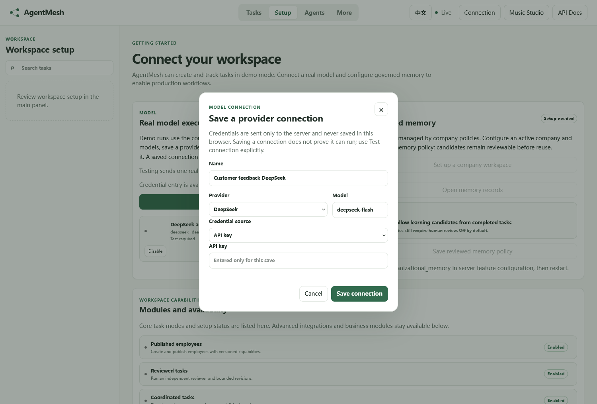
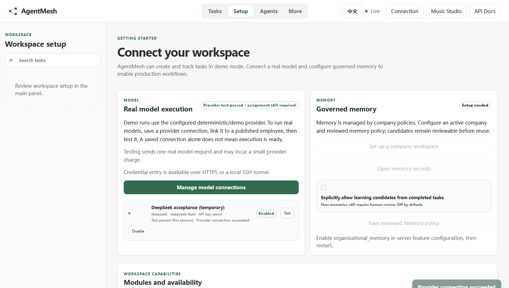
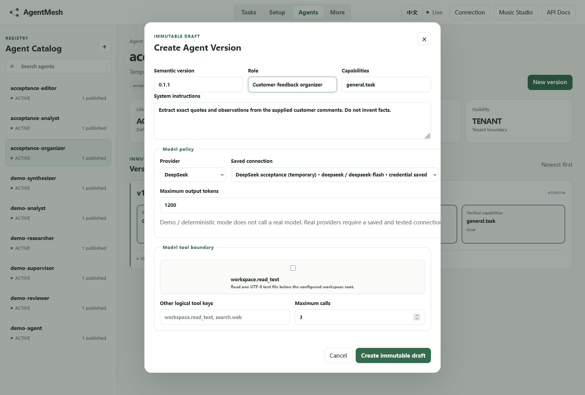
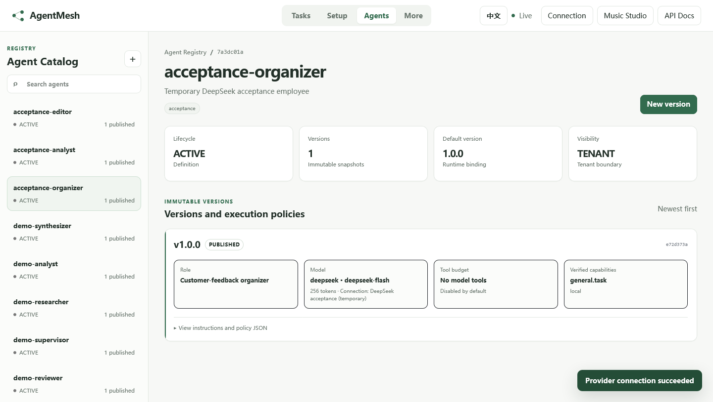
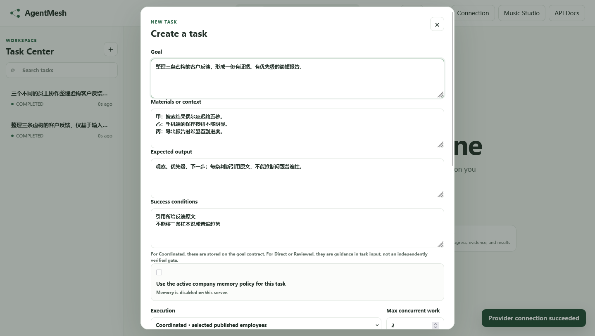
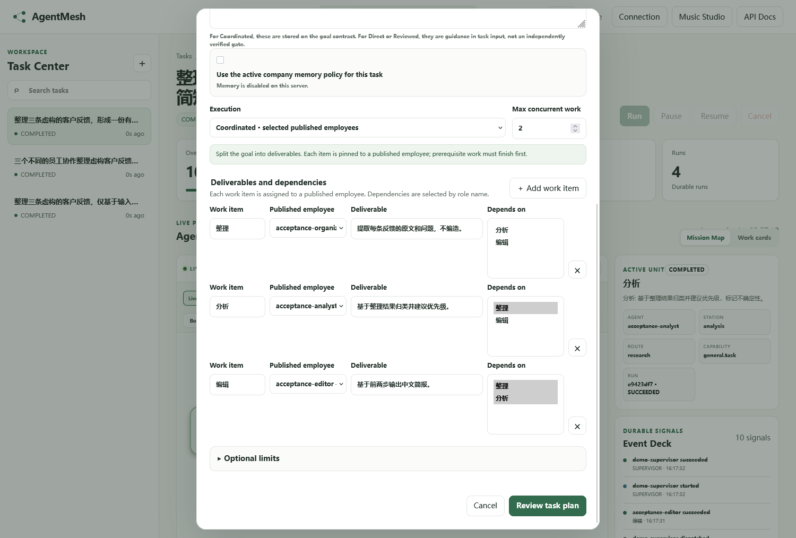
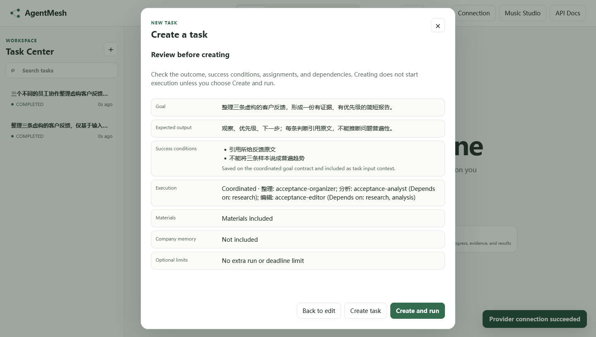
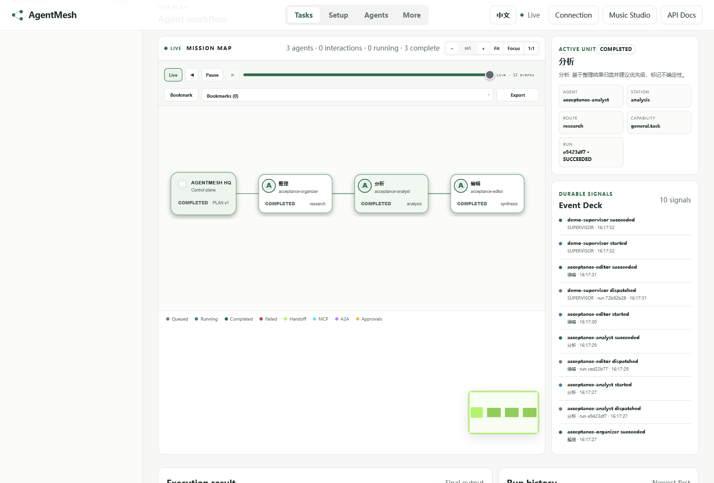
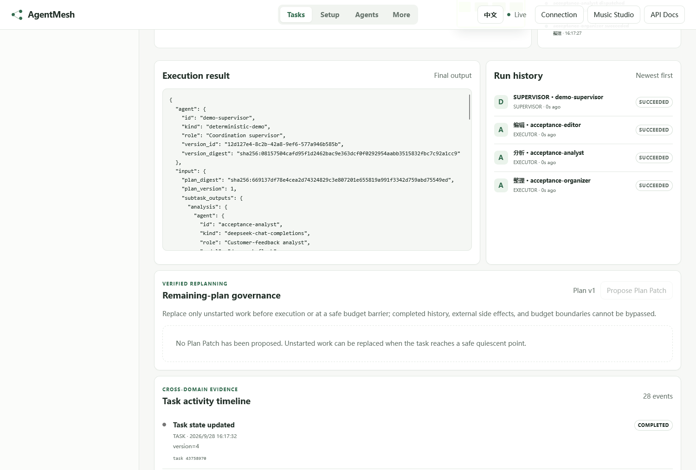

# Run a real multi-agent task: customer feedback brief

English | [简体中文](customer-feedback-deepseek.zh-CN.md)

This walkthrough is for a first-time AgentMesh user. A product lead supplies three fictional customer comments. An organizer extracts evidence, an analyst prioritizes issues, and an editor writes a short brief. All three employees share one model connection, but each has a separately published role and instruction set. **No MCP, A2A, company memory, or external memory service is required.**

The screenshots are from a private, real-model acceptance run on 2026-09-28. The task was created and executed through the Console; all three DeepSeek executor runs succeeded. Screenshots contain synthetic input only, never a provider key or platform token. Your own IDs, output, and usage will differ.

## What you will configure

| Term | In this example |
|---|---|
| Model connection | One DeepSeek API key and model name, shared by three employees |
| Agent Definition | A stable identity for each organizer, analyst, and editor |
| Agent Version | A published, immutable set of role instructions, capabilities, and model policy |
| Task | One request with three dependent work items and their Runs |

> The default `docker compose up --build` profile runs a **keyless deterministic demo**. Before entering a real key, an administrator must enable Identity/RBAC, configure the same model-connection encryption key on API and Worker, and expose the Console through verified HTTPS or a local/SSH tunnel. Follow the [SSH-only administration runbook](../operations/model-connections-ssh.md). Ordinary task authors do not need the model key. Never enter credentials on a public HTTP origin or in a Task, screenshot, or Git commit.

## 1. Save and test a model connection (administrator)

Open the Console through the secure channel. In **Connection settings**, enter the AgentMesh administrator Bearer token; this is distinct from the provider API key. In **Setup → Manage model connections**, add:

| Field | Example |
|---|---|
| Name | `Customer feedback DeepSeek` |
| Provider | `DeepSeek` |
| Model | `deepseek-flash` |
| Credential source | `API key` |
| API key | Your DeepSeek key, entered only in this secure form |

`deepseek-flash` was used in this acceptance run; check the [official DeepSeek model documentation](https://api-docs.deepseek.com/quick_start/pricing/) for later changes. The screenshot deliberately leaves the key field blank.



Select **Save connection**, then explicitly select **Test** on the saved connection. Saving proves only that AgentMesh stored the credential; testing makes a real provider request and may incur a small charge. “Test passed (this session)” is a browser-session indication, not ongoing health monitoring. Memory setup is not needed for this scenario.



## 2. Create and publish three employees (administrator)

Go to **Agents**, select **＋**, and create `feedback-organizer`, `feedback-analyst`, and `feedback-editor`. Choose an Owner ID and visibility appropriate for your team. For each Definition, select **New version**:

| Employee | Role | System instruction essentials |
|---|---|---|
| `feedback-organizer` | Customer feedback organizer | Extract exact quotes and observations; invent nothing |
| `feedback-analyst` | Customer feedback analyst | Group issues, suggest priorities, and acknowledge uncertainty from just three samples |
| `feedback-editor` | Customer feedback editor | Use upstream results to write “Observations, Priority, Next steps” |

Set **Capabilities** to `general.task`, **Provider** to `DeepSeek`, and **Saved connection** to the tested connection. Start with **Maximum output tokens** around `1200` for this brief. The acceptance employees were intentionally capped at `256`, which visibly truncated some text. Leave Tool selection empty: the input is pasted into the Task, so no file or web tool is required. For each employee, select **Create immutable draft → Submit for review → Publish version**, making it the default version. The screenshots use temporary `acceptance-*` names; use the names above for a real team.





To change instructions or output limits later, create and publish a new Version. Existing Runs retain their original Version identity.

## 3. Create coordinated work

In **Tasks → ＋**, paste these synthetic comments into **Materials or context**; a local path alone does not provide file access:

```text
Customer A: Search results are occasionally delayed by about five seconds.
Customer B: The Save button is hard to find on mobile.
Customer C: I would like progress feedback while a report is exported.
```

Set **Goal** to “Summarize the three customer comments in a short evidence-backed, prioritized brief.” Set **Expected output** to “Observations, priority, and next steps; cite each source and avoid claims about prevalence.” Add two **Success conditions**: cite the supplied comments, and do not present three comments as a general trend. Select **Execution → Coordinated · selected published employees**.



Edit the three default work-item rows and assign published employees. **Depends on** is a multi-select field:

| Work item | Published employee | Deliverable | Depends on |
|---|---|---|---|
| Organize | `feedback-organizer` | Quotes and observed issues | Nothing |
| Analyze | `feedback-analyst` | Categories and evidence-based priority | Organize |
| Edit | `feedback-editor` | Three-section brief | Organize and Analyze |



Select **Review task plan**, verify the goal, employees, and dependencies, then select **Create and run**. **Create task** alone does not start execution. The review screen may use generated work-item keys such as `research` and `analysis`; these correspond to the three displayed rows, not additional employees. Success conditions are saved in the Task context/goal contract, but they do not replace human content review.



## 4. Observe and check the result

The Task detail shows its status, progress, work units, and Runs. Select **Mission Map** to see the dependency route from AgentMesh HQ through organizer, analyst, and editor. The acceptance run had **three completed work units and four successful Runs**: three real DeepSeek executors plus one system supervisor.



Scroll to **Execution result** and **Run history**. In this release, the result is raw JSON. The readable editor brief is at `output.input.subtask_outputs.synthesis.summary` for the default UI-generated work-item keys; if you changed the keys, find the editor's output under its key. Do not judge the deliverable from top-level `output.summary` alone: the default supervisor is still deterministic/demo and emits a generic workflow summary. Run history shows exactly which employees executed.



The Console-created acceptance Task recorded **2,542 actual provider tokens** and **28 activity items**. Those are one-run observations, not a fixed price or quality guarantee. Its `interactions` count was 0: dependencies and dispatch/completion events were visible, but this case did not emit an explicit Handoff interaction. A route on the map does not mean an A2A or MCP message occurred.

Check that each subtask finished in order; conclusions cite supplied text; priorities are framed as suggestions rather than statistical facts; and no content was invented or truncated. **`COMPLETED` confirms workflow completion, not automatic factual correctness.**

## Troubleshooting

- **Saved connection, but Demo output:** verify each employee's published default Version binds the DeepSeek connection and that the Task selects those employees.
- **Coordinated disabled:** ask an administrator to enable `coordinated_execution` and `agent_registry_management`.
- **Cannot enter a key or token:** use the configured HTTPS or SSH-local origin. Do not bypass the public-HTTP protection.
- **Truncated output:** publish a new Version with a larger output-token cap, then create a new Task. Do not silently mutate an existing Run.
- **Budget tokens differ from provider usage:** budget reservation/settlement is not a billing figure. Inspect the Task `/usage` records for provider tokens. An empty cost field does not mean the provider call was free.
- **Need web search, files, persistent memory, or sending replies:** these are separate governed integrations, not capabilities granted by a model API key.

To prove the free core path first, run the Direct demo in the [five-minute guide](../getting-started.md), then return here to connect a real model.
